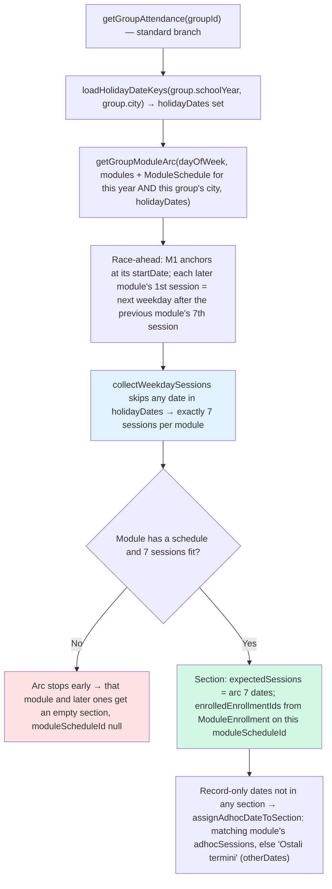
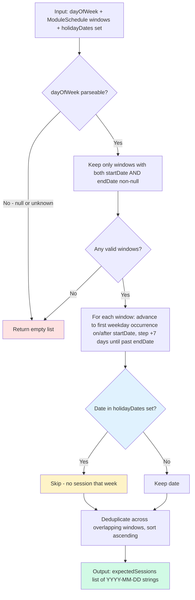
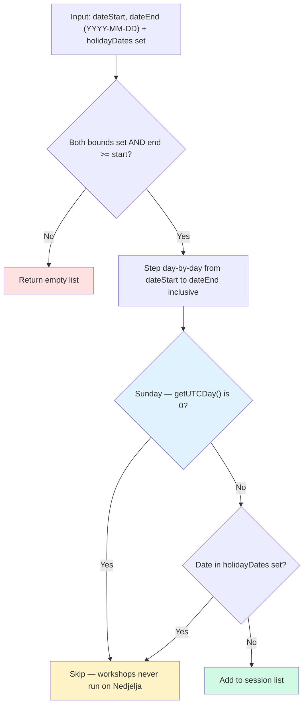
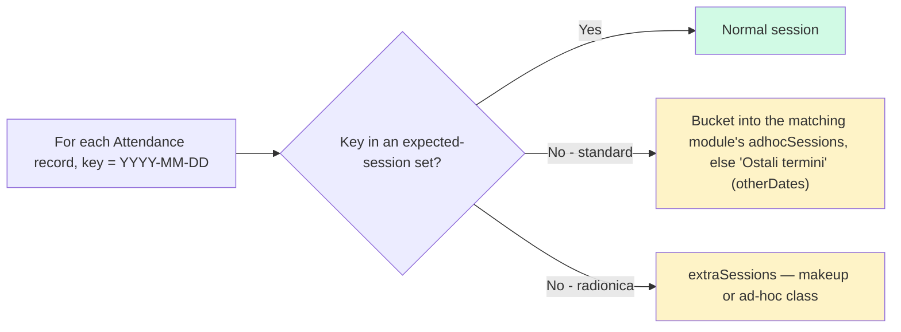
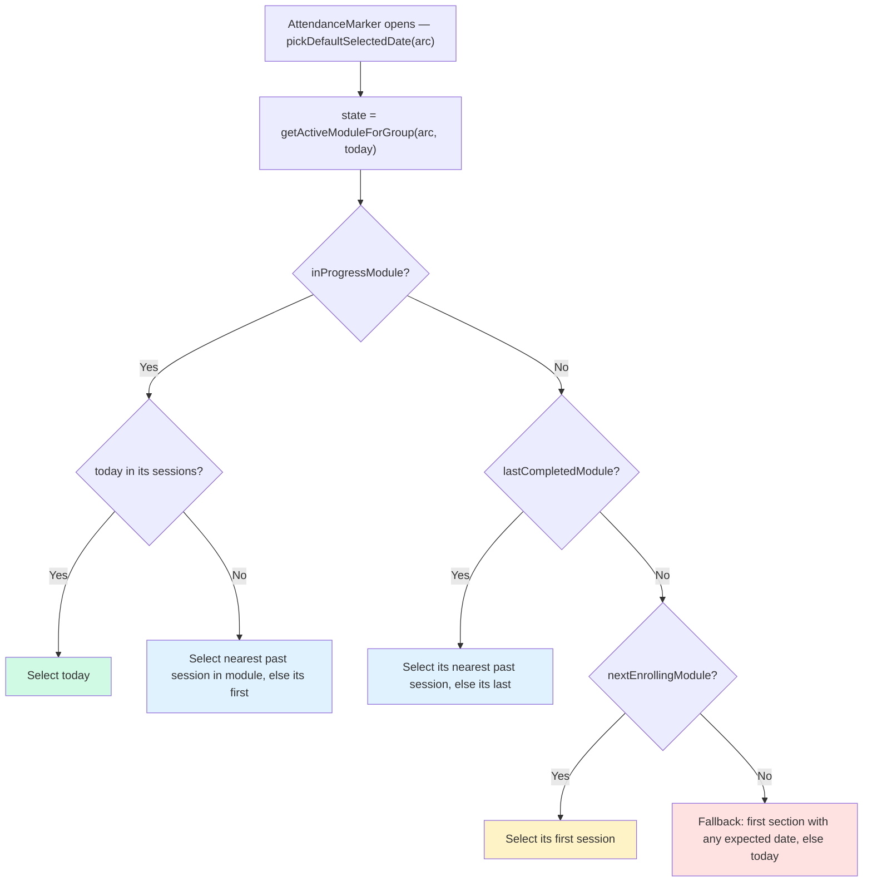

# Attendance — Session Dates and Marking Flow

There is no `ClassSession` model. Expected session dates are derived on the fly and Attendance rows are keyed by `(enrollmentId, sessionDate)` (`@db.Date`, UTC midnight). There are two derivations, both holiday-aware via `loadHolidayDateKeys(schoolYear, city)` — holiday calendars are **per-city**, and each group resolves against its own city's set (a Šibenik closure never moves a Split group's sessions, and a holiday's attendance-cascade delete is city-filtered for the same reason):

- **Standard programs** — dates come from the per-group **race-ahead module arc** (`getGroupModuleArc`): up to 4 modules × 7 weekday sessions, anchored at the school-year kickoff (M1 `startDate`), skipping holidays. `getGroupAttendance` slices these into per-module sections.
- **Radionice** (`course.isCustom`) — `computeRadionicaSessions` enumerates every day in the `[dateStart, dateEnd]` range, skipping Sundays and holidays. The flat list is preserved (no module sections).

> A holiday is pre-filtered out of the expected set so attendance never shows a slot for it. Any further cancellation (snow day, ad-hoc) is the teacher's call — they leave the row unmarked or write a note.

## Standard groups — per-group race-ahead arc

`getGroupAttendance` (standard branch) builds the arc, then maps each `CourseModule` to a section. Session dates per section are the arc entry's 7 dates — **not** the raw `ModuleSchedule` windows.

> **Per-group, race-ahead — not `ModuleSchedule` windows.** Source: `getGroupModuleArc` in `src/lib/group-module-arc.ts`. Module N+1 starts on the group's next weekday occurrence after Module N's 7th session, so two groups in the same course on different weekdays (or with different holiday counts) sit on different modules on the same calendar date. The `ModuleSchedule.startDate/endDate` rows stay the slowest-weekday reference for calendar headers and admin pages; the arc reads only M1's `startDate` (the kickoff) and models per-group breaks via the holiday set, not via gaps between module windows.

## `computeExpectedSessions` — weekday × module windows − holidays

The weekday-window primitive in `src/lib/session-dates.ts`. It enumerates each `dayOfWeek` occurrence inside the supplied `ModuleSchedule` windows, dedupes overlaps, drops holidays, and sorts. It now powers the **school-year planner** and the **group end-date** computation — *not* attendance sectioning (which uses the arc above).

> Source: `computeExpectedSessions()` in `src/lib/session-dates.ts`. All dates use UTC midnight to match Prisma `@db.Date` storage. Holidays arrive as a `Set` of `YYYY-MM-DD` keys from `loadHolidayDateKeys`. Standard groups have a fixed weekday (Pon–Sub), so no separate Sunday filter is needed here — only radionice need that (below).

## Radionice — `computeRadionicaSessions`

> Source: `computeRadionicaSessions()` in `src/lib/session-dates.ts`. Each non-Sunday, non-holiday day in the closed range is one expected session. Sundays are excluded because the association never schedules on Nedjelja (matches `ACTIVE_WEEKDAYS`, which lists only Pon–Sub). `getGroupAttendance` (radionica branch) returns this flat list with no module sections.

## Extra / ad-hoc sessions

A recorded Attendance date that isn't an expected session is surfaced, never dropped.

> Extra sessions appear when a teacher records attendance for a date outside the expected set — typically a makeup class, or a session held on what was pre-filtered as a holiday. Standard groups route it to the nearest module section (or "Ostali termini"); radionice collect it in `extraSessions`.

## Teacher Bulk-Mark Flow

> Source: `bulkMarkSession()` in `src/actions/teacher/attendance.ts`. The upsert means re-saving the same date updates existing records rather than creating duplicates.

## Default Session Selection (standard groups)

`pickDefaultSelectedDate` picks the most relevant date from the arc state — standard branch only; the radionica branch returns no `defaultSelectedDate`.

> Source: `pickDefaultSelectedDate()` in `src/actions/teacher/attendance.ts`. Driven entirely by the race-ahead arc (`getActiveModuleForGroup`), so the default date sits inside the module the group is actually on right now.
