# Attendance — Session Dates and Marking Flow

There is no `ClassSession` model. Expected session dates are derived on the fly and Attendance rows are keyed by `(enrollmentId, sessionDate)` (`@db.Date`, UTC midnight). There are three derivations — one per `ProgramKind`, branched via the `src/lib/program-kind.ts` predicates — all holiday-aware via `loadHolidayDateKeys(schoolYear, city)` — holiday calendars are **per-city**, and each group resolves against its own city's set (a Šibenik closure never moves a Split group's sessions, and a holiday's attendance-cascade delete is city-filtered for the same reason):

- **Standard programs** (`isStandard`) — dates come from the per-group **race-ahead module arc** (`getGroupModuleArc`): up to 4 modules × 7 weekday sessions, anchored at the school-year kickoff (M1 `startDate`), skipping holidays. `getGroupAttendance` slices these into per-module sections.
- **Radionice** (`isRadionica`) — `computeRadionicaSessions` enumerates every day in the `[dateStart, dateEnd]` range, skipping Sundays and holidays. The flat list is preserved (no module sections).
- **Natjecateljski program** (`isCompetition`) — `computeSeasonSessions({ dayOfWeek, startDate, endDate, holidayDates })` yields one session a week on the group's weekday inside the program's `CourseSeason` `[startDate, endDate]` for this `(schoolYear, city)`. Holiday weeks are dropped outright — **no session-count target, no make-up** — and an unplanned season (or missing weekday) yields `[]`. Flat list, like radionice.

- **Probni sat** (STANDARD only) — `computeTrialSession` yields the single occurrence of the group's weekday inside that year's `TrialWeek`. Not a fourth per-kind derivation but an **extra date prepended to the standard branch**: one free trial session before module 1, which keeps its full seven.

> A holiday is pre-filtered out of the expected set so attendance never shows a slot for it. Any further cancellation (snow day, ad-hoc) is the teacher's call — they leave the row unmarked or write a note.

Since 2026-07 there are **two** record tables sharing that derived session date: `Attendance`, keyed `(enrollmentId, sessionDate)`, for students; and `TeacherAttendance`, keyed `(userId, scheduledGroupId, sessionDate)`, for teaching hours. Both are written by the same `bulkMarkSession` transaction. `TeacherAttendance` is keyed on the **group**, not on `TeacherAssignment`, so the rows outlive an unassignment or a removed zamjena — they are the sole source of **hours** for the payout report (`getTeacherWorkReport` → `src/lib/teacher-work-report.ts`, each present row worth the group's `endTime − startTime`), which prices those hours at the teacher's current `User.hourlyRateCents` — a null rate makes every amount null rather than 0, and there is deliberately no six-month total. Marking a date as a holiday after the fact deletes **both** tables' rows for that date, city-filtered, so a cancelled class is never still billed.

Since 2026-09-23 **who may be booked for a termin** is not the group's `TeacherAssignment` list but the termin's **effective staff**: `effectiveStaffFor(regular TeacherAssignment rows, SessionStaffChange rows, date)` in `src/lib/session-staff.ts` — the regular staff, minus anyone a change on that date replaces, plus the change users (a regular who is also the subject of a change that day appears once, with the change's role). Changes are written by an admin only (see *Per-termin staff changes* below). The server's booking and the Dolazak marker's per-date teacher rows (`sessionTeacherRows`) both read that one function, so the hours booked can never disagree with the names shown.

## Standard groups — per-group race-ahead arc

`getGroupAttendance` (standard branch) builds the arc, then maps each `CourseModule` to a section. Session dates per section are the arc entry's 7 dates — **not** the raw `ModuleSchedule` windows.

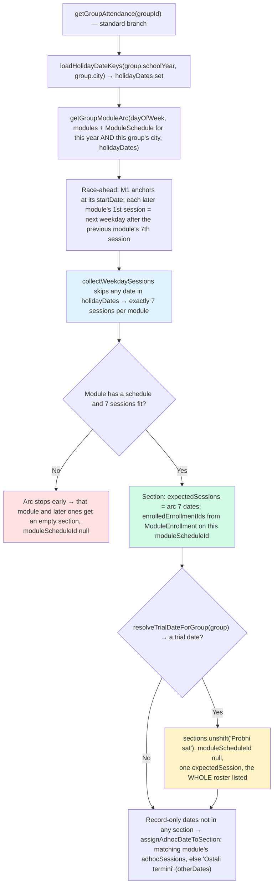

> **The trial section is unshifted BEFORE the ad-hoc bucketing, on purpose.** With no section owning the date, a marked probni sat would fall into "Ostali termini". `moduleScheduleId` is null (there is no `ModuleEnrollment` to bill it against) and the whole roster is listed, because the trial predates any per-module enrollment. Marking it writes ordinary `Attendance` **and** `TeacherAttendance` rows — the trial is free for the child but a paid hour for the teacher, so it appears in Evidencija rada like any other date. Source: `resolveTrialDateForGroup` (`src/lib/trial-week.ts`) → `computeTrialSession` (`src/lib/session-dates.ts`), keyed on the **group's own** `schoolYear`; an absent `TrialWeek` row is the "no probni sat this year" state, and a holiday on the group's weekday **removes** that group's trial rather than moving it.

> **Per-group, race-ahead — not `ModuleSchedule` windows.** Source: `getGroupModuleArc` in `src/lib/group-module-arc.ts`. Module N+1 starts on the group's next weekday occurrence after Module N's 7th session, so two groups in the same course on different weekdays (or with different holiday counts) sit on different modules on the same calendar date. The `ModuleSchedule.startDate/endDate` rows stay the slowest-weekday reference for calendar headers and admin pages; the arc reads only M1's `startDate` (the kickoff) and models per-group breaks via the holiday set, not via gaps between module windows.

## `computeExpectedSessions` — weekday × module windows − holidays

The weekday-window primitive in `src/lib/session-dates.ts`. It enumerates each `dayOfWeek` occurrence inside the supplied `ModuleSchedule` windows, dedupes overlaps, drops holidays, and sorts. It now powers the **school-year planner** and the **group end-date** computation — *not* attendance sectioning (which uses the arc above).

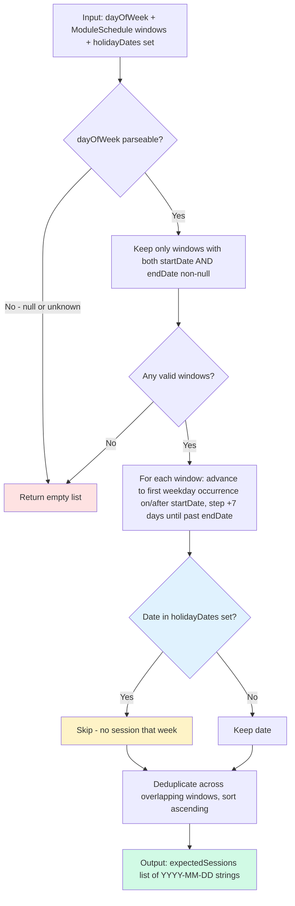

> Source: `computeExpectedSessions()` in `src/lib/session-dates.ts`. All dates use UTC midnight to match Prisma `@db.Date` storage. Holidays arrive as a `Set` of `YYYY-MM-DD` keys from `loadHolidayDateKeys`. Standard groups have a fixed weekday (Pon–Sub), so no separate Sunday filter is needed here — only radionice need that (below).

## Radionice — `computeRadionicaSessions`

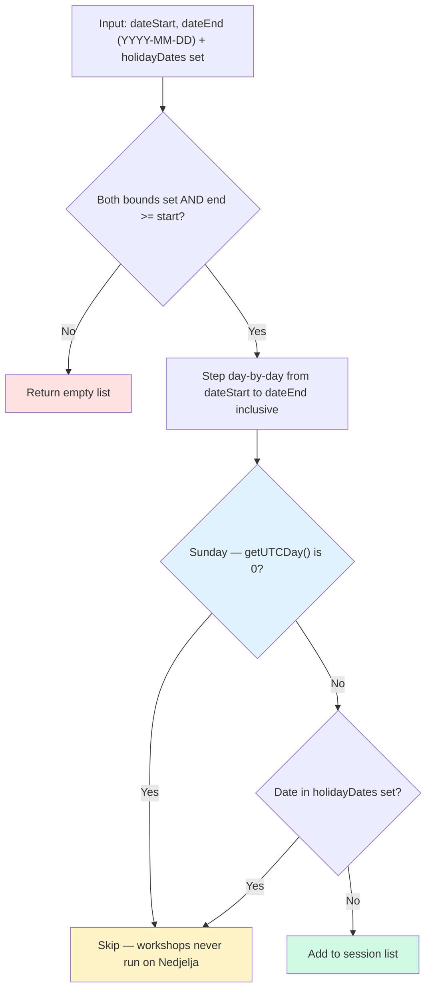

> Source: `computeRadionicaSessions()` in `src/lib/session-dates.ts`. Each non-Sunday, non-holiday day in the closed range is one expected session. Sundays are excluded because the association never schedules on Nedjelja (matches `ACTIVE_WEEKDAYS`, which lists only Pon–Sub). `getGroupAttendance` (radionica branch) returns this flat list with no module sections.

## Natjecateljski program — `computeSeasonSessions`

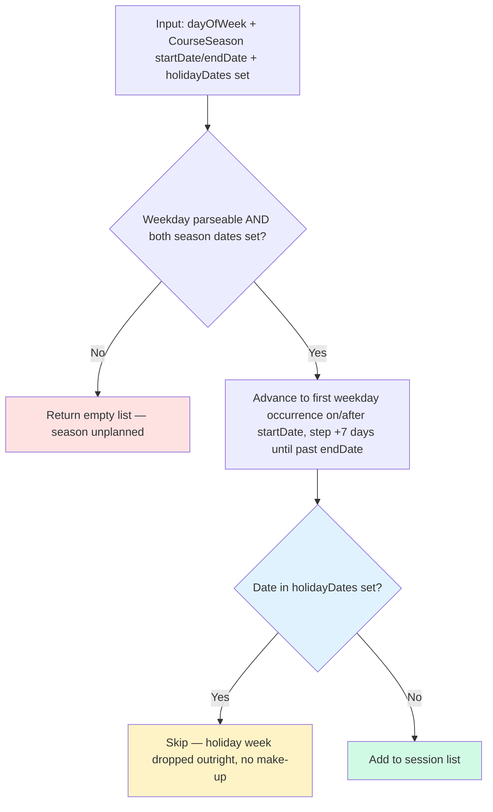

> Source: `computeSeasonSessions()` in `src/lib/session-dates.ts` — a thin wrapper that hands `computeExpectedSessions` the season as its single window. There is **no session-count target**: two groups on different weekdays legitimately finish the season with different totals, because the competitive track is paced by the calendar, not by a fixed curriculum length. The season row comes from `CourseSeason` keyed `(courseId, schoolYear, city)`.

## Which branch a group takes — `getGroupAttendance`

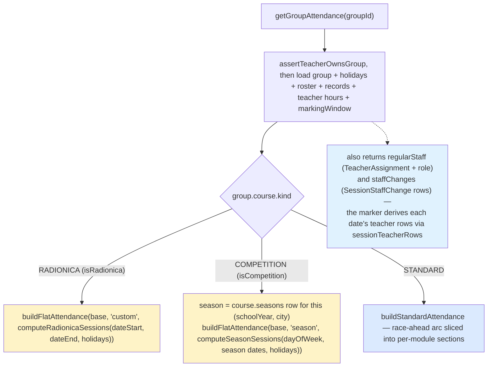

> The return type is a union on `kind`: the two flat branches share one shape — `{ kind: 'custom' | 'season', expectedSessions[], extraSessions[] }` (`'custom'` = radionica, `'season'` = competition) — while standard returns `{ kind: 'standard', sections[], otherDates[], defaultSelectedDate }`. On the client, `AttendanceMarker` routes `kind === 'standard'` to `StandardAttendanceMarker` and both flat kinds to one `FlatAttendanceMarker`, whose default date comes from `pickFlatDefault` (today if expected, else nearest past, else first). The header line is `scheduleHint(dateRange = kind === 'custom', …)` — a radionica reads as its date range, while a competition group reads as its weekday, exactly like a standard group.

## Extra / ad-hoc sessions

A recorded Attendance date that isn't an expected session is surfaced, never dropped.

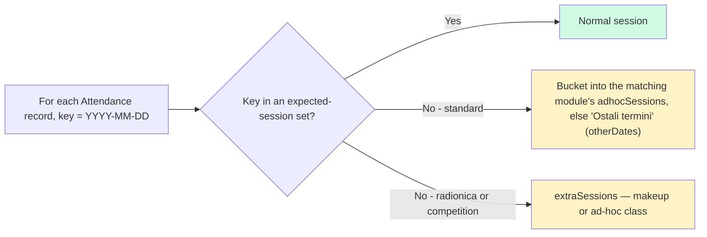

> Extra sessions appear when a teacher records attendance for a date outside the expected set — typically a makeup class, or a session held on what was pre-filtered as a holiday. Standard groups route it to the nearest module section (or "Ostali termini"); the flat kinds (radionica and competition) collect it in `extraSessions`.

## Teacher Bulk-Mark Flow

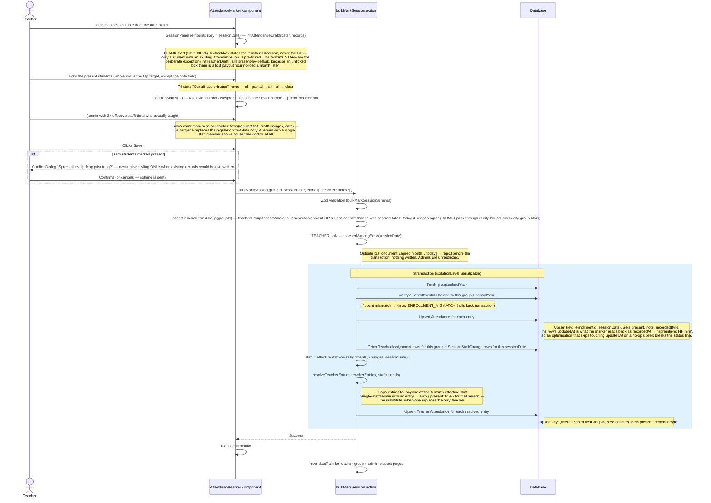

> Source: `bulkMarkSession()` in `src/actions/teacher/attendance.ts`. The upsert means re-saving the same date updates existing records rather than creating duplicates. The client-side draft rules the flow starts from live in `src/lib/attendance-draft.ts` — next section.

## Client-side draft state the marker reads back

An empty checkbox means two different things either side of a save — "not asked yet" before, "marked absent" after — so the marker carries a status line no checkbox can express:

| Condition | Line |
|---|---|
| no records, no edits | *Nije evidentirano — označite prisutne polaznike* |
| draft differs from records | *Nespremljene izmjene — N od M označeno* |
| records exist, draft matches | *Evidentirano · N od M prisutno · spremljeno HH:mm* |

`dirty` wins over `saved` (reading back the old timestamp on edited work would be a lie), it is **computed against the records rather than tracked as a touched-flag** — ticking a box and unticking it again must leave the session clean — and notes compare **trimmed**, because `note.trim() || null` is what the save writes. Save is disabled only when nothing changed **and the saved rows cover everyone on the session**: `hasUnrecordedEntries` keeps it live when a student enrolled — or a teacher was assigned — *after* the session was saved, since their missing row rests at the draft baseline and can never present as an edit (2026-09-01). In the date list the chip shows `—` rather than `0/8` when nothing is recorded: `0/8` counts records but reads as "nobody came"; `8/8` still means "fully recorded", the question that list answers. The rules are pure functions in `src/lib/attendance-draft.ts` (`initAttendanceDraft`, `initTeacherDraft`, `isSessionDirty`, `summarizeSession`, `sessionStatus`, `hasUnrecordedEntries`), kept out of the component so the standard and flat branches cannot answer them differently.

**Hand-added dates ("Dodaj datum ručno") are a client-side draft too.** Nothing exists server-side until evidencija is saved for the date, so it lives in per-group `sessionStorage` (`src/lib/adhoc-date-memory.ts`): it survives tab switches and reloads within one browser tab, is pruned automatically once the server lists the date itself, is removable with the × on its row (a sibling button, offered only while the date has no saved rows — 2026-09-01), and dies with the tab as the backstop. The structural replacement for all of this is the planned `ClassSession` model (Flux `6q66ke4`).

## Teaching hours — which rows get written

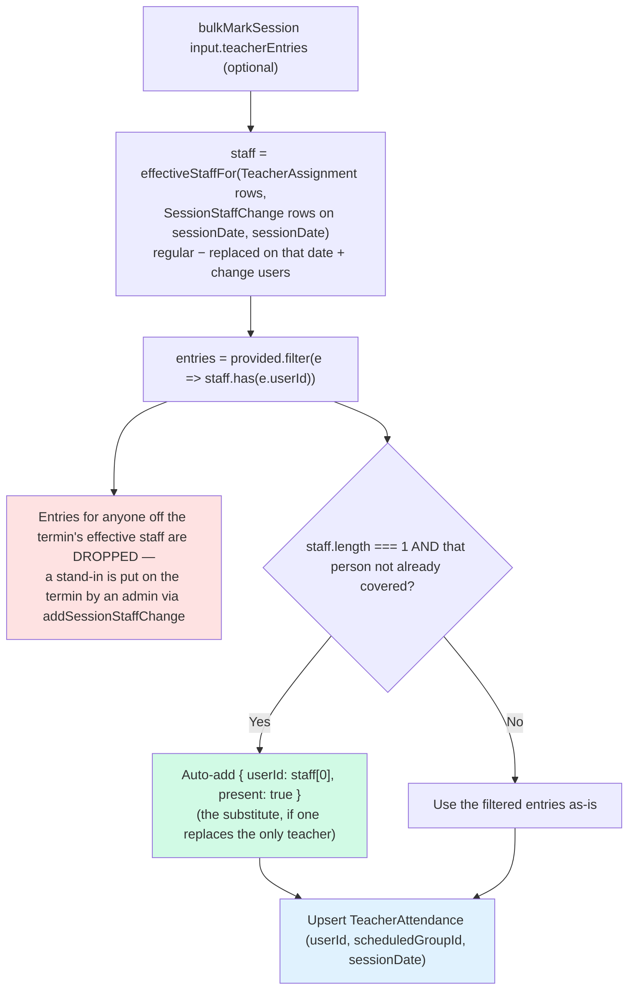

> Source: `resolveTeacherEntries()` in `src/actions/teacher/attendance.ts`, fed by `effectiveStaffFor()` in `src/lib/session-staff.ts` inside the same `Serializable` transaction. Explicit entries win; a single-staff termin needs no interaction — marking the students books that person's hour, which is what books a substitute rather than the teacher they replaced. Nothing is ever booked for someone off the termin's effective staff, so a tampered payload cannot invent payable hours. Re-saving the same date updates rather than duplicates, exactly like the student upsert. **Removing a change never rewrites hours already booked** — `removeSessionStaffChange` deletes only the `SessionStaffChange` row; `TeacherAttendance` stays as the payout record.

## Per-termin staff changes — `addSessionStaffChange`

A `SessionStaffChange` puts someone on **one termin** of a group: a zamjena (`replacesUserId` set), an extra person (null), or a regular in a different role for that day only. Admin-only on both levels (regular roles via `setTeacherAssignmentRole`, changes via `addSessionStaffChange`); a teacher only ticks, on Dolazak, who of the resulting staff actually taught.

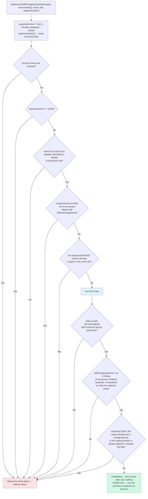

> Source: `addSessionStaffChange` / `staffChangeError` / `termErrorOutsideYear` / `sameDayConflict` in `src/actions/admin/session-staff.ts`, `staffChangeDateError` in `src/lib/session-staff.ts`. A refusal names the offending date, so an admin never ends up with half a run of termini covered. The date rule is deliberately "a day the group could meet", not "a computed termin", so a hand-added Dolazak date can be covered too.
>
> **Access follows the change.** `teacherGroupAccessWhere` (`src/lib/teacher-guard.ts`) — the one predicate behind `assertTeacherOwnsGroup`, `assertTeacherCanViewStudent`, `getMyAssignedGroups` and the gallery guard — admits a TeacherAssignment **or** a `SessionStaffChange` with `sessionDate ≥ staffChangeAccessFrom(now)` (today's Europe/Zagreb date). A substitute sees the group from the moment the admin adds them until the end of the termin's day, and loses it the day after with no cleanup step. `deleteTeacher` removes that teacher's changes from today on and keeps past ones as history.

## The teacher marking window

Hours are money, so a **TEACHER** may only record the current calendar month, up to and including today — no marking a class that hasn't happened, and no filling in a whole month after the fact. The window is anchored on the Europe/Zagreb date (`teacherMarkingWindow` in `src/lib/attendance-window.ts`), matching how `recentMonthWindows` computes the report, so the 1st never flips a couple of hours early on a UTC server.

| Selected date | TEACHER | ADMIN |
|---|---|---|
| Today, or earlier this month | markable | markable |
| Tomorrow / later | rejected — *"Ne možete evidentirati dolazak za budući termin."* | markable |
| Any earlier month | rejected — *"Možete evidentirati samo termine tekućeg mjeseca…"* | markable |

**Admins are deliberately unrestricted** — the correction path is `bulkMarkSession` itself: the `teacherMarkingError` check runs only for `role === 'TEACHER'`, so an admin marking through the same Dolazak tab can record any date and a genuinely missed Friday never becomes permanently unrecordable. (`src/actions/admin/attendance.ts` only exposes the read side, `getStudentAttendance`, for the admin student page.) `getGroupAttendance` returns `markingWindow` (null for admins) so the UI degrades honestly: out-of-window dates stay clickable for viewing, but the Save button is replaced by the reason and the roster goes read-only. Past sessions remain visible; only writing is gated.

## Retroactive holidays

Marking a date as a holiday *after* attendance exists deletes both record tables for that date, inside one transaction and filtered by `(schoolYear, city)`. That date's `SessionStaffChange` rows go in the same transaction **without any confirmation** — they only schedule someone and are not payout evidence:

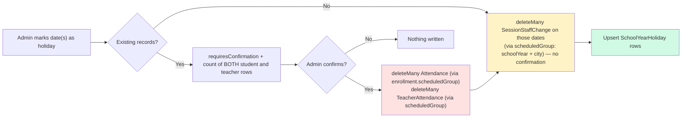

> Source: `src/actions/admin/holidays.ts` (`upsertHolidayRange` and `bulkImportHolidays` share the same scoped helpers, `deleteAffectedAttendance` and `deleteStaffChangesOn`). The city filter is load-bearing — this delete is irreversible, and a Šibenik closure must never destroy Split rows. Deleting the teacher rows too is what stops a cancelled class from still being billed.

## Default Session Selection (standard groups)

`pickDefaultSelectedDate` picks the most relevant date from the arc state — standard branch only; the flat branches (radionica and competition) return no `defaultSelectedDate`, and `FlatAttendanceMarker` picks its own client-side via `pickFlatDefault`.

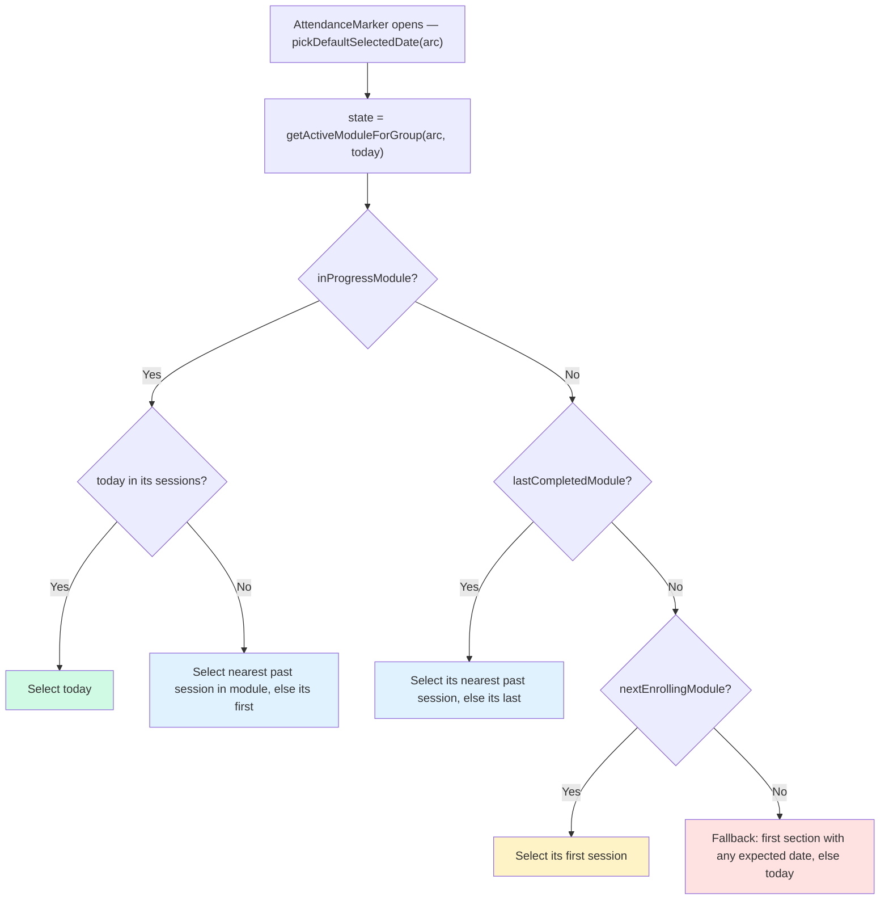

> Source: `pickDefaultSelectedDate()` in `src/actions/teacher/attendance.ts`. Driven entirely by the race-ahead arc (`getActiveModuleForGroup`), so the default date sits inside the module the group is actually on right now.
