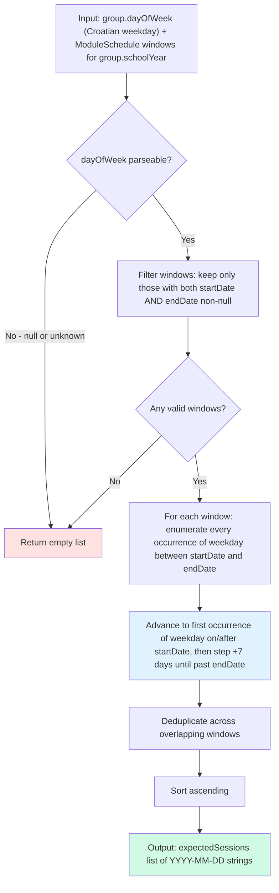
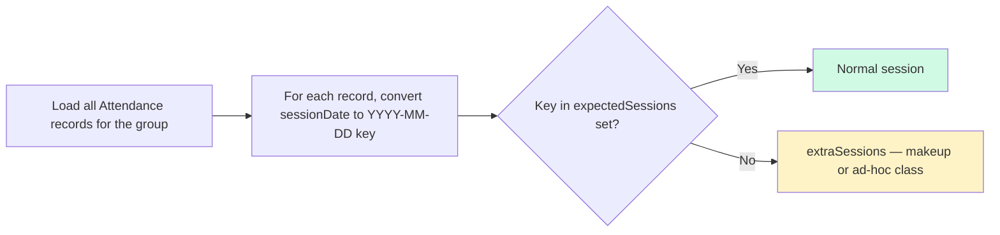
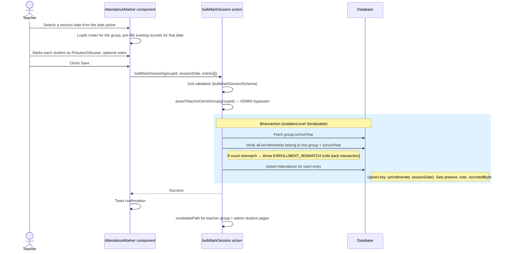
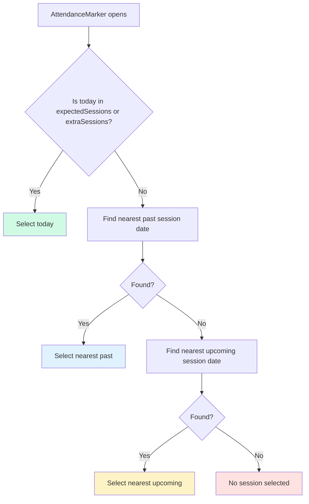

# Attendance — Session Dates and Marking Flow

There is no `ClassSession` model. Expected session dates are derived on the fly from the group's weekday + module schedule windows. Attendance rows are keyed by `(enrollmentId, sessionDate)`.

## Session Date Computation

> Source: `computeExpectedSessions()` in `src/lib/session-dates.ts`. All dates use UTC midnight to match Prisma `@db.Date` storage.

## Extra Sessions

> Extra sessions appear when a teacher records attendance for a date that falls outside all module windows — typically a makeup class. The UI renders them alongside expected dates.

## Teacher Bulk-Mark Flow

> Source: `bulkMarkSession()` in `src/actions/teacher/attendance.ts`. The upsert means re-saving the same date updates existing records rather than creating duplicates.

## Default Session Selection

