# Enrollment Rules

Business rules for the inquiry → account-creation pipeline, spot reservation, and inquiry state transitions.

**City tenancy:** the public `/upisi` form opens with a **mandatory city dropdown** (Split/Šibenik, no default) as Step 1's first field; the whole pipeline below runs inside that one city. `submitInquiry` server-verifies `chosenGroup.city === submitted city` and persists `Inquiry.city`; the party form has no dropdown — `submitPartyInquiry` stamps `SPLIT` (proslave are Split-only at launch). Admin review, group pickers and account creation are scoped to the admin's session city; `createStudentFromInquiry` additionally asserts `group.city === inquiry.city` inside the transaction, and a returning-student identity match in the *other* city blocks the accept flow with an escalation message (never auto-reuses the account).

---

## 1. Inquiry State Machine

Only `Inquiry` has a real state machine. `Enrollment` and `ModuleEnrollment` are presence rows — see §6.

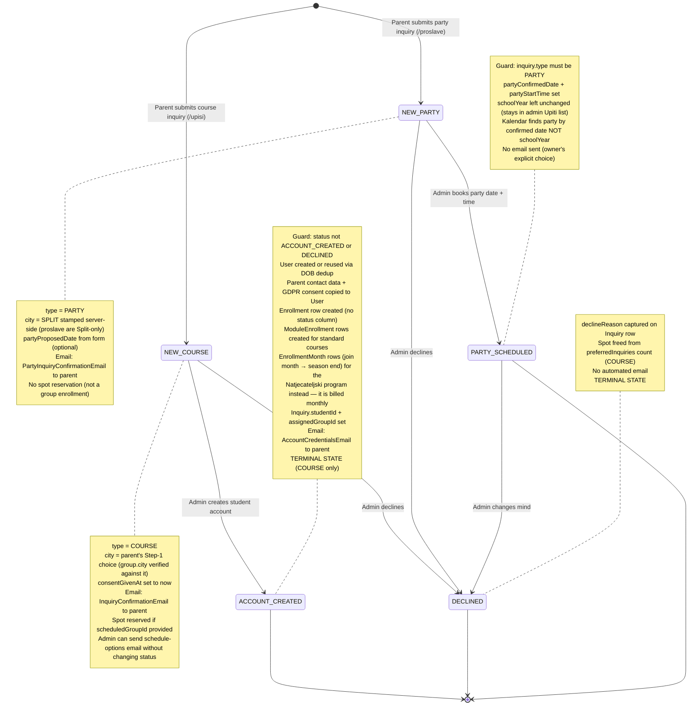

### Transition table

| From | To | Action | Guard | Side effects |
|------|-----|--------|-------|-------------|
| — | `NEW` | `submitInquiry` / `submitPartyInquiry` | Zod validation; COURSE: `group.city === submitted city`; COURSE **without** `scheduledGroupId`: `!isTerminRequired(programs, grade, courseId)` | Inquiry created with `city`; confirmation email; spot reserved if group selected (COURSE) |
| `NEW` | `ACCOUNT_CREATED` | `createStudentFromInquiry` | `status !== ACCOUNT_CREATED && status !== DECLINED`; `type === COURSE` | User + Enrollment + ModuleEnrollments; credentials email; `studentId` + `assignedGroupId` set |
| `NEW` | `PARTY_SCHEDULED` | `schedulePartyInquiry` | `type === PARTY` | `partyConfirmedDate` + `partyStartTime` set; appears on Kalendar |
| `NEW` | `DECLINED` | `declineInquiry` | Zod (reason min 3 trimmed, max 2000) | `declineReason` persisted; spot freed |
| `PARTY_SCHEDULED` | `DECLINED` | `declineInquiry` | — (no status guard on decline) | `declineReason` persisted |

### Non-status actions

| Action | When | Side effects |
|--------|------|-------------|
| `sendScheduleOptions` | Status `NEW` only | Fetches selected groups + sends schedule email. No DB writes, status stays `NEW`. Can be called multiple times. |

### Deletion

- `deleteInquiry` has no status guard — can delete at any status.
- Does NOT cascade to `User` or `Enrollment` if already created.

---

## 2. Spot Reservation and Availability

Spot math differs between standard courses (module-scoped) and radionice (group-scoped).

### Standard course (module-scoped)

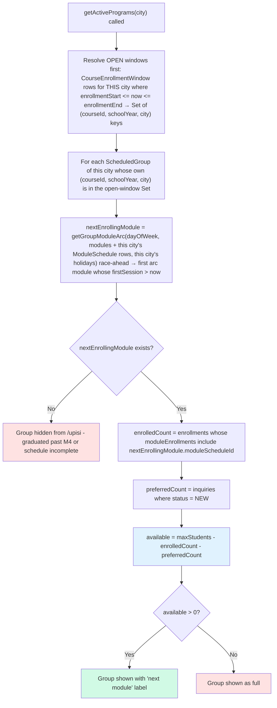

### Radionica (group-scoped, `course.isCustom`)

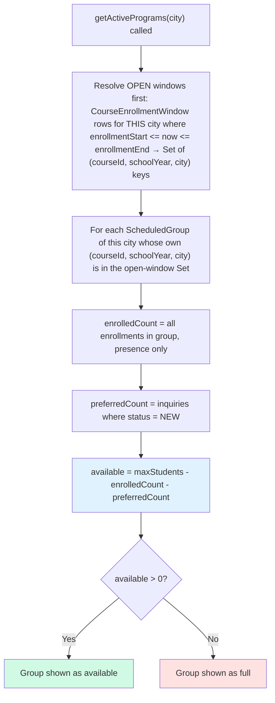

### When spots change

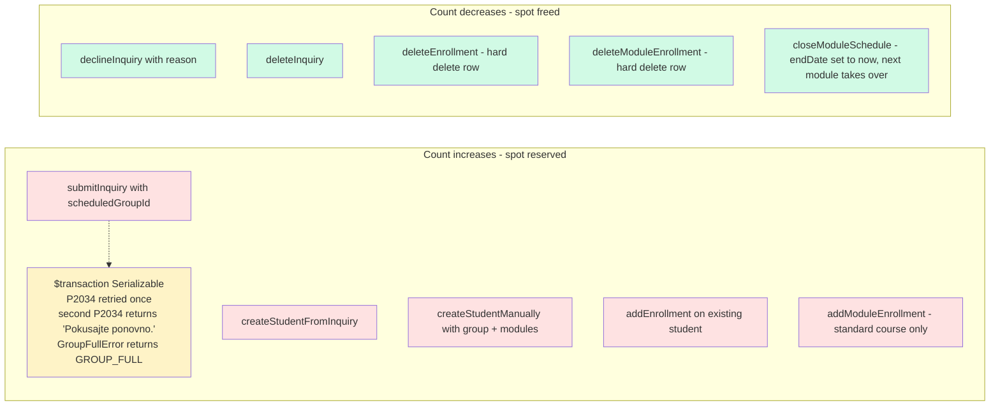

> The preferred-inquiry count is `status === NEW` only. When an inquiry transitions to `ACCOUNT_CREATED` (or `DECLINED`) it stops counting as a preferred inquiry; the new enrollment takes over the slot so the net count stays the same.

### Capacity guard pattern (write path)

Every action that can take a spot routes through the shared guard in `src/lib/group-capacity.ts`. The guard runs the mutation inside a `Serializable` transaction, re-checks capacity from inside that same snapshot, and throws `GroupFullError` rather than over-booking.

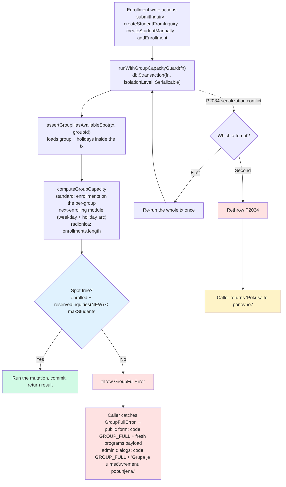

> `GroupFullError` is a domain signal, **not** a serialization failure — it propagates straight to the caller and is never retried. Only Prisma `P2034` (Serializable write-write conflict) triggers the single re-run; a second `P2034` is rethrown for the caller to surface as a generic retry message.

### Termin is conditionally mandatory (pre-transaction gate)

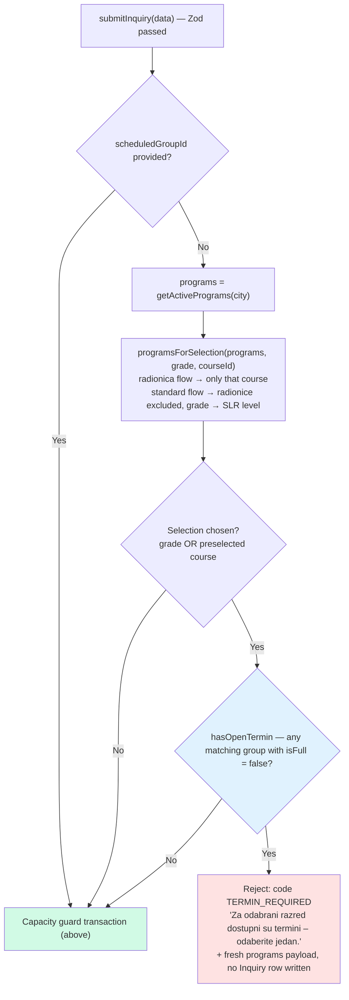

> Source: `isTerminRequired` / `programsForSelection` / `hasOpenTermin` in `src/lib/inquiry-availability.ts`, called from `submitInquiry` **before** `runWithGroupCapacityGuard`. It is the server mirror of the client's conditional requirement, so a stale or tampered payload can't skip the choice. When no enrolment window is open, or every matching group is full, the termin stays **optional** — a general "leave your details" inquiry still goes through. `courseId` is only sent in the radionica/preselected flow, so it maps to the same `preselectedCourseId` argument the client uses.
>
> The public result union therefore carries **two** codes — `code: 'GROUP_FULL' | 'TERMIN_REQUIRED'` — and both ship a fresh `programs[]` so the form re-renders live availability rather than acting on the stale list the visitor submitted against.

---

## 3. Student Deduplication

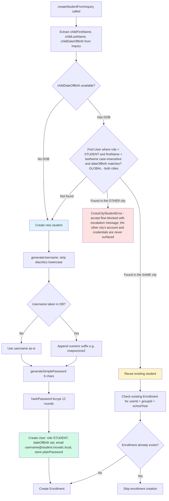

---

## 4. Grade-to-Level Mapping and Group Filtering

> Step 3 renders only the **Step-1 city's** programs/groups (`programsByCity` payload; changing the city clears any stale course/group selection). Grade filtering below then applies within that city.
>
> The mapping is a single source of truth: `GRADE_TO_LEVEL` in `src/lib/inquiry-availability.ts`, shared by the client dropdown filter and the server-side `TERMIN_REQUIRED` gate in §2 — so the two can't drift apart.

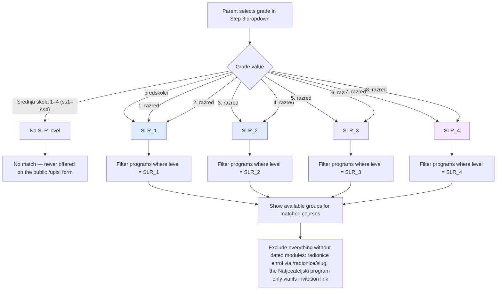

### Grade changes reset group selection

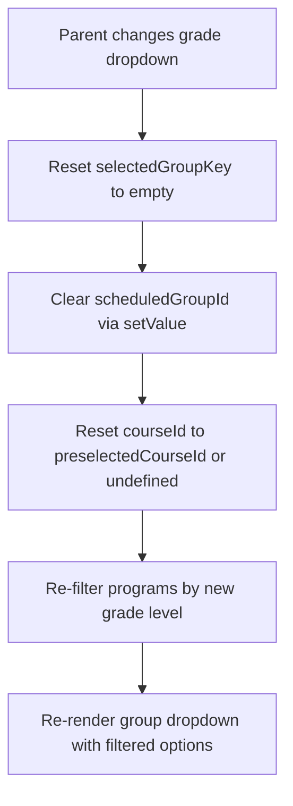

### Workshop / Radionica form

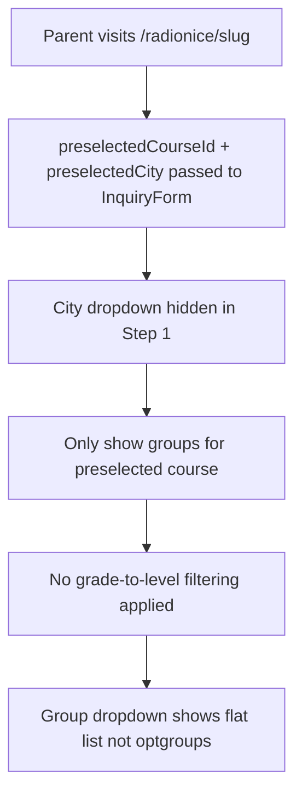

### Per-program signup link (`/upisi/<slug>`)

The link you send when the program is already decided — a returning student
moving up a level, or a competitor invited into the Natjecateljski program. It
deliberately **bypasses §4's grade→level rule**: last year's SLR 1 group moves
on to SLR 2 whatever their razred says. `/upisi` itself is unchanged.

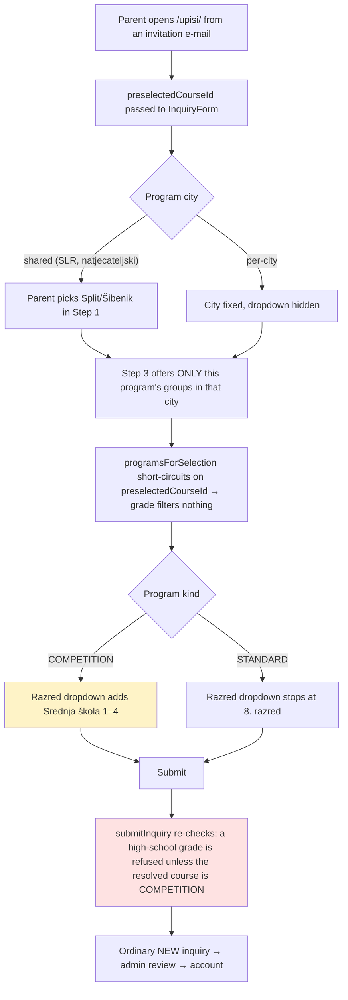

---

## 5. Enrollment Window Logic

The signup window lives on `CourseEnrollmentWindow(courseId, schoolYear, city)` — one row per program per school year **per city** (each city opens the shared program independently), inherited by every group of that program/year/city.

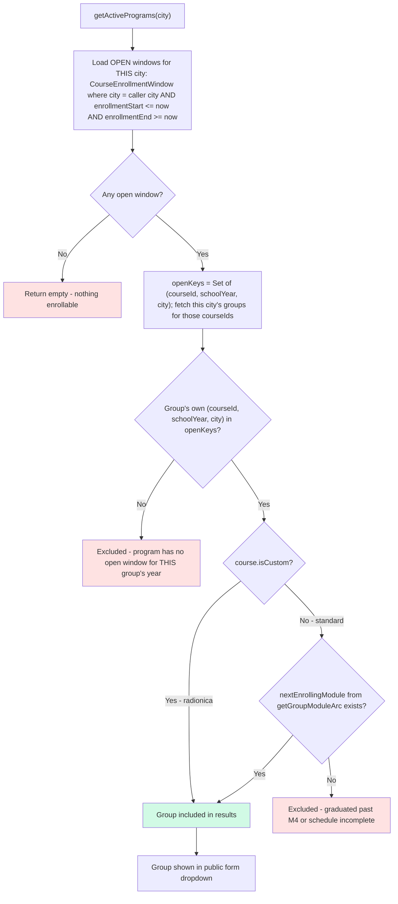

> A window counts as open only when **both** `enrollmentStart` and `enrollmentEnd` are set and `now` falls inside the range. No `CourseEnrollmentWindow` row for a `(course, year, city)` — or one outside the range — hides every group of that program/year in that city; a Split window never exposes Šibenik groups or vice versa. There is no "always open" shortcut.
>
> The standard-course second gate is the per-group race-ahead arc (`getGroupModuleArc` → next-enrolling module), not a raw `ModuleSchedule.startDate > now` check. Closing the running module early (`closeModuleSchedule` sets `endDate = today`) reshapes the arc so a later module becomes the next-enrolling one.

---

## 6. sendScheduleOptions Flow

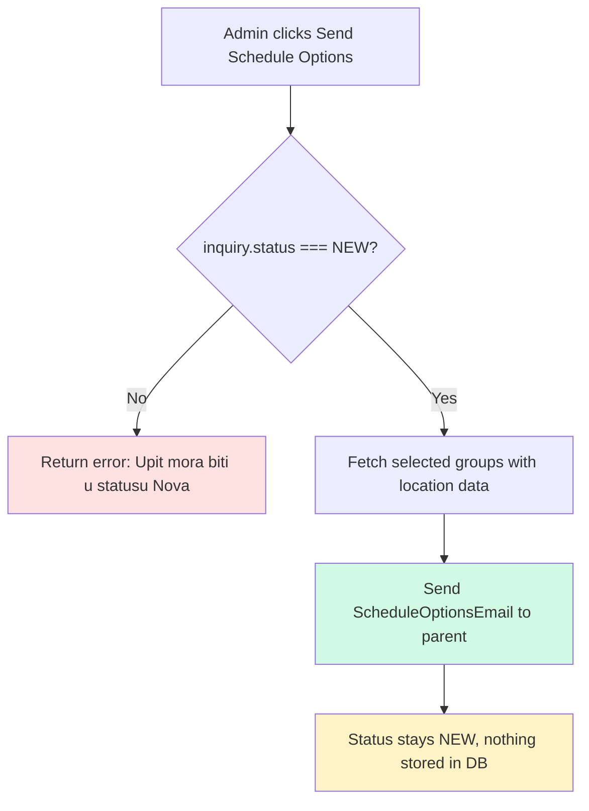

> `sendScheduleOptions` is a pure email action — no database writes. It can be called multiple times. The inquiry's preferred group from the original submission is preserved and preselected when creating an account.

---

## 7. Why there is no Enrollment or ModuleEnrollment state machine

`Enrollment` and `ModuleEnrollment` are presence rows — a student is "in" a group/module iff the row exists. Both models dropped their `status` columns in migration `20260415000000_drop_enrollment_statuses`.

- **`ModuleEnrollment`** — to remove a student from a module, delete the row. Removing module N does **not** cascade to N+1, N+2 — each row is an independent fact.
- **A module is "done"** when `ModuleSchedule.endDate < now`. No per-enrollment status update needed — every `ModuleEnrollment` for that schedule is automatically treated as past once the date is past.
- **`Enrollment`** — a group-membership row per school year. No status, no lifecycle. Deleting it (`onDelete: Cascade`) removes its `ModuleEnrollment` rows.
- **Cancellations are deletes.** For a radionica: `deleteEnrollment`. For a single module in a standard course: `deleteModuleEnrollment`.
- **History is whatever rows still exist.** Past `ModuleEnrollment` rows stay in the DB as the record of what the student participated in. There is no "COMPLETED" status to set.

---

## 8. End-to-End Enrollment Sequence

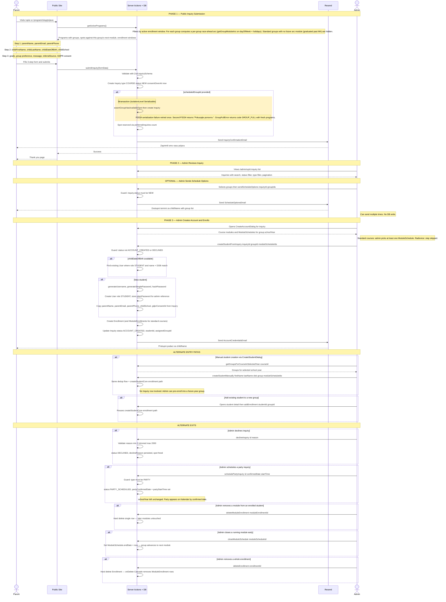

> The "available spots" number for standard courses comes from the **next-starting** module (first module by `sortOrder` whose arc has a future first session for that group's weekday), not the currently-running module.

---

## 9. What is NOT in this pipeline — `/stem-edukacija`

The B2B institutional inquiry form (`submitStemEducationInquiry`, `src/actions/stem-education.ts`) is **email-only**. It writes nothing to the database — no `Inquiry` row, no status, no state machine, no spot reservation, no `city` stamp. The notification email to the association inbox is the record (owner decision 2026-07-25), which is why it is documented here as an explicit carve-out rather than left for a reader to hunt for.

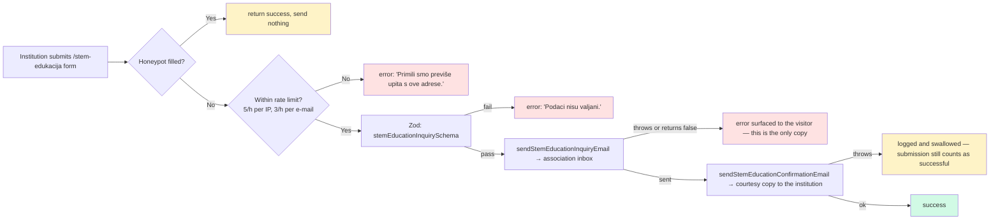

> The asymmetric error handling is deliberate: a failed **notification** loses the inquiry, so the visitor must see it; a failed **confirmation** loses nothing. Note the notification sender returning `false` (meaning `RESEND_API_KEY` is unset) is treated exactly like a throw — otherwise an unset key in production would destroy the inquiry while telling the visitor it arrived.
>
> Because the action is public, unauthenticated and mail-triggering, it is throttled per IP and per submitted address, with a honeypot field that reports success while sending nothing. Sources: `src/lib/rate-limit.ts`, `src/lib/validators/stem-education.ts`.
