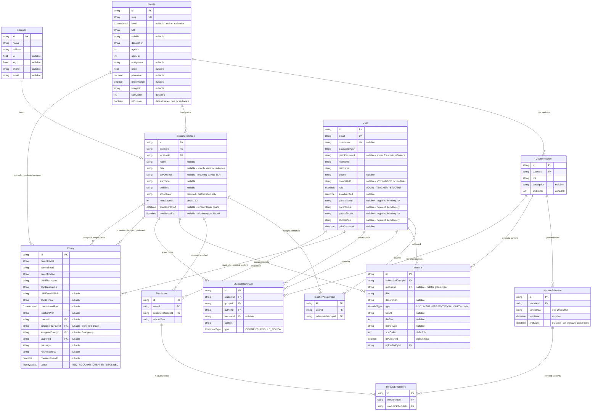

# Entity-Relationship Diagram — Enrollment Flow

## Enums

| Enum | Values |
|------|--------|
| UserRole | `ADMIN`, `TEACHER`, `STUDENT` |
| CourseLevel | `SLR_1`, `SLR_2`, `SLR_3`, `SLR_4` |
| InquiryStatus | `NEW`, `ACCOUNT_CREATED`, `DECLINED` |
| CommentType | `COMMENT`, `MODULE_REVIEW` |
| MaterialType | `DOCUMENT`, `PRESENTATION`, `VIDEO`, `LINK` |

> There are no `EnrollmentStatus` / `ModuleEnrollmentStatus` enums. Presence of a row means the student is in the group/module; deletion is the only way out.

## Key Relationships

| Relationship | Description |
|-------------|-------------|
| Course → CourseModule | One course has many modules (the template) |
| CourseModule → ModuleSchedule | One template module has one schedule per `schoolYear` (historized instance) |
| Course → ScheduledGroup | One course has many groups - time slots |
| ScheduledGroup → Location | Each group meets at one location |
| ScheduledGroup → TeacherAssignment → User | Teachers assigned to groups - many-to-many |
| Inquiry → Course | Parent preferred program - optional |
| Inquiry.scheduledGroupId → ScheduledGroup | Parent preferred group from form - reserves spot |
| Inquiry.assignedGroupId → ScheduledGroup | Admin final group assignment - set on account creation |
| Inquiry → User | Student account created from this inquiry |
| User → Enrollment → ScheduledGroup | Student enrolled in group for a school year |
| Enrollment → ModuleEnrollment → ModuleSchedule | Per-module opt-in within a group enrollment |
| CourseModule → Material | Template-level material (inherited across years) |
| ScheduledGroup → Material | Group-level material (one cohort only) |

## Unique Constraints

| Model | Constraint |
|-------|-----------|
| User.email | unique |
| User.username | unique (nullable) |
| Course.slug | unique |
| ModuleSchedule | `(moduleId, schoolYear)` |
| Enrollment | `(userId, scheduledGroupId, schoolYear)` |
| ModuleEnrollment | `(enrollmentId, moduleScheduleId)` |
| TeacherAssignment | `(userId, scheduledGroupId)` |

## Schedule Pattern

- **Standard SLR courses**: `dayOfWeek` + `startTime`/`endTime` for recurring weekly schedule
- **Radionice - workshops**: `date` + `startTime`/`endTime` for specific one-off dates

## Activity Rules

- A `ScheduledGroup` appears on `/upisi` iff it has an **active enrollment window** (`enrollmentStart <= now` AND (`enrollmentEnd IS NULL` OR `enrollmentEnd >= now`)). Groups with both null are hidden.
- For **standard courses**, the group must also have a **next-starting** `ModuleSchedule` for its own `schoolYear` — the first module (by `sortOrder`) whose `startDate > now`. If every module has already started, the group is hidden until an admin either closes the running module (sets `endDate = now`) or a future module's `startDate` crosses into the future again.
- `ScheduledGroup.schoolYear` is **historical metadata only** — it is not used to filter what the public form shows. An admin can create a group for a future year and it will appear as soon as its enrollment window opens.
- An `Enrollment` row means "this student is in this group for this school year". To cancel a radionica enrollment, delete the row.
- A `ModuleEnrollment` row means "this student is taking this module instance". To remove a student from a module, delete the row. Cascading to later modules is **not** automatic — each module row must be deleted individually.
- A module is "done" when `ModuleSchedule.endDate < now`, either because the date naturally passed or because a teacher manually set `endDate = now` via `closeModuleSchedule`.
