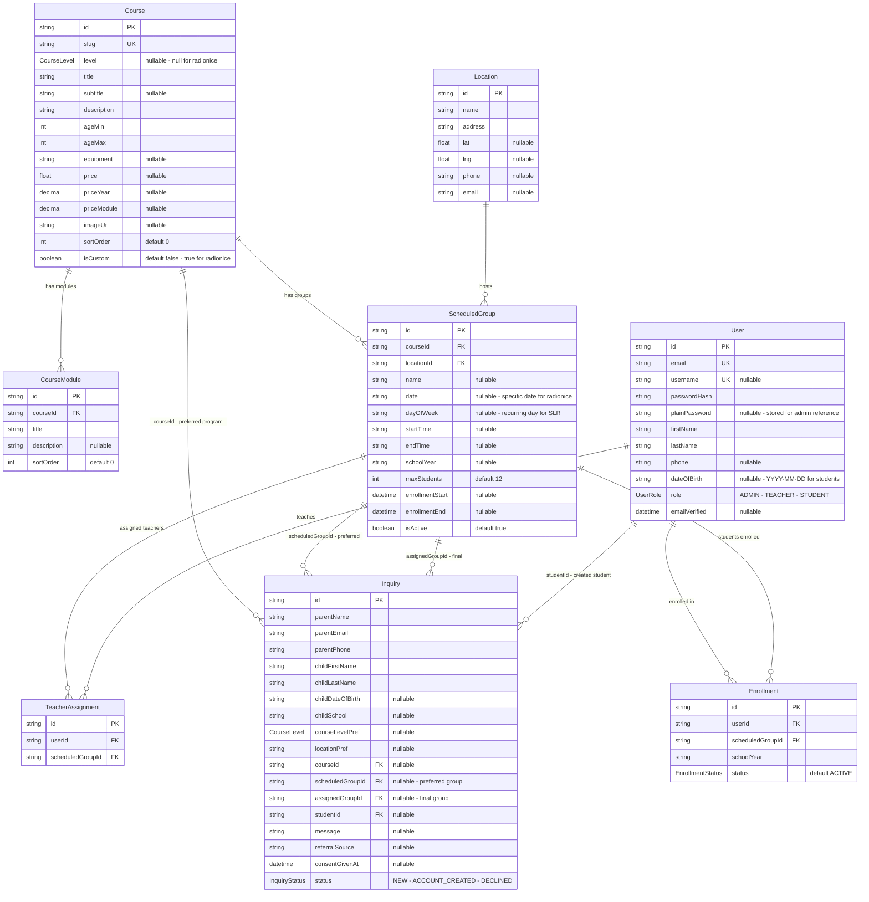

# Entity-Relationship Diagram — Enrollment Flow

## Enums

| Enum | Values |
|------|--------|
| UserRole | `ADMIN`, `TEACHER`, `STUDENT` |
| CourseLevel | `SLR_1`, `SLR_2`, `SLR_3`, `SLR_4` |
| InquiryStatus | `NEW`, `ACCOUNT_CREATED`, `DECLINED` |
| EnrollmentStatus | `PENDING`, `ACTIVE`, `COMPLETED`, `CANCELLED` |

## Key Relationships

| Relationship | Description |
|-------------|-------------|
| Course → CourseModule | One course has many modules |
| Course → ScheduledGroup | One course has many groups - time slots |
| ScheduledGroup → Location | Each group meets at one location |
| ScheduledGroup → TeacherAssignment → User | Teachers assigned to groups - many-to-many |
| Inquiry → Course | Parent preferred program - optional |
| Inquiry.scheduledGroupId → ScheduledGroup | Parent preferred group from form - reserves spot |
| Inquiry.assignedGroupId → ScheduledGroup | Admin final group assignment - set on account creation |
| Inquiry → User | Student account created from this inquiry |
| User → Enrollment → ScheduledGroup | Student enrolled in group for a school year |
| Enrollment unique constraint | userId + scheduledGroupId + schoolYear |
| InquiryGroupOption unique constraint | inquiryId + scheduledGroupId |
| TeacherAssignment unique constraint | userId + scheduledGroupId |

## Schedule Pattern

- **Standard SLR courses**: `dayOfWeek` + `startTime`/`endTime` for recurring weekly schedule
- **Radionice - workshops**: `date` + `startTime`/`endTime` for specific one-off dates
