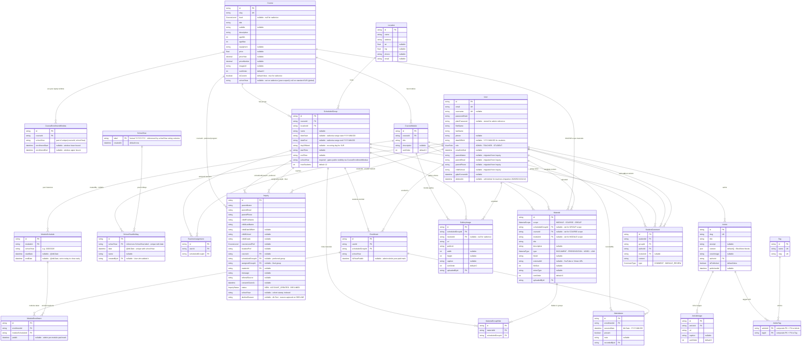

# Entity-Relationship Diagram

```mermaid
erDiagram
    Course {
        string id PK
        string slug UK
        CourseLevel level "nullable - null for radionice"
        string title
        string subtitle "nullable"
        string description
        int ageMin
        int ageMax
        string equipment "nullable"
        float price "nullable"
        decimal priceYear "nullable"
        decimal priceModule "nullable"
        string imageUrl "nullable"
        int sortOrder "default 0"
        boolean isCustom "default false - true for radionice"
        string schoolYear "nullable - set on radionice (year-scoped); null on standard SLR (global)"
    }

    CourseEnrollmentWindow {
        string id PK
        string courseId FK
        string schoolYear "part of unique(courseId, schoolYear)"
        datetime enrollmentStart "nullable - window lower bound"
        datetime enrollmentEnd "nullable - window upper bound"
    }

    CourseModule {
        string id PK
        string courseId FK
        string title
        string description "nullable"
        int sortOrder "default 0"
    }

    ModuleSchedule {
        string id PK
        string moduleId FK
        string schoolYear "e.g. 2025/2026"
        datetime startDate "nullable - @db.Date"
        datetime endDate "nullable - @db.Date; set to today to close early"
    }

    SchoolYear {
        string label PK "format YYYY/YYYY - referenced by schoolYear string columns"
        datetime createdAt "default now"
    }

    SchoolYearHoliday {
        string id PK
        string schoolYear FK "references SchoolYear.label - unique with date"
        datetime date "@db.Date - unique with schoolYear"
        string name "nullable"
        string createdById FK "nullable - User who added it"
    }

    Location {
        string id PK
        string name
        string address
        float lat "nullable"
        float lng "nullable"
        string phone "nullable"
        string email "nullable"
    }

    ScheduledGroup {
        string id PK
        string courseId FK
        string locationId FK
        string name "nullable"
        string dateStart "nullable - radionica range start YYYY-MM-DD"
        string dateEnd "nullable - radionica range end YYYY-MM-DD"
        string dayOfWeek "nullable - recurring day for SLR"
        string startTime "nullable"
        string endTime "nullable"
        string schoolYear "required - gates public visibility via CourseEnrollmentWindow"
        int maxStudents "default 12"
    }

    TeacherAssignment {
        string id PK
        string userId FK
        string scheduledGroupId FK
    }

    Inquiry {
        string id PK
        string parentName
        string parentEmail
        string parentPhone
        string childFirstName
        string childLastName
        string childDateOfBirth "nullable"
        string childSchool "nullable"
        string childGrade "nullable"
        CourseLevel courseLevelPref "nullable"
        string locationPref "nullable"
        string courseId FK "nullable"
        string scheduledGroupId FK "nullable - preferred group"
        string assignedGroupId FK "nullable - final group"
        string studentId FK "nullable"
        string message "nullable"
        string referralSource "nullable"
        datetime consentGivenAt "nullable"
        InquiryStatus status "NEW - ACCOUNT_CREATED - DECLINED"
        string schoolYear "nullable - cohort stamp; indexed"
        string declineReason "nullable - db.Text - reason captured on DECLINE"
    }

    User {
        string id PK
        string email UK
        string username UK "nullable"
        string passwordHash
        string plainPassword "nullable - stored for admin reference"
        string firstName
        string lastName
        string phone "nullable"
        string dateOfBirth "nullable - YYYY-MM-DD for students"
        UserRole role "ADMIN - TEACHER - STUDENT"
        datetime emailVerified "nullable"
        string parentName "nullable - migrated from Inquiry"
        string parentEmail "nullable - migrated from Inquiry"
        string parentPhone "nullable - migrated from Inquiry"
        string childSchool "nullable - migrated from Inquiry"
        datetime gdprConsentAt "nullable"
        datetime deletedAt "nullable - soft-delete for teachers (migration 20260513101212)"
    }

    Enrollment {
        string id PK
        string userId FK
        string scheduledGroupId FK
        string schoolYear
        datetime fullYearPaidAt "nullable - admin whole-year paid mark"
    }

    ModuleEnrollment {
        string id PK
        string enrollmentId FK
        string moduleScheduleId FK
        datetime paidAt "nullable - admin per-module paid mark"
    }

    Material {
        string id PK
        MaterialScope scope "MODULE - COURSE - GROUP"
        string scheduledGroupId FK "nullable - set for GROUP scope"
        string courseId FK "nullable - set for COURSE scope"
        string moduleId FK "nullable - set for MODULE scope"
        string title
        string description "nullable"
        MaterialType type "DOCUMENT - PRESENTATION - VIDEO - LINK"
        string fileUrl "nullable"
        string externalUrl "nullable - YouTube or Vimeo URL"
        int fileSize "nullable"
        string mimeType "nullable"
        int sortOrder "default 0"
        string uploadedById FK
    }

    MaterialGroupHide {
        string id PK
        string materialId FK
        string scheduledGroupId FK
    }

    GalleryImage {
        string id PK
        string scheduledGroupId FK
        string moduleId FK "nullable - null for radionice"
        string url
        string publicId
        int width "nullable"
        int height "nullable"
        string caption "nullable"
        int sortOrder "default 0"
        string uploadedById FK
    }

    Attendance {
        string id PK
        string enrollmentId FK
        datetime sessionDate "db.Date - YYYY-MM-DD"
        boolean present
        string note "nullable"
        string recordedById FK
    }

    Article {
        string id PK
        string slug UK
        string title
        string excerpt "nullable"
        json content "default [] - BlockNote blocks"
        string coverImage "nullable"
        string authorId FK
        boolean isPublished "default false"
        datetime publishedAt "nullable"
    }

    ArticleImage {
        string id PK
        string articleId FK
        string url
        string caption "nullable"
        int sortOrder "default 0"
    }

    Tag {
        string id PK
        string name UK
        string slug UK
    }

    ArticleTag {
        string articleId PK "composite PK + FK to Article"
        string tagId PK "composite PK + FK to Tag"
    }

    StudentComment {
        string id PK
        string studentId FK
        string groupId FK
        string authorId FK
        string moduleId FK "nullable"
        string content
        CommentType type "COMMENT - MODULE_REVIEW"
    }

    Course ||--o{ CourseModule : "has modules"
    Course ||--o{ ScheduledGroup : "has groups"
    Course ||--o{ CourseEnrollmentWindow : "per-year signup window"
    Location ||--o{ ScheduledGroup : "hosts"

    CourseModule ||--o{ ModuleSchedule : "year instances"
    CourseModule ||--o{ Material : "MODULE scope content"
    CourseModule ||--o{ GalleryImage : "module gallery"
    CourseModule ||--o{ StudentComment : "template reviews"

    ScheduledGroup ||--o{ TeacherAssignment : "assigned teachers"
    ScheduledGroup ||--o{ Enrollment : "students enrolled"
    ScheduledGroup ||--o{ Material : "GROUP scope materials"
    ScheduledGroup ||--o{ MaterialGroupHide : "hides materials"
    ScheduledGroup ||--o{ GalleryImage : "gallery photos"
    ScheduledGroup ||--o{ StudentComment : "group notes"

    Course ||--o{ Material : "COURSE scope materials"
    Material ||--o{ MaterialGroupHide : "hidden in groups"

    User ||--o{ TeacherAssignment : "teaches"
    User ||--o{ Material : "uploaded"
    User ||--o{ GalleryImage : "uploaded"
    User ||--o{ Article : "author"
    User ||--o{ Attendance : "recordedBy"
    User ||--o{ StudentComment : "authored"
    User ||--o{ StudentComment : "about student"
    User ||--o{ SchoolYearHoliday : "createdBy - nullable"

    SchoolYear ||--o{ SchoolYearHoliday : "year holidays"

    Course ||--o{ Inquiry : "courseId - preferred program"
    ScheduledGroup ||--o{ Inquiry : "scheduledGroupId - preferred"
    ScheduledGroup ||--o{ Inquiry : "assignedGroupId - final"
    User ||--o{ Inquiry : "studentId - created student"

    User ||--o{ Enrollment : "enrolled in"
    Enrollment ||--o{ ModuleEnrollment : "modules taken"
    Enrollment ||--o{ Attendance : "attendance records"
    ModuleSchedule ||--o{ ModuleEnrollment : "enrolled students"

    Article ||--o{ ArticleImage : "inline images"
    Article ||--o{ ArticleTag : "tagged with"
    Tag ||--o{ ArticleTag : "articles"
```

## Enums

| Enum | Values |
|------|--------|
| UserRole | `ADMIN`, `TEACHER`, `STUDENT` |
| CourseLevel | `SLR_1`, `SLR_2`, `SLR_3`, `SLR_4` |
| InquiryStatus | `NEW`, `ACCOUNT_CREATED`, `DECLINED` |
| CommentType | `COMMENT`, `MODULE_REVIEW` |
| MaterialType | `DOCUMENT`, `PRESENTATION`, `VIDEO`, `LINK`, `ROBOCAMP` |
| MaterialScope | `MODULE`, `COURSE`, `GROUP` |

> There are no `EnrollmentStatus` / `ModuleEnrollmentStatus` enums. Presence of a row means the student is in the group/module; deletion is the only way out.

## Key Relationships

| Relationship | Description |
|-------------|-------------|
| Course → CourseModule | One course has many modules (the template) |
| CourseModule → ModuleSchedule | One template module has one schedule per `schoolYear` (historized instance) |
| Course → ScheduledGroup | One course has many groups - time slots |
| ScheduledGroup → Location | Each group meets at one location |
| ScheduledGroup → TeacherAssignment → User | Teachers assigned to groups - many-to-many |
| Inquiry → Course | Parent preferred program - optional |
| Inquiry.scheduledGroupId → ScheduledGroup | Parent preferred group from form - reserves spot |
| Inquiry.assignedGroupId → ScheduledGroup | Admin final group assignment - set on account creation |
| Inquiry → User | Student account created from this inquiry |
| User → Enrollment → ScheduledGroup | Student enrolled in group for a school year |
| Enrollment → ModuleEnrollment → ModuleSchedule | Per-module opt-in within a group enrollment |
| Material.scope → MODULE / COURSE / GROUP | Discriminated union - exactly one FK populated per scope |
| Material → MaterialGroupHide → ScheduledGroup | Per-group visibility override for MODULE/COURSE-scoped materials |
| ScheduledGroup → GalleryImage → CourseModule | Images scoped to group; `moduleId` required for standard programs, null for radionice |
| Enrollment → Attendance | One attendance record per session date per enrollment. Session dates are derived, not stored. |
| User → Article | Author relation for news articles |
| Course → CourseEnrollmentWindow | Per-`(course, schoolYear)` public signup window. Every group of that program/year inherits it; replaces the old per-group `enrollmentStart/End`. |
| SchoolYear → SchoolYearHoliday | Per-year non-class days (holidays, breaks, ad-hoc closures). Excluded from `computeExpectedSessions` / `computeRadionicaSessions`. `SchoolYearHoliday.schoolYear` is a real Prisma FK to `SchoolYear.label` (`onDelete: Cascade`). |
| User → SchoolYearHoliday | `createdBy` relation (nullable) — admin who added the holiday. |
| SchoolYear | Standalone registry of valid year labels (`YYYY/YYYY`). The `schoolYear` string columns on `ScheduledGroup`, `ModuleSchedule`, `Enrollment`, `Inquiry`, `Course` (radionice) and `CourseEnrollmentWindow` reference `SchoolYear.label` by string with **no** Prisma FK relation; only `SchoolYearHoliday.schoolYear` is a true FK. |

## Unique Constraints

| Model | Constraint |
|-------|-----------|
| User.email | unique |
| User.username | unique (nullable) |
| Course.slug | unique |
| Article.slug | unique |
| Tag.name | unique |
| Tag.slug | unique |
| ModuleSchedule | `(moduleId, schoolYear)` |
| CourseEnrollmentWindow | `(courseId, schoolYear)` |
| SchoolYearHoliday | `(schoolYear, date)` |
| Enrollment | `(userId, scheduledGroupId, schoolYear)` |
| ModuleEnrollment | `(enrollmentId, moduleScheduleId)` |
| TeacherAssignment | `(userId, scheduledGroupId)` |
| MaterialGroupHide | `(materialId, scheduledGroupId)` |
| Attendance | `(enrollmentId, sessionDate)` |
| ArticleTag | `(articleId, tagId)` composite PK |

## Indexes (non-unique)

| Model | Indexes |
|-------|---------|
| Inquiry | `scheduledGroupId`, `status`, `assignedGroupId`, `courseId`, `studentId`, `schoolYear` |
| CourseEnrollmentWindow | `schoolYear` |
| SchoolYearHoliday | `schoolYear` |
| Material | `(scope, moduleId)`, `(scope, courseId)`, `(scope, scheduledGroupId)` |
| GalleryImage | `(scheduledGroupId, moduleId, sortOrder)` |
| Attendance | `sessionDate` |

## Schedule Pattern

- **Standard SLR courses**: `dayOfWeek` + `startTime`/`endTime` for recurring weekly schedule
- **Radionice - workshops**: `dateStart`/`dateEnd` + `startTime`/`endTime` — a closed day range that runs every (non-Sunday, non-holiday) day at the same time

## Activity Rules

- A `ScheduledGroup` appears on `/upisi` iff its program has an **open `CourseEnrollmentWindow` for the group's own `schoolYear`** — a row keyed `(courseId, schoolYear)` with both dates set and `enrollmentStart <= now <= enrollmentEnd`. No window row for that `(course, year)`, or one outside the range, hides every group of that program/year. The window moved off `ScheduledGroup` (the old `enrollmentStart/End` columns were dropped).
- For **standard courses**, the group must also have a **next-enrolling module** — `getGroupModuleArc` race-aheads from the school-year kickoff (M1 `startDate`) using the group's `dayOfWeek` + holiday set, and `getActiveModuleForGroup` returns the first arc module whose first session is still in the future. If the arc has run out of future modules (graduated past M4, or schedule incomplete) the group is hidden from the public form.
- `ScheduledGroup.schoolYear` **is** part of the public-visibility filter: `getActivePrograms` only keeps a group when an open window exists for that group's exact `(courseId, schoolYear)`. (It remains historization metadata for `ModuleSchedule` / `ModuleEnrollment` / `StudentComment` too.)
- An `Enrollment` row means "this student is in this group for this school year". To cancel a radionica enrollment, delete the row. `fullYearPaidAt` is the admin "whole school year paid" mark.
- A `ModuleEnrollment` row means "this student is taking this module instance". To remove a student from a module, delete the row. Cascading to later modules is **not** automatic — each module row must be deleted individually. `paidAt` is the admin per-module paid mark.
- A module is "done" when `ModuleSchedule.endDate < now`, either because the date naturally passed or because a teacher manually set `endDate = now` via `closeModuleSchedule`.
