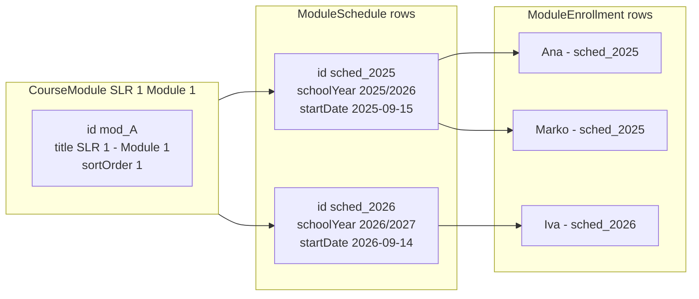

# Entity-Relationship Diagram


```mermaid
erDiagram
    Course {
        string id PK
        string slug UK
        CourseLevel level "nullable - null for radionice and the competition program"
        string title
        string subtitle "nullable"
        string description
        int ageMin
        int ageMax
        string equipment "nullable"
        float price "nullable"
        string imageUrl "nullable"
        int sortOrder "default 0"
        ProgramKind kind "STANDARD - RADIONICA - COMPETITION, default STANDARD - the authoritative discriminator"
        boolean isCustom "legacy write-only mirror of kind = RADIONICA, kept in sync on write - read by no application code"
        string schoolYear "nullable - set on radionice (year-scoped); null on standard SLR + competition (global)"
        City city "nullable - null on shared standard SLR + competition; set on per-city radionice"
    }

    CourseEnrollmentWindow {
        string id PK
        string courseId FK
        string schoolYear "part of unique(courseId, schoolYear, city)"
        City city "each city opens the shared program independently"
        datetime enrollmentStart "nullable - window lower bound"
        datetime enrollmentEnd "nullable - window upper bound"
    }

    CourseSeason {
        string id PK
        string courseId FK
        string schoolYear "part of unique(courseId, schoolYear, city)"
        City city "each city runs the competition season on its own dates"
        datetime startDate "nullable - @db.Date season lower bound"
        datetime endDate "nullable - @db.Date season upper bound"
    }

    TrialWeek {
        string id PK
        string schoolYear "part of unique(schoolYear, city)"
        City city "each city picks its own probni-sat week"
        datetime startDate "@db.Date - NOT NULL, unlike CourseSeason's: a half-set week is not a week"
        datetime endDate "@db.Date - NOT NULL; upsertTrialWeek refuses a span over 7 days"
    }

    CourseGradeRule {
        string id PK
        string courseId FK
        string schoolYear "part of unique(courseId, schoolYear, city)"
        City city "each city offers the shared program to its own razredi"
        string grades "String[] - ELEMENTARY_GRADE_VALUES ('predskolci' - '1'…'8'), the same values Inquiry.childGrade stores; an EMPTY array is the explicit 'offered to nobody' and an ABSENT ROW means 'use the default ladder'"
    }

    CourseModule {
        string id PK
        string courseId FK
        string title
        string description "nullable"
        int sortOrder "default 0"
    }

    ModuleSchedule {
        string id PK
        string moduleId FK
        string schoolYear "e.g. 2025/2026"
        City city "per-city planner rows for the shared curriculum"
        datetime startDate "nullable - @db.Date"
        datetime endDate "nullable - @db.Date; set to today to close early"
    }

    SchoolYear {
        string label PK "format YYYY/YYYY - referenced by schoolYear string columns"
        datetime createdAt "default now"
    }

    SchoolYearHoliday {
        string id PK
        string schoolYear FK "references SchoolYear.label - unique with (city, date)"
        City city "per-city holiday calendars"
        datetime date "@db.Date - unique with (schoolYear, city)"
        string name "nullable"
        string createdById FK "nullable - User who added it"
    }

    Location {
        string id PK
        string name
        string address
        string phone "nullable"
        string email "nullable"
        City city "canonical venue-to-city map; unique(id, city) backs the composite FK"
    }

    ScheduledGroup {
        string id PK
        string courseId FK
        string locationId FK "composite FK (locationId, city) to Location(id, city)"
        City city "denormalized from the venue - drift impossible at DB level"
        string name "nullable"
        string dateStart "nullable - radionica range start YYYY-MM-DD"
        string dateEnd "nullable - radionica range end YYYY-MM-DD"
        string dayOfWeek "nullable - recurring day for SLR"
        string startTime "nullable"
        string endTime "nullable"
        string schoolYear "required - gates public visibility via CourseEnrollmentWindow"
        int maxStudents "default 12"
    }

    TeacherAssignment {
        string id PK
        string userId FK
        string scheduledGroupId FK
    }

    Inquiry {
        string id PK
        InquiryType type "COURSE - PARTY - default COURSE"
        string parentName
        string parentEmail
        string parentPhone
        string childFirstName "nullable - null for PARTY"
        string childLastName "nullable - null for PARTY"
        string childDateOfBirth "nullable"
        string childSchool "nullable"
        string childGrade "nullable"
        string courseId FK "nullable"
        string scheduledGroupId FK "nullable - preferred group"
        boolean noSuitableTermin "default false - parent's none-of-the-termini-work answer; mutually exclusive with scheduledGroupId; COMPETITION signup link only"
        string assignedGroupId FK "nullable - final group"
        string studentId FK "nullable"
        string message "nullable"
        string referralSource "nullable"
        datetime partyProposedDate "nullable - PARTY: parent's preferred date"
        datetime partyConfirmedDate "nullable - PARTY: admin-confirmed date"
        string partyStartTime "nullable - PARTY: HH:mm start time"
        datetime consentGivenAt "nullable"
        InquiryStatus status "NEW - PARTY_SCHEDULED - ACCOUNT_CREATED - DECLINED"
        string schoolYear "nullable - submission-year bucket; NOT derived from party dates"
        string declineReason "nullable - db.Text - reason captured on DECLINE"
        City city "required - parent's Step-1 choice; PARTY stamps SPLIT server-side"
    }

    User {
        string id PK
        string email UK
        string username UK "nullable"
        string passwordHash
        string plainPassword "nullable - stored for admin reference"
        string firstName
        string lastName
        string phone "nullable"
        string dateOfBirth "nullable - YYYY-MM-DD for students"
        UserRole role "ADMIN - TEACHER - STUDENT"
        string parentName "nullable - migrated from Inquiry"
        string parentEmail "nullable - migrated from Inquiry"
        string parentPhone "nullable - migrated from Inquiry"
        string childSchool "nullable - migrated from Inquiry"
        int hourlyRateCents "nullable - payout rate in euro CENTS per hour for a TEACHER or teaching ADMIN; admin-only - never selected into a teacher- or student-facing payload"
        datetime credentialsSentAt "nullable - when a CREDENTIALS campaign last mailed working login details. Cleared by resetStudentPassword. Deliberately NOT backfilled: null means not sent BY THIS SYSTEM, never a guess"
        datetime gdprConsentAt "nullable"
        datetime deletedAt "nullable - soft-delete for teachers (migration 20260513101212)"
        City city "tenant - drives session scoping for all three roles"
    }

    Enrollment {
        string id PK
        string userId FK
        string scheduledGroupId FK
        string schoolYear
        datetime fullYearPaidAt "nullable - admin whole-year paid mark"
        datetime contractSignedAt "nullable - Ugovor potpisan. The ONLY enrollment mark a TEACHER may see and set, and only for their own groups in the CURRENT year; an admin is unrestricted, being the correction path"
    }

    EnrollmentMonth {
        string id PK
        string enrollmentId FK
        datetime periodStart "@db.Date first day of the billed month - unique(enrollmentId, periodStart)"
        datetime paidAt "nullable - null = owed once periodStart passes"
    }

    ModuleEnrollment {
        string id PK
        string enrollmentId FK
        string moduleScheduleId FK
        datetime paidAt "nullable - admin per-module paid mark"
    }

    Material {
        string id PK
        MaterialScope scope "MODULE - COURSE - GROUP"
        string scheduledGroupId FK "nullable - set for GROUP scope"
        string courseId FK "nullable - set for COURSE scope"
        string moduleId FK "nullable - set for MODULE scope"
        string title
        string description "nullable"
        MaterialType type "DOCUMENT - PRESENTATION - VIDEO - LINK - ROBOCAMP"
        string fileUrl "nullable"
        string externalUrl "nullable - YouTube or Vimeo URL"
        int fileSize "nullable"
        string mimeType "nullable"
        int sortOrder "default 0"
        string uploadedById FK
    }

    MaterialGroupHide {
        string id PK
        string materialId FK
        string scheduledGroupId FK
    }

    GalleryImage {
        string id PK
        string scheduledGroupId FK
        string moduleId FK "nullable - null for radionice"
        string url
        string publicId
        int width "nullable"
        int height "nullable"
        string caption "nullable"
        int sortOrder "default 0"
        string uploadedById FK
    }

    Attendance {
        string id PK
        string enrollmentId FK
        datetime sessionDate "db.Date - YYYY-MM-DD"
        boolean present
        string note "nullable"
        string recordedById FK
    }

    TeacherAttendance {
        string id PK
        string userId FK "the teacher whose hour this is"
        string scheduledGroupId FK
        datetime sessionDate "db.Date - YYYY-MM-DD"
        boolean present
        string recordedById FK "who typed it in - may differ from userId"
    }

    EmailCampaign {
        string id PK
        City city "tenant - the sending admin's city"
        EmailCampaignKind kind "CUSTOM - REENROLLMENT - EVALUATION - CREDENTIALS"
        string sourceSchoolYear "cohort source year"
        string sourceGroupIds "String[] - audit-only snapshot, no FK; empty in preporuka mode"
        string sourceRecommendations "String[] - preporuka labels; empty in group mode"
        string targetSchoolYear "nullable - REENROLLMENT target year"
        string targetCourseId FK "nullable - SetNull"
        string targetGroupIds "String[] - termini offered; lets a resume rebuild the same boxes"
        string subject
        string bodyText "db.Text"
        string sentById FK
        int sentCount "incremented per recipient while sending"
        int failedCount
        int skippedCount
        int excludedCount
        int totalCount "denominator for progress polling"
        datetime finishedAt "nullable - null while the send is still running"
    }

    EmailCampaignRecipient {
        string id PK
        string campaignId FK
        string parentEmail
        EmailRecipientStatus status "PENDING - SENT - FAILED - ALREADY_SENT - SKIPPED"
        string childNames "String[] - snapshot at send time"
        string assessmentIds "String[] - EVALUATION only: the exact card(s) this row mails, re-verified via assertCardsBelongTo before each send; empty otherwise"
        string failureReason "nullable - why FAILED, or why SKIPPED had no address"
        string sentKey "nullable - invitation idempotency key, set only on SENT"
        datetime sentAt
    }

    Article {
        string id PK
        string slug UK
        string title
        string excerpt "nullable"
        json content "default [] - BlockNote blocks"
        string coverImage "nullable"
        string authorId FK
        boolean isPublished "default false"
        datetime publishedAt "nullable"
        City city "auto-stamped from the author's admin session; public list stays cross-city with badges"
    }

    ArticleImage {
        string id PK
        string articleId FK
        string url
        string caption "nullable"
        int sortOrder "default 0"
    }

    Tag {
        string id PK
        string name UK
        string slug UK
    }

    ArticleTag {
        string articleId PK "composite PK + FK to Article"
        string tagId PK "composite PK + FK to Tag"
    }

    StudentComment {
        string id PK
        string studentId FK
        string groupId FK
        string authorId FK
        string content
    }

    StudentAssessment {
        string id PK
        string studentId FK "unique with groupId - one card per student per group"
        string groupId FK
        string authorId FK
        SkillLevel slaganje "nullable - prakticne vjestine, STANDARD rubric"
        SkillLevel programiranje "nullable - STANDARD rubric"
        SkillLevel razradaIdeja "nullable - COMPETITION rubric"
        SkillLevel izvedivost "nullable - COMPETITION rubric"
        SkillLevel inovacije "nullable - both rubrics"
        SkillLevel suradnja "nullable - timske vjestine"
        SkillLevel komunikacija "nullable"
        SkillLevel zabava "nullable"
        string opisnaOcjena "nullable text"
        RecommendationKind recommendationKind "nullable"
        string recommendedCourseId FK "nullable - SetNull"
    }

    Course ||--o{ CourseModule : "has modules"
    Course ||--o{ ScheduledGroup : "has groups"
    Course ||--o{ CourseEnrollmentWindow : "per-year signup window"
    Course ||--o{ CourseSeason : "per-year COMPETITION season"
    Course ||--o{ CourseGradeRule : "per-year razred override - Cascade"
    Location ||--o{ ScheduledGroup : "hosts"

    CourseModule ||--o{ ModuleSchedule : "year instances"
    CourseModule ||--o{ Material : "MODULE scope content"
    CourseModule ||--o{ GalleryImage : "module gallery"

    ScheduledGroup ||--o{ TeacherAssignment : "assigned teachers"
    ScheduledGroup ||--o{ Enrollment : "students enrolled"
    ScheduledGroup ||--o{ Material : "GROUP scope materials"
    ScheduledGroup ||--o{ MaterialGroupHide : "hides materials"
    ScheduledGroup ||--o{ GalleryImage : "gallery photos"
    ScheduledGroup ||--o{ StudentComment : "group notes"
    ScheduledGroup ||--o{ StudentAssessment : "report cards"

    Course ||--o{ Material : "COURSE scope materials"
    Material ||--o{ MaterialGroupHide : "hidden in groups"

    User ||--o{ TeacherAssignment : "teaches"
    User ||--o{ Material : "uploaded"
    User ||--o{ GalleryImage : "uploaded"
    User ||--o{ Article : "author"
    User ||--o{ Attendance : "recordedBy"
    User ||--o{ StudentComment : "authored"
    User ||--o{ StudentComment : "about student"
    User ||--o{ StudentAssessment : "authored"
    User ||--o{ StudentAssessment : "assessed student"
    Course ||--o{ StudentAssessment : "recommendedCourse - SetNull"
    User ||--o{ SchoolYearHoliday : "createdBy - nullable"

    SchoolYear ||--o{ SchoolYearHoliday : "year holidays"

    Course ||--o{ Inquiry : "courseId - preferred program"
    ScheduledGroup ||--o{ Inquiry : "scheduledGroupId - preferred"
    ScheduledGroup ||--o{ Inquiry : "assignedGroupId - final"
    User ||--o{ Inquiry : "studentId - created student"

    User ||--o{ Enrollment : "enrolled in"
    Enrollment ||--o{ ModuleEnrollment : "modules taken"
    Enrollment ||--o{ EnrollmentMonth : "monthly fee - COMPETITION"
    Enrollment ||--o{ Attendance : "attendance records"
    ModuleSchedule ||--o{ ModuleEnrollment : "enrolled students"

    User           ||--o{ TeacherAttendance : "teacher hours - Cascade"
    User           ||--o{ TeacherAttendance : "recordedBy - no cascade"
    ScheduledGroup ||--o{ TeacherAttendance : "sessions taught - RESTRICT"

    User          ||--o{ EmailCampaign : "sentBy"
    Course        ||--o{ EmailCampaign : "targetCourse - SetNull"
    EmailCampaign ||--o{ EmailCampaignRecipient : "one row per inbox - per child for EVALUATION"

    Article ||--o{ ArticleImage : "inline images"
    Article ||--o{ ArticleTag : "tagged with"
    Tag ||--o{ ArticleTag : "articles"
```

## Enums

| Enum | Values |
|------|--------|
| City | `SPLIT`, `SIBENIK` — the tenant boundary; **no `@default`**, every create stamps it explicitly |
| UserRole | `ADMIN`, `TEACHER`, `STUDENT` |
| CourseLevel | `UVOD`, `SLR_1`, `SLR_2`, `SLR_3`, `SLR_4` — `UVOD` (predškolci, WeDo 2.0) is a rung *before* the ladder; the SLR levels were deliberately **not** renumbered (each one's name is its level). The competition program has `level = null` |
| ProgramKind | `STANDARD`, `RADIONICA`, `COMPETITION` — the authoritative program discriminator on `Course.kind`. Branch through the predicates in `src/lib/program-kind.ts` (`isRadionica`, `isCompetition`, `hasDatedModules`, `hasModules`, `showsAllModules`, `isMonthlyBilled`, `isGradable`, `isEditableCourse`), never on a bare enum comparison |
| InquiryType | `COURSE`, `PARTY` |
| InquiryStatus | `NEW`, `PARTY_SCHEDULED`, `ACCOUNT_CREATED`, `DECLINED` |
| SkillLevel | `POCETNO`, `U_RAZVOJU`, `OSTVARENO` — the three report-card skill grades |
| RecommendationKind | `COURSE`, `COMPETITION_PREP`, `COMPETITION_PROGRAM`, `COMPETITION_FLL`, `COMPETITION_WRO` — `COURSE` pairs with `recommendedCourseId`; the rest are the `RECOMMENDATION_SPECIALS` tracks (the per-team FLL/WRO values let a mentor recommend the *team* a child should join, which no catalog entry can express) |
| MaterialType | `DOCUMENT`, `PRESENTATION`, `VIDEO`, `LINK`, `ROBOCAMP` |
| MaterialScope | `MODULE`, `COURSE`, `GROUP` |
| EmailCampaignKind | `CUSTOM`, `REENROLLMENT`, `EVALUATION`, `CREDENTIALS` — REENROLLMENT sends are idempotent per `(city, targetCourseId, targetSchoolYear)`; CUSTOM is deliberately repeatable; EVALUATION mails report cards with one recipient row per **child** (not per inbox) and never sets `sentKey`, so a corrected card stays re-sendable. **CREDENTIALS** is one row per child ACCOUNT (a child in two selected groups is still one mail) and, since 2026-08-17, the ONLY way a student login leaves the building — neither inquiry acceptance nor manual creation mails anything. Radionica groups are deliberately NOT excluded from it: a workshop child gets a real portal account too |
| EmailRecipientStatus | `PENDING`, `SENT`, `FAILED`, `ALREADY_SENT`, `SKIPPED` — every intended recipient is written as `PENDING` upfront, so the detail view lists the whole cohort immediately and a resumed send knows exactly who is still owed a mail |

> There are no `EnrollmentStatus` / `ModuleEnrollmentStatus` enums. Presence of a row means the student is in the group/module; deletion is the only way out.

## Key Relationships

| Relationship | Description |
|-------------|-------------|
| Course → CourseModule | One course has many modules (the template) |
| CourseModule → ModuleSchedule | One template module has one schedule per `schoolYear` (historized instance) |
| Course → ScheduledGroup | One course has many groups - time slots |
| ScheduledGroup → Location | Each group meets at one location — composite FK `(locationId, city) → Location(id, city)`, so a group can never drift to another city than its venue |
| ScheduledGroup → TeacherAssignment → User | Teachers assigned to groups - many-to-many |
| Inquiry → Course | Parent preferred program - optional |
| Inquiry.scheduledGroupId → ScheduledGroup | Parent preferred group from form - reserves spot |
| Inquiry.assignedGroupId → ScheduledGroup | Admin final group assignment - set on account creation |
| Inquiry → User | Student account created from this inquiry |
| User → Enrollment → ScheduledGroup | Student enrolled in group for a school year |
| Enrollment → ModuleEnrollment → ModuleSchedule | Per-module opt-in within a group enrollment |
| Course → CourseSeason | Per-`(courseId, schoolYear, city)` season range `[startDate, endDate]` for the COMPETITION program (`onDelete: Cascade`) — its replacement for module dates. Sessions are derived weekly on each group's own `dayOfWeek` via `computeSeasonSessions`: holiday weeks dropped outright, **no session-count target and no make-up**, so two weekdays legitimately finish with different totals. Edited via `<CourseSeasonEditor>` on `/admin/programi/[courseId]`. |
| TrialWeek | **No relations at all.** A standalone `(schoolYear, city)` row like the `SchoolYear` registry — nothing is stored per group, because a calendar week contains exactly one occurrence of each weekday, so `computeTrialSession` (`src/lib/session-dates.ts`) derives the date from the group's existing `dayOfWeek`. An **ABSENT row is the "no probni sat this year" state**, the same doctrine as `CourseGradeRule`, which also means the feature is dark until an admin sets a week on `/admin/skolska-godina`. Read through `resolveTrialDateForGroup` (`src/lib/trial-week.ts`), always keyed on the GROUP'S own `schoolYear` — never `computeSchoolYear()`, the trap `getCourseGradeRules` documents. STANDARD only (`hasDatedModules`): a radionica is a one-off trial of its own and the competitive program is invitation-only. |
| Enrollment → EnrollmentMonth | One payable month of a monthly-billed (COMPETITION) enrollment (`onDelete: Cascade`). Written up front by `ensureEnrollment` → `createSeasonMonths` from the **join month** through season end — a child joining in January never owes the autumn. A month becomes owed once `periodStart <= now`, so the 1st-of-month flip needs no cron. `upsertCourseSeason` re-syncs rows on a date edit (`syncSeasonMonths`, same transaction) and never deletes a paid month; `fullYearPaidAt` still works as the pay-upfront override. |
| Material.scope → MODULE / COURSE / GROUP | Discriminated union - exactly one FK populated per scope |
| Material → MaterialGroupHide → ScheduledGroup | Per-group visibility override for MODULE/COURSE-scoped materials |
| ScheduledGroup → GalleryImage → CourseModule | Images scoped to group; `moduleId` required for programs with modules (a natjecanje for COMPETITION), null for radionice |
| Enrollment → Attendance | One attendance record per session date per enrollment. Session dates are derived, not stored. |
| User → Article | Author relation for news articles |
| Course → CourseEnrollmentWindow | Per-`(course, schoolYear, city)` public signup window. Every group of that program/year/city inherits it; replaces the old per-group `enrollmentStart/End`. |
| Course → CourseGradeRule | Which razredi a **STANDARD** program is offered to on the public signup form (`onDelete: Cascade`) — the editable override of the built-in `GRADE_TO_LEVEL` ladder. **Absent row = the default ladder; `grades: []` = offered to nobody**, and that distinction is the whole model (`programAcceptsGrade` returns the override whenever one exists, empty or not). Overlap is intentional: two programs may both claim 8. razred and Step 3 renders one optgroup each. `getCourseGradeRules(city)` reads each program's rule for the year that program's **own open enrollment window** names — not `computeSchoolYear()`, because upisi for the next year open while today still names the year that is ending. Only STANDARD programs have one (`hasDatedModules`); radionice and the competition program reach signup through `preselectedCourseId`, which bypasses razred narrowing entirely. Edited via `<CourseGradesEditor>`, where "Vrati na zadano" **deletes** the row rather than writing the defaults into it. |
| SchoolYear → SchoolYearHoliday | Per-year non-class days (holidays, breaks, ad-hoc closures). Excluded from `computeExpectedSessions` / `computeRadionicaSessions` / `computeSeasonSessions`. `SchoolYearHoliday.schoolYear` is a real Prisma FK to `SchoolYear.label` (`onDelete: Cascade`). |
| User → SchoolYearHoliday | `createdBy` relation (nullable) — admin who added the holiday. |
| SchoolYear | Standalone registry of valid year labels (`YYYY/YYYY`). The `schoolYear` string columns on `ScheduledGroup`, `ModuleSchedule`, `Enrollment`, `Inquiry`, `Course` (radionice) and `CourseEnrollmentWindow` reference `SchoolYear.label` by string with **no** Prisma FK relation; only `SchoolYearHoliday.schoolYear` is a true FK. |
| User → TeacherAttendance ← ScheduledGroup | Teaching hours, keyed `(userId, scheduledGroupId, sessionDate)` — deliberately **not** keyed on `TeacherAssignment`, so unassigning a teacher or a stand-in covering one session never rewrites who worked which hour. Sole source of **hours** for the admin payout report (`src/lib/teacher-work-report.ts`), which prices them at the teacher's current `User.hourlyRateCents` over the last `REPORT_MONTH_COUNT` (6) months — a null rate makes every `amountCents` null rather than 0, and changing the rate re-prices all six months, including ones already paid. Cascades from `User`, but **RESTRICT** from `ScheduledGroup`: these rows are payout evidence, so `deleteGroup`/`deleteCourse` block on them explicitly and the FK is the backstop. `recordedBy` is a separate non-cascading `User` relation — authorship, not entitlement. |
| EmailCampaign → EmailCampaignRecipient | One row per parent inbox per send — except EVALUATION, where a row is one **child** (two siblings on one address get two rows, each mailing exactly one card via the row's `assessmentIds`, re-verified by `assertCardsBelongTo` immediately before each send). Rows cascade (`onDelete: Cascade`) and are written as `PENDING` **before** any mail goes out. A `SENT` row carries `sentKey`, and the `(sentKey, parentEmail)` unique index is what actually prevents a double invitation — two overlapping sends can't both win the insert. Cleared to null on `FAILED` so a retry may re-invite. The four `*Count` columns are display counters; recipient rows are ground truth. |
| Course → EmailCampaign | `targetCourse` for REENROLLMENT invitations, `onDelete: SetNull` — deleting a program keeps the send history readable. |

## Unique Constraints

| Model | Constraint |
|-------|-----------|
| User.email | unique |
| User.username | unique (nullable) |
| Course.slug | unique |
| Article.slug | unique |
| Tag.name | unique |
| Tag.slug | unique |
| ModuleSchedule | `(moduleId, schoolYear, city)` |
| CourseEnrollmentWindow | `(courseId, schoolYear, city)` |
| CourseSeason | `(courseId, schoolYear, city)` |
| CourseGradeRule | `(courseId, schoolYear, city)` |
| TrialWeek | `(schoolYear, city)` |
| SchoolYearHoliday | `(schoolYear, city, date)` |
| Location | `(id, city)` — backstop target for the `ScheduledGroup(locationId, city)` composite FK |
| Enrollment | `(userId, scheduledGroupId, schoolYear)` |
| EnrollmentMonth | `(enrollmentId, periodStart)` |
| ModuleEnrollment | `(enrollmentId, moduleScheduleId)` |
| TeacherAssignment | `(userId, scheduledGroupId)` |
| MaterialGroupHide | `(materialId, scheduledGroupId)` |
| Attendance | `(enrollmentId, sessionDate)` |
| TeacherAttendance | `(userId, scheduledGroupId, sessionDate)` |
| StudentAssessment | `(studentId, groupId)` — one report card per student per group |
| EmailCampaignRecipient | `(sentKey, parentEmail)` — NULLs are distinct in Postgres, so CUSTOM and FAILED rows (both `sentKey = null`) never collide; only SENT invitations are constrained |
| ArticleTag | `(articleId, tagId)` composite PK |

## Indexes (non-unique)

| Model | Indexes |
|-------|---------|
| User | `(role, city)` |
| Location | `city` |
| ScheduledGroup | `(city, schoolYear)` |
| Inquiry | `scheduledGroupId`, `status`, `assignedGroupId`, `courseId`, `studentId`, `schoolYear`, `(type, status)`, `(city, schoolYear, status)` |
| Article | `(city, isPublished)` |
| CourseEnrollmentWindow | `schoolYear` |
| CourseSeason | `schoolYear` |
| CourseGradeRule | `(schoolYear, city)` |
| TrialWeek | `schoolYear` |
| SchoolYearHoliday | `schoolYear` |
| EnrollmentMonth | `periodStart` |
| Material | `(scope, moduleId)`, `(scope, courseId)`, `(scope, scheduledGroupId)` |
| GalleryImage | `(scheduledGroupId, moduleId, sortOrder)` |
| StudentAssessment | `groupId` |
| Attendance | `sessionDate` |
| TeacherAttendance | `(userId, sessionDate)`, `(scheduledGroupId, sessionDate)`, `recordedById` |
| EmailCampaign | `(city, createdAt)`, `(city, kind, targetCourseId, targetSchoolYear)`, `sentById`, `targetCourseId` |
| EmailCampaignRecipient | `campaignId` |

> The trailing single-column entries on `TeacherAttendance` and `EmailCampaign` are FK-support indexes. Postgres does not create them automatically, and each of those FKs is `RESTRICT` or `SET NULL` — without the index every `User`/`Course` delete seq-scans the referencing table.

## City Tenancy (two-city separation)

Split and Šibenik run as fully separated tenants inside one app. "City" is the tenant; `Location` stays the venue *within* a city (Trokut inkubator is a `Location` with `city = SIBENIK`).

**Models carrying a `city` column:** `User`, `Location`, `ScheduledGroup` (denormalized from its venue, enforced by the composite FK), `Inquiry`, `Article`, `CourseEnrollmentWindow`, `ModuleSchedule`, `CourseSeason` (each city runs the shared competition program's season on its own dates), `CourseGradeRule` (each city offers the shared standard program to its own razredi), `TrialWeek` (each city picks its own probni-sat week), `SchoolYearHoliday`, `EmailCampaign` (the sending admin's city — the tenant boundary for both recipient resolution and the `/admin/email` history list), and `Course` (nullable — `null` = shared standard SLR program and the competition program, set = per-city radionica).

**Everything else derives its city transitively** — `Enrollment`/`ModuleEnrollment`/`EnrollmentMonth`/`Attendance`/`TeacherAttendance`/`GalleryImage`/`TeacherAssignment`/`StudentComment`/`StudentAssessment`/`MaterialGroupHide` through their group, `ArticleImage`/`ArticleTag` through their article, `EmailCampaignRecipient` through its campaign.

**Deliberately shared (no city):** the `SchoolYear` label registry, the `Tag` taxonomy, `CourseModule` templates, and MODULE/COURSE-scoped `Material` rows (one curriculum for both cities). GROUP-scoped materials are per-group, hence per-city.

**No `@default` on any city column** — a create that forgets to stamp `city` is a compile/DB error, never a silent SPLIT mis-stamp. Scoping is session-driven: `session.user.city` is a JWT claim (re-checked against the DB every 60s), and admin/teacher/student queries filter by it server-side. There is no city switcher and no super-admin.

## Schedule Pattern

- **Standard SLR courses**: `dayOfWeek` + `startTime`/`endTime` for recurring weekly schedule, paced through four dated modules (`ModuleSchedule`)
- **Radionice - workshops**: `dateStart`/`dateEnd` + `startTime`/`endTime` — a closed day range that runs every (non-Sunday, non-holiday) day at the same time
- **Natjecateljski program - COMPETITION**: `dayOfWeek` + `startTime`/`endTime` weekly like standard, but paced by the per-`(courseId, schoolYear, city)` `CourseSeason` range instead of module windows — one session a week via `computeSeasonSessions`, holiday weeks dropped outright, no session-count target and no make-up. Its `CourseModule` rows (the natjecanja) are deliberately **undated**: no `ModuleSchedule`, no arc, no active module

## Activity Rules

- A `ScheduledGroup` appears on `/prijava` iff its program has an **open `CourseEnrollmentWindow` for the group's own `(schoolYear, city)`** — a row keyed `(courseId, schoolYear, city)` with both dates set and `enrollmentStart <= now <= enrollmentEnd`. No window row for that `(course, year, city)`, or one outside the range, hides every group of that program/year in that city — a Split window never exposes Šibenik groups or vice versa (`getActivePrograms(city)`). The window moved off `ScheduledGroup` (the old `enrollmentStart/End` columns were dropped).
- For **standard courses**, the group must also have a **next-enrolling module** — `getGroupModuleArc` race-aheads from the school-year kickoff (M1 `startDate`) using the group's `dayOfWeek` + holiday set, and `getActiveModuleForGroup` returns the first arc module whose first session is still in the future. If the arc has run out of future modules (graduated past M4, or schedule incomplete) the group is hidden from the public form.
- `ScheduledGroup.schoolYear` **is** part of the public-visibility filter: `getActivePrograms` only keeps a group when an open window exists for that group's exact `(courseId, schoolYear)`. (It remains historization metadata for `ModuleSchedule` / `ModuleEnrollment` / `StudentComment` too.)
- The **Natjecateljski program never appears in `getActivePrograms(city)`** — its course filter is `kind: { not: 'COMPETITION' }`. Signup happens only through the invitation link `/prijava/natjecateljski-program`, fed by `getSignupProgram(city, slug)`; both feeds share one internal `loadPrograms` and differ **only** in the course filter, so window/capacity/holiday logic can never drift.
- A **radionica group is offered only until the day it starts**: `isRadionicaOpenForSignup` (`src/lib/session-dates.ts`) keeps it in the public feed while `dateStart > today` on the Europe/Zagreb calendar day; from midnight of its own `dateStart`, `toActiveGroup` drops it. A radionica with **both date bounds blank** stays bookable — missing data must not silently retire a termin. `submitInquiry` re-checks the same rule and answers `code: 'TERMIN_CLOSED'`. Admin flows still see a running workshop on purpose.
- A **COMPETITION enrollment is billed monthly** through its `EnrollmentMonth` rows (a month is owed once `periodStart <= now`), not via `fullYearPaidAt` / `ModuleEnrollment.paidAt` — though `fullYearPaidAt` still works as the pay-upfront override.
- An `Enrollment` row means "this student is in this group for this school year". To cancel a radionica enrollment, delete the row. `fullYearPaidAt` is the admin "whole school year paid" mark.
- A `ModuleEnrollment` row means "this student is taking this module instance". To remove a student from a module, delete the row. Cascading to later modules is **not** automatic — each module row must be deleted individually. `paidAt` is the admin per-module paid mark.
- A module is "done" when `ModuleSchedule.endDate < now`, either because the date naturally passed or because a teacher manually set `endDate = now` via `closeModuleSchedule`.

## Module Template vs Year Instance

Every standard SLR course is split into four modules (M1–M4). The same four titles run every school year, but each year's instance has its own dates and its own cohort of students. The schema separates the **template** (`CourseModule` — what the module is about, shared across years) from the **year instance** (`ModuleSchedule` — when it runs and who takes it).

### `ModuleSchedule.startDate / endDate` are course-wide reference, NOT per-group

`ModuleSchedule.startDate` is the school-year kickoff for the whole course. `ModuleSchedule.endDate` is the **slowest-weekday's 7th session** — written by the planner so all weekdays are guaranteed at least 7 sessions inside the window.

But each `ScheduledGroup` runs on its own `dayOfWeek`, and `SchoolYearHoliday` rows don't fall evenly across weekdays. So the *real* first/last session for a Wed group is different from the same module's first/last for a Mon group. The "which module is this group on" question therefore can't be answered from `ModuleSchedule.startDate/endDate` alone.

`getGroupModuleArc({ dayOfWeek, modules, holidayDates })` ([src/lib/group-module-arc.ts](../../src/lib/group-module-arc.ts)) walks 4×7 weekday occurrences forward from the school-year kickoff, race-ahead. Used by:

- `computeGroupCapacity` (`src/lib/group-capacity.ts`) — counts enrollments against each group's own next-enrolling module.
- `toActiveGroup` in `src/actions/public/programs.ts` — hides a group when its arc has no future module.
- `getCurrentActiveModuleForGroup` in `src/lib/active-module.ts` — drives "current materials" in the student portal and teacher gallery.
- `computeModuleMarkers` in `src/lib/school-year-planner.ts` — calendar M1↑/M1↓ markers land on each weekday's own 7th session.

### What changes year to year

| Concept | Lives on | Changes year to year? |
|---------|----------|----------------------|
| Module title, description, `sortOrder` | `CourseModule` | No — one template, many year instances |
| Start / end dates (course-wide reference) | `ModuleSchedule` | Yes — new row per `schoolYear` |
| Per-group first/last session | *Derived* — `getGroupModuleArc` | N/A — computed on every read |
| Roster (which students took this module) | `ModuleEnrollment → ModuleSchedule` | Yes — scoped to a single year |
| MODULE-scoped material | `Material.moduleId → CourseModule` | No — inherited forward, shared by all cohorts |
| COURSE-scoped material | `Material.courseId → Course` | No — applies program-wide (standard and radionice) |
| GROUP-scoped material | `Material.scheduledGroupId → ScheduledGroup` | Yes — specific to one cohort/group |
| Student feedback | `StudentComment` (notes) + `StudentAssessment` (report card, unique per `studentId+groupId`) | Group-scoped — no template link since 2026-07 (MODULE_REVIEW removed) |

### Unique constraint

```
ModuleSchedule @@unique([moduleId, schoolYear, city])
```

A given template module has **at most one schedule per school year per city** — each city runs its own planner over the shared curriculum (Šibenik can launch mid-cycle with its own dates). Creating a new year is "for each `CourseModule`, create one `ModuleSchedule` with the new year string, the admin's city and the planned `startDate`/`endDate`."

### Example — SLR 1, Module 1 across two years


```mermaid
flowchart LR
    subgraph Template[CourseModule SLR 1 Module 1]
        T[id mod_A<br/>title SLR 1 - Module 1<br/>sortOrder 1]
    end

    subgraph Instances[ModuleSchedule rows]
        S1[id sched_2025<br/>schoolYear 2025/2026<br/>startDate 2025-09-15]
        S2[id sched_2026<br/>schoolYear 2026/2027<br/>startDate 2026-09-14]
    end

    subgraph Enrollments[ModuleEnrollment rows]
        ME1[Ana - sched_2025]
        ME2[Marko - sched_2025]
        ME3[Iva - sched_2026]
    end

    Template --> S1
    Template --> S2
    S1 --> ME1
    S1 --> ME2
    S2 --> ME3
```

### Relationship to `Enrollment`

`Enrollment` is "this student is in this group for this school year". `ModuleEnrollment` is "this student is taking this module instance within that group enrollment". For a radionica (`kind: RADIONICA`) only the `Enrollment` row exists — no modules. A competition enrollment (`kind: COMPETITION`) has no `ModuleEnrollment` rows either — its natjecanja are undated — and carries `EnrollmentMonth` rows as the billable unit instead.

Deleting an `Enrollment` cascades (`onDelete: Cascade`) to its `ModuleEnrollment` rows. Deleting a `ModuleEnrollment` does **not** cascade — removing a student from M2 leaves M3 and M4 untouched.
