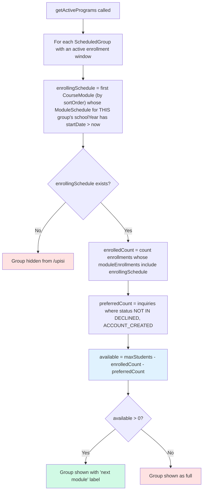
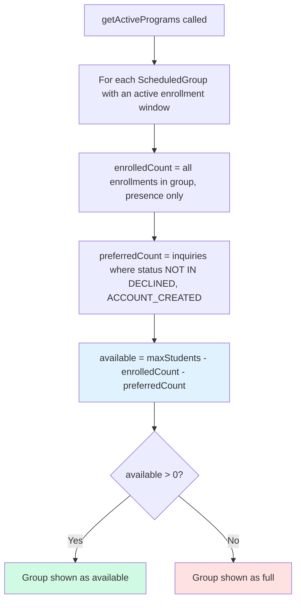
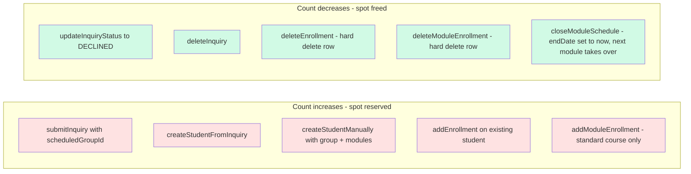
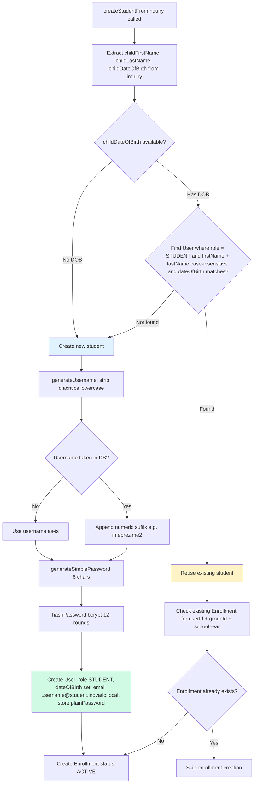
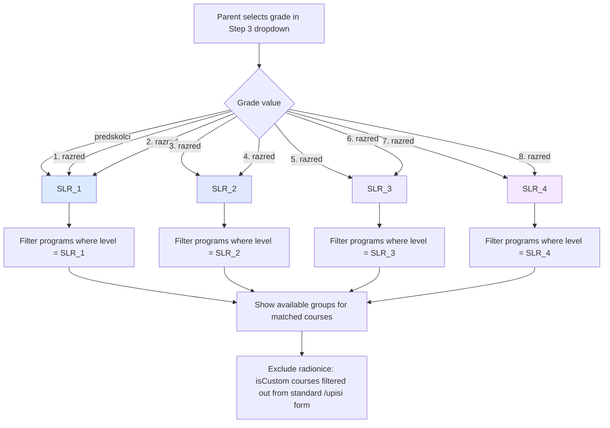
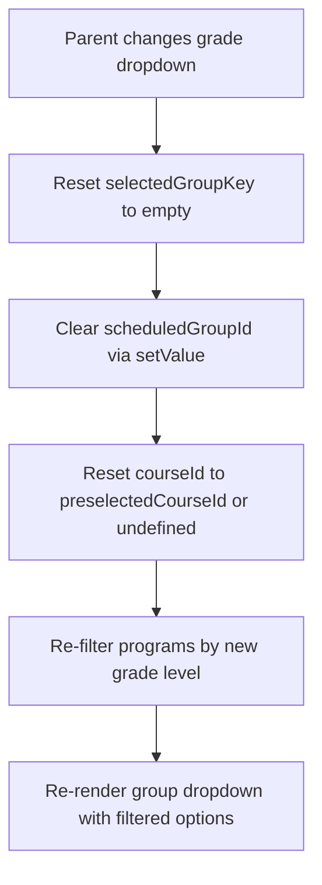
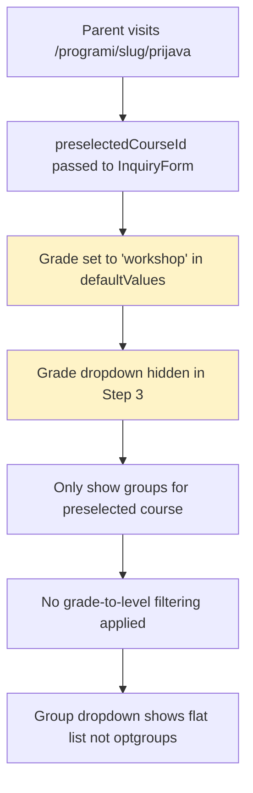
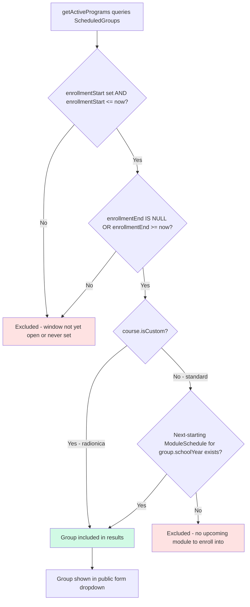
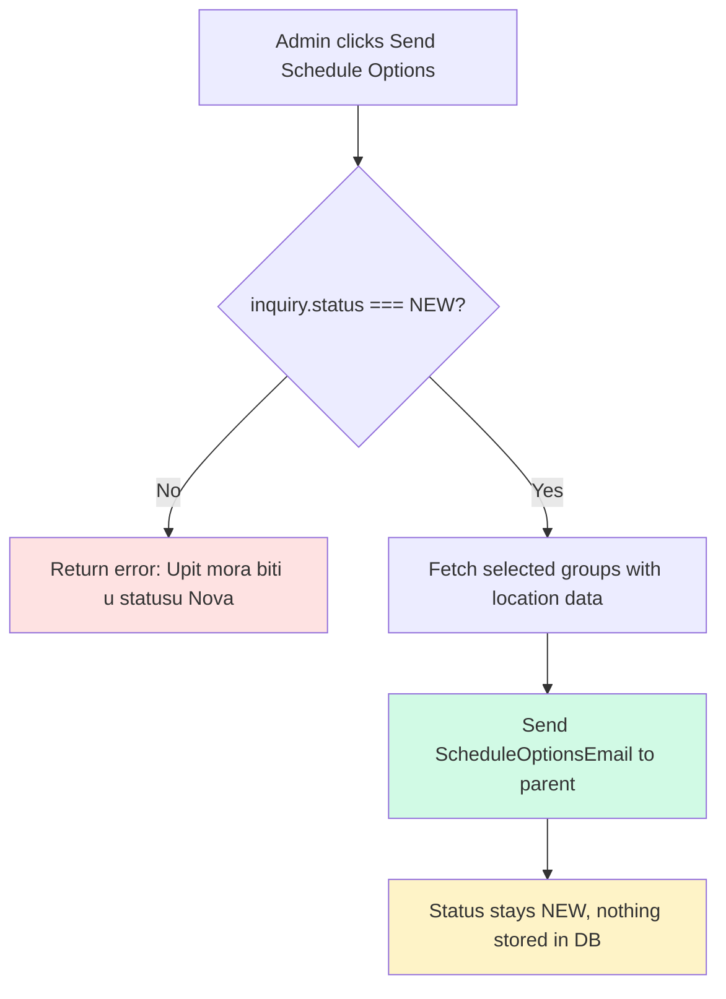

# Business Rules — Flowcharts

## 1. Spot Reservation and Availability

Spot math differs between standard courses (module-scoped) and radionice (group-scoped). Both share the same "preferred inquiry" offset.

### Standard course (module-scoped)

### Radionica (group-scoped, `course.isCustom`)

### When spots change

> Note: When an inquiry transitions to ACCOUNT_CREATED, it stops counting as a preferred inquiry (filter excludes both DECLINED and ACCOUNT_CREATED). The new enrollment takes over the slot, so the net count stays the same.
>
> Note: `closeModuleSchedule` doesn't delete any `ModuleEnrollment` rows — it just moves `ModuleSchedule.endDate` to now. The "enrolling module" logic advances to the next module (by sortOrder) whose `startDate` is still in the future, so the displayed free-spot count flips to that next module's capacity.

---

## 2. Student Deduplication

---

## 3. Grade-to-Level Mapping and Group Filtering

### Grade changes reset group selection

### Workshop - Radionica Form

---

## 4. Enrollment Window Logic

> Note: Groups with **both** `enrollmentStart` and `enrollmentEnd` null are hidden. Every publicly listable group must have an explicit start. There is no "always open" shortcut anymore.
>
> Note: `ScheduledGroup.schoolYear` is **not** part of the visibility check. Admins control public visibility purely via the enrollment window; the school-year field is retained only for historization (which cohort a given `ModuleSchedule` / `ModuleEnrollment` / `StudentComment` belongs to).
>
> Note: The second gate (next-starting module) is what keeps a standard group from appearing mid-year once all its modules have already started. To re-open the group, an admin closes the running module via `closeModuleSchedule` (sets `endDate = now`), which makes the next module's `startDate > now` check pass again.

---

## 5. sendScheduleOptions Flow

> Note: sendScheduleOptions is a pure email action — no database writes. It can be called multiple times. The inquiry's preferred group from the original submission is preserved and preselected when creating an account.
