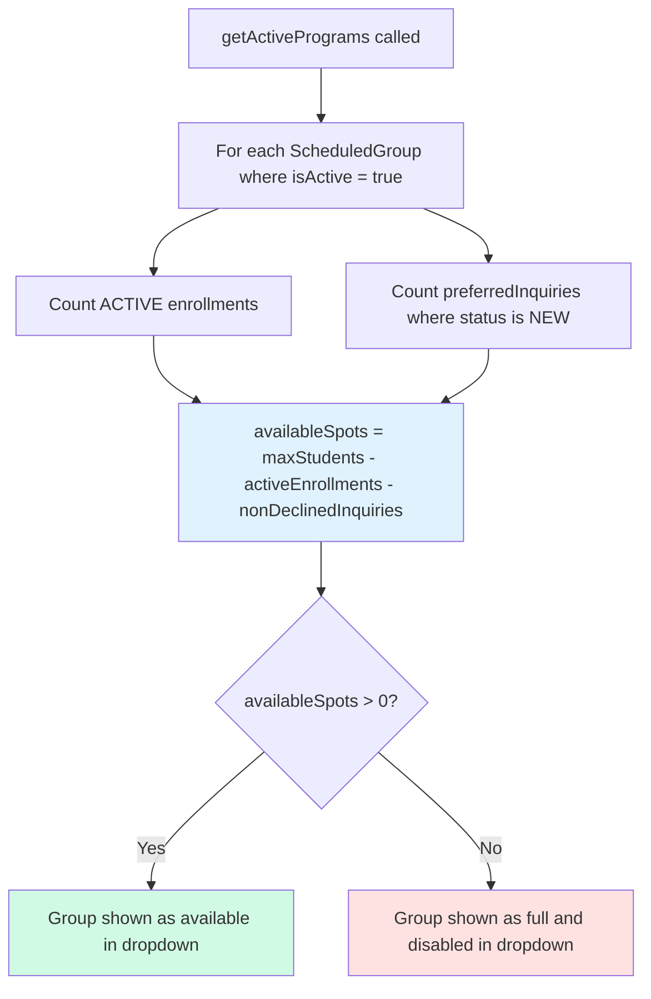
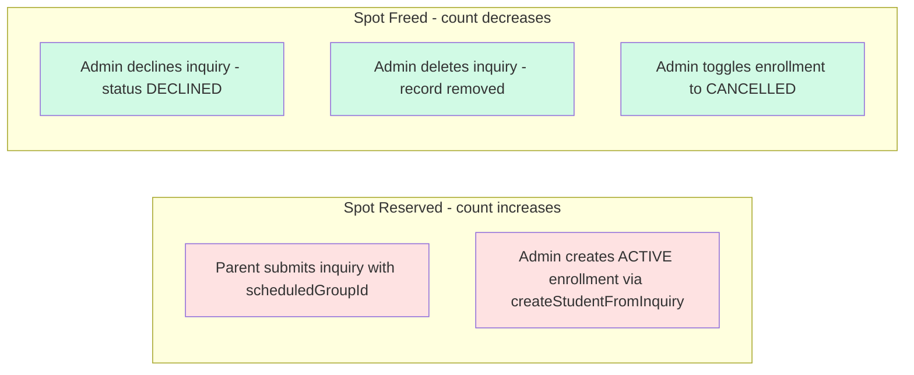
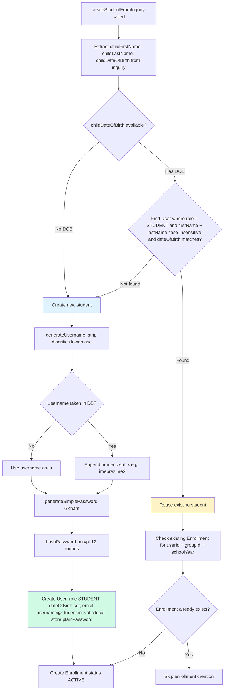
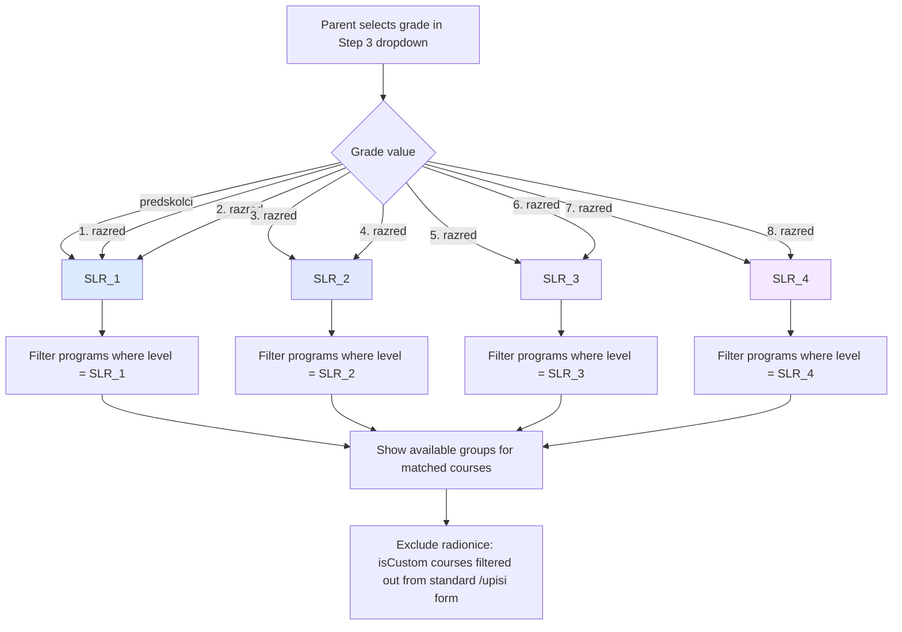
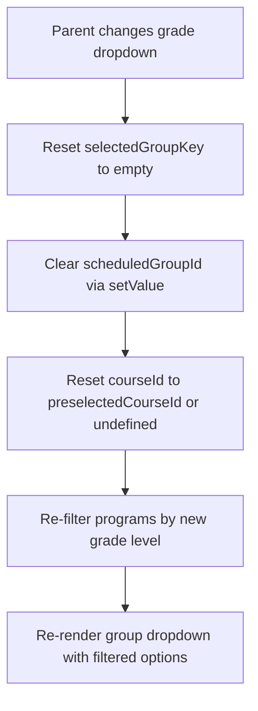
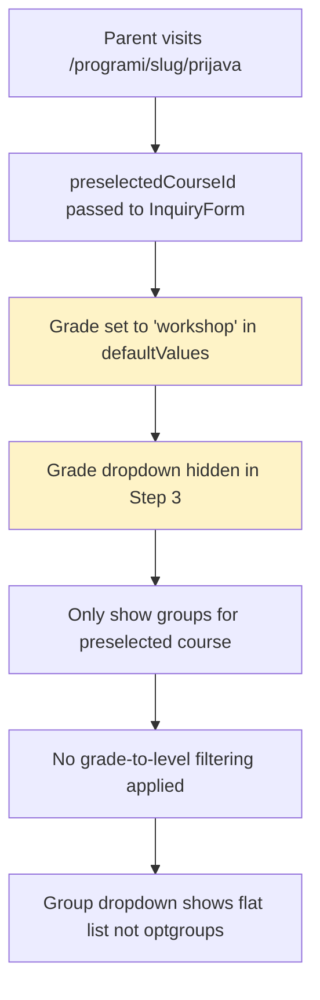
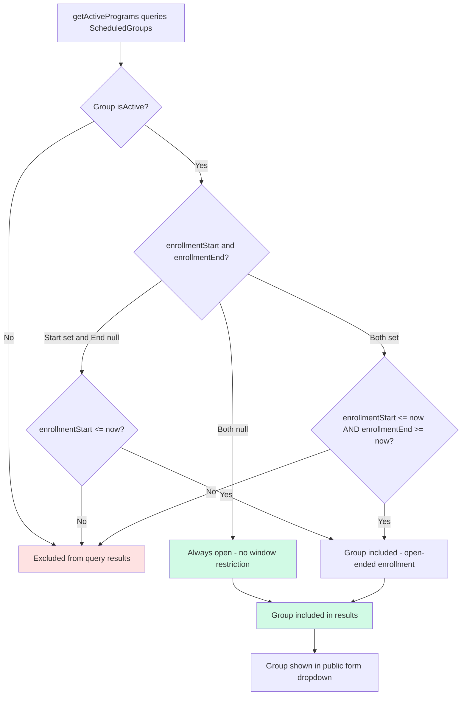
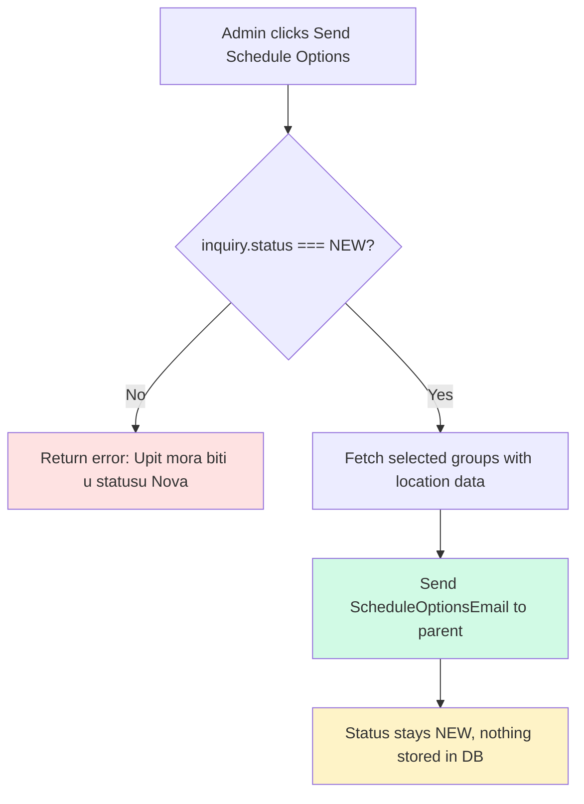

# Business Rules — Flowcharts

## 1. Spot Reservation and Availability

### When spots change

> Note: When an inquiry transitions to ACCOUNT_CREATED, it stops counting as a preferredInquiry (filter excludes both DECLINED and ACCOUNT_CREATED). The new active enrollment takes over the slot, so the net spot count stays the same.

---

## 2. Student Deduplication

---

## 3. Grade-to-Level Mapping and Group Filtering

### Grade changes reset group selection

### Workshop - Radionica Form

---

## 4. Enrollment Window Logic

> Note: The enrollment window filter and `group.isActive` check both run at the DB query level via Prisma `where` conditions. There is no `course.isActive` — activity is controlled only at the group level.

---

## 5. sendScheduleOptions Flow

> Note: sendScheduleOptions is a pure email action — no database writes. It can be called multiple times. The inquiry's preferred group from the original submission is preserved and preselected when creating an account.
