# Business Rules — Flowcharts

## 1. Spot Reservation and Availability

Spot math differs between standard courses (module-scoped) and radionice (group-scoped). Both share the same "preferred inquiry" offset.

### Standard course (module-scoped)

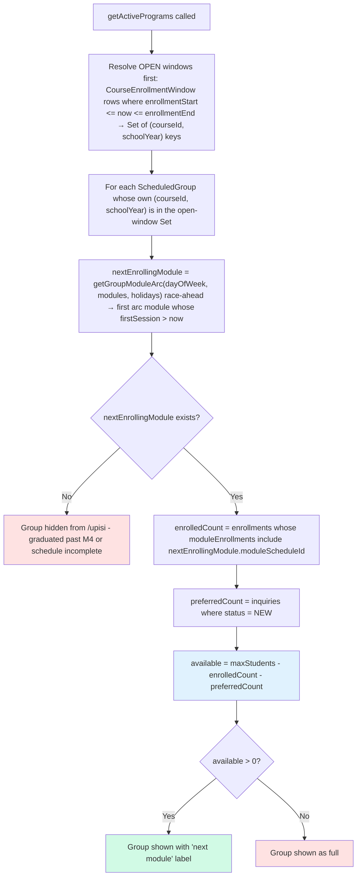
```mermaid
flowchart TD
    A[getActivePrograms called] --> A2["Resolve OPEN windows first: CourseEnrollmentWindow rows where enrollmentStart &lt;= now &lt;= enrollmentEnd → Set of (courseId, schoolYear) keys"]
    A2 --> B["For each ScheduledGroup whose own (courseId, schoolYear) is in the open-window Set"]
    B --> C["nextEnrollingModule = getGroupModuleArc(dayOfWeek, modules, holidays) race-ahead → first arc module whose firstSession &gt; now"]
    C --> D{nextEnrollingModule exists?}
    D -->|No| HIDE[Group hidden from /upisi - graduated past M4 or schedule incomplete]
    D -->|Yes| E["enrolledCount = enrollments whose moduleEnrollments include nextEnrollingModule.moduleScheduleId"]
    E --> F[preferredCount = inquiries where status = NEW]
    F --> G["available = maxStudents - enrolledCount - preferredCount"]
    G --> H{available > 0?}
    H -->|Yes| SHOW[Group shown with 'next module' label]
    H -->|No| FULL[Group shown as full]

    style HIDE fill:#fee2e2
    style SHOW fill:#d1fae5
    style FULL fill:#fee2e2
    style G fill:#e0f2fe
```

### Radionica (group-scoped, `course.isCustom`)

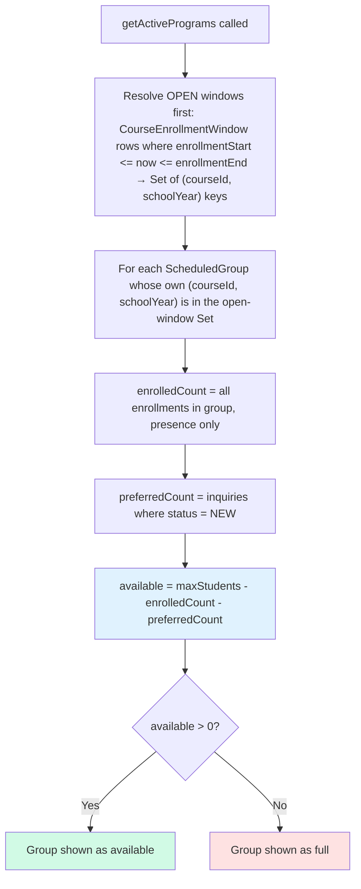
```mermaid
flowchart TD
    A[getActivePrograms called] --> A2["Resolve OPEN windows first: CourseEnrollmentWindow rows where enrollmentStart &lt;= now &lt;= enrollmentEnd → Set of (courseId, schoolYear) keys"]
    A2 --> B["For each ScheduledGroup whose own (courseId, schoolYear) is in the open-window Set"]
    B --> C[enrolledCount = all enrollments in group, presence only]
    C --> D[preferredCount = inquiries where status = NEW]
    D --> E["available = maxStudents - enrolledCount - preferredCount"]
    E --> F{available > 0?}
    F -->|Yes| SHOW[Group shown as available]
    F -->|No| FULL[Group shown as full]

    style SHOW fill:#d1fae5
    style FULL fill:#fee2e2
    style E fill:#e0f2fe
```

### When spots change

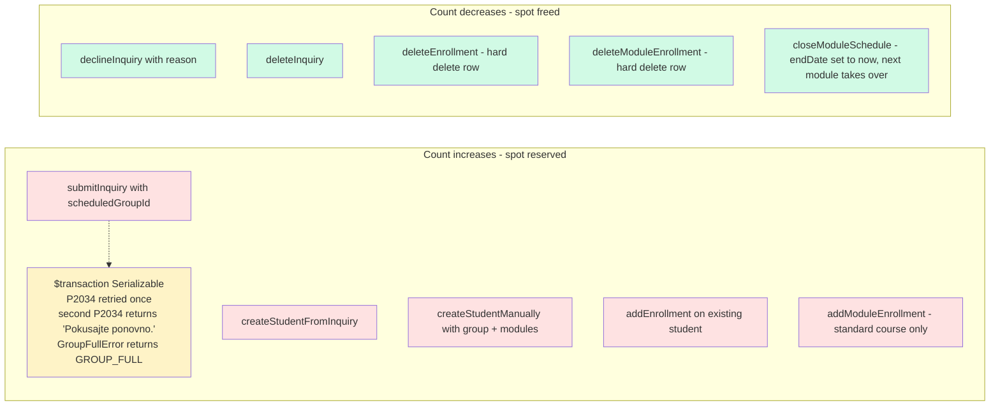
```mermaid
flowchart LR
    subgraph "Count increases - spot reserved"
        R1[submitInquiry with scheduledGroupId]
        R2[createStudentFromInquiry]
        R3[createStudentManually with group + modules]
        R4[addEnrollment on existing student]
        R5[addModuleEnrollment - standard course only]
        R1_TX["$transaction Serializable<br/>P2034 retried once<br/>second P2034 returns 'Pokusajte ponovno.'<br/>GroupFullError returns GROUP_FULL"]
        R1 -.-> R1_TX
    end

    subgraph "Count decreases - spot freed"
        F1[declineInquiry with reason]
        F2[deleteInquiry]
        F3[deleteEnrollment - hard delete row]
        F4[deleteModuleEnrollment - hard delete row]
        F5["closeModuleSchedule - endDate set to now, next module takes over"]
    end

    style R1 fill:#fee2e2
    style R2 fill:#fee2e2
    style R3 fill:#fee2e2
    style R4 fill:#fee2e2
    style R5 fill:#fee2e2
    style R1_TX fill:#fef3c7
    style F1 fill:#d1fae5
    style F2 fill:#d1fae5
    style F3 fill:#d1fae5
    style F4 fill:#d1fae5
    style F5 fill:#d1fae5
```

> Note: The preferred-inquiry count is `status === NEW` only (`_count.preferredInquiries` with `where: { status: 'NEW' }`). When an inquiry transitions to ACCOUNT_CREATED (or DECLINED) it stops counting as a preferred inquiry. The new enrollment takes over the slot, so the net count stays the same.
>
> Note: `closeModuleSchedule` doesn't delete any `ModuleEnrollment` rows — it just moves `ModuleSchedule.endDate` to now. The "enrolling module" logic advances to the next module (by sortOrder) whose `startDate` is still in the future, so the displayed free-spot count flips to that next module's capacity.

### Capacity Guard Pattern (write path)

Every action that can take up a spot routes its mutation through the shared guard in `src/lib/group-capacity.ts`. The guard runs the mutation inside a `Serializable` transaction, re-checks capacity from inside that same snapshot, and throws `GroupFullError` rather than over-booking. Consumers: `submitInquiry`, `createStudentFromInquiry`, `createStudentManually`, `addEnrollment`.

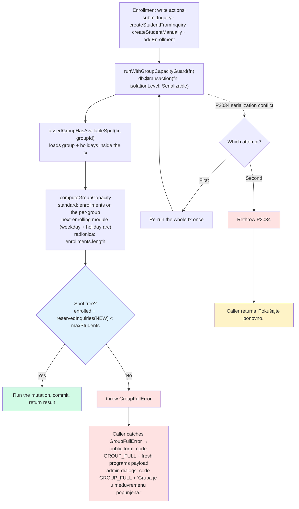
```mermaid
flowchart TD
    A["Enrollment write actions:<br/>submitInquiry · createStudentFromInquiry ·<br/>createStudentManually · addEnrollment"] --> B["runWithGroupCapacityGuard(fn)<br/>db.$transaction(fn, isolationLevel: Serializable)"]

    B --> C["assertGroupHasAvailableSpot(tx, groupId)<br/>loads group + holidays inside the tx"]
    C --> D["computeGroupCapacity<br/>standard: enrollments on the per-group<br/>next-enrolling module (weekday + holiday arc)<br/>radionica: enrollments.length"]
    D --> E{"Spot free?<br/>enrolled + reservedInquiries(NEW) &lt; maxStudents"}

    E -->|Yes| F["Run the mutation, commit, return result"]
    E -->|No| G["throw GroupFullError"]

    B -.->|P2034 serialization conflict| H{"Which attempt?"}
    H -->|First| I["Re-run the whole tx once"]
    I --> B
    H -->|Second| K["Rethrow P2034"]

    G --> FULL["Caller catches GroupFullError →<br/>public form: code GROUP_FULL + fresh programs payload<br/>admin dialogs: code GROUP_FULL + 'Grupa je u međuvremenu popunjena.'"]
    K --> RETRY["Caller returns 'Pokušajte ponovno.'"]

    style F fill:#d1fae5
    style E fill:#e0f2fe
    style G fill:#fee2e2
    style FULL fill:#fee2e2
    style K fill:#fee2e2
    style RETRY fill:#fef3c7
```

> Note: `GroupFullError` is a domain signal, **not** a serialization failure — it propagates straight to the caller and is never retried. Only Prisma `P2034` (Serializable write-write conflict) triggers the single re-run inside `runWithGroupCapacityGuard`; a second `P2034` is rethrown for the caller to surface as a generic retry message.

---

## 2. Student Deduplication

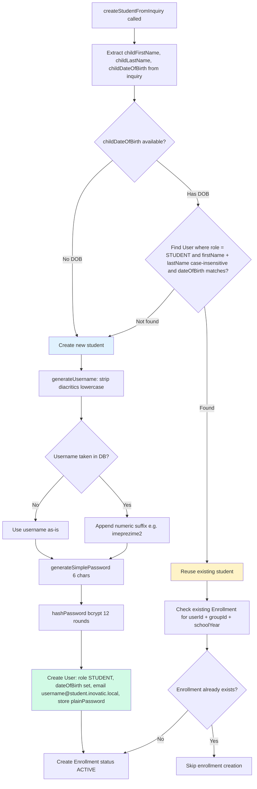
```mermaid
flowchart TD
    A[createStudentFromInquiry called] --> B[Extract childFirstName, childLastName, childDateOfBirth from inquiry]
    B --> C{childDateOfBirth available?}
    C -->|No DOB| NEW[Create new student]
    C -->|Has DOB| D{Find User where role = STUDENT and firstName + lastName case-insensitive and dateOfBirth matches?}
    D -->|Found| REUSE[Reuse existing student]
    D -->|Not found| NEW

    NEW --> G[generateUsername: strip diacritics lowercase]
    G --> H{Username taken in DB?}
    H -->|No| I[Use username as-is]
    H -->|Yes| J[Append numeric suffix e.g. imeprezime2]
    I --> K[generateSimplePassword 6 chars]
    J --> K
    K --> L[hashPassword bcrypt 12 rounds]
    L --> M["Create User: role STUDENT, dateOfBirth set, email username@student.inovatic.local, store plainPassword"]

    REUSE --> N[Check existing Enrollment for userId + groupId + schoolYear]
    M --> N2[Create Enrollment status ACTIVE]
    N --> O{Enrollment already exists?}
    O -->|Yes| P[Skip enrollment creation]
    O -->|No| N2

    style NEW fill:#e0f2fe
    style REUSE fill:#fef3c7
    style M fill:#d1fae5
```

---

## 3. Grade-to-Level Mapping and Group Filtering

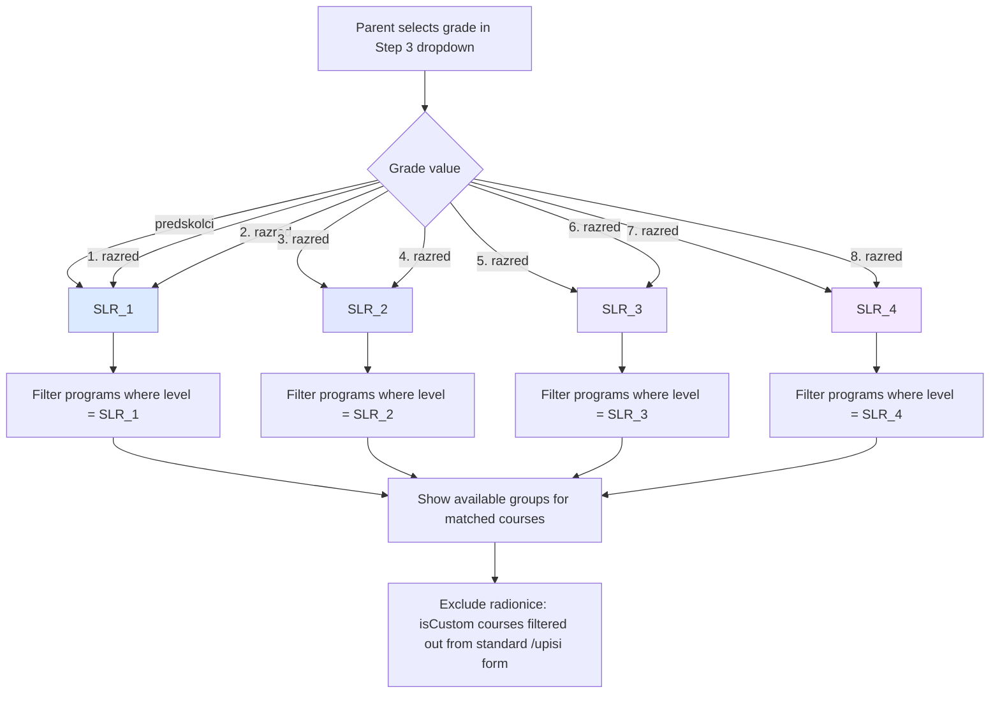
```mermaid
flowchart TD
    A[Parent selects grade in Step 3 dropdown] --> B{Grade value}

    B -->|predskolci| C[SLR_1]
    B -->|1. razred| C
    B -->|2. razred| C
    B -->|3. razred| D[SLR_2]
    B -->|4. razred| D
    B -->|5. razred| E[SLR_3]
    B -->|6. razred| E
    B -->|7. razred| F[SLR_4]
    B -->|8. razred| F

    C --> G[Filter programs where level = SLR_1]
    D --> G2[Filter programs where level = SLR_2]
    E --> G3[Filter programs where level = SLR_3]
    F --> G4[Filter programs where level = SLR_4]

    G --> H[Show available groups for matched courses]
    G2 --> H
    G3 --> H
    G4 --> H

    H --> I["Exclude radionice: isCustom courses filtered out from standard /upisi form"]

    style C fill:#dbeafe
    style D fill:#e0e7ff
    style E fill:#ede9fe
    style F fill:#f3e8ff
```

### Grade changes reset group selection

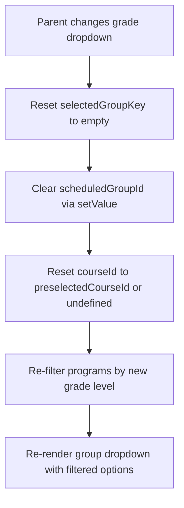
```mermaid
flowchart TD
    A[Parent changes grade dropdown] --> B[Reset selectedGroupKey to empty]
    B --> C[Clear scheduledGroupId via setValue]
    C --> D[Reset courseId to preselectedCourseId or undefined]
    D --> E[Re-filter programs by new grade level]
    E --> F[Re-render group dropdown with filtered options]
```

### Workshop - Radionica Form

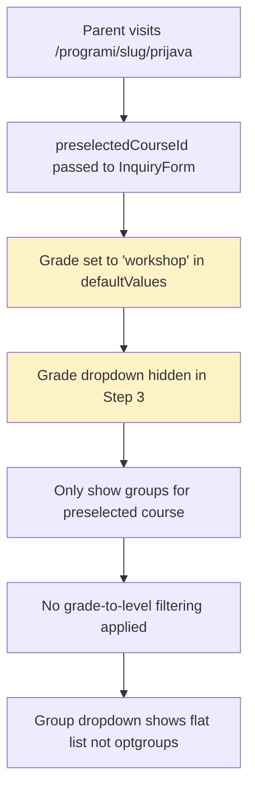
```mermaid
flowchart TD
    A["Parent visits /programi/slug/prijava"] --> B[preselectedCourseId passed to InquiryForm]
    B --> C["Grade set to 'workshop' in defaultValues"]
    C --> D[Grade dropdown hidden in Step 3]
    D --> E[Only show groups for preselected course]
    E --> F[No grade-to-level filtering applied]
    F --> G[Group dropdown shows flat list not optgroups]

    style C fill:#fef3c7
    style D fill:#fef3c7
```

---

## 4. Enrollment Window Logic

The signup window lives on `CourseEnrollmentWindow(courseId, schoolYear)` — one row per program per school year, inherited by every group of that program/year. (It used to live per-group on `ScheduledGroup.enrollmentStart/enrollmentEnd`; those columns were dropped.)

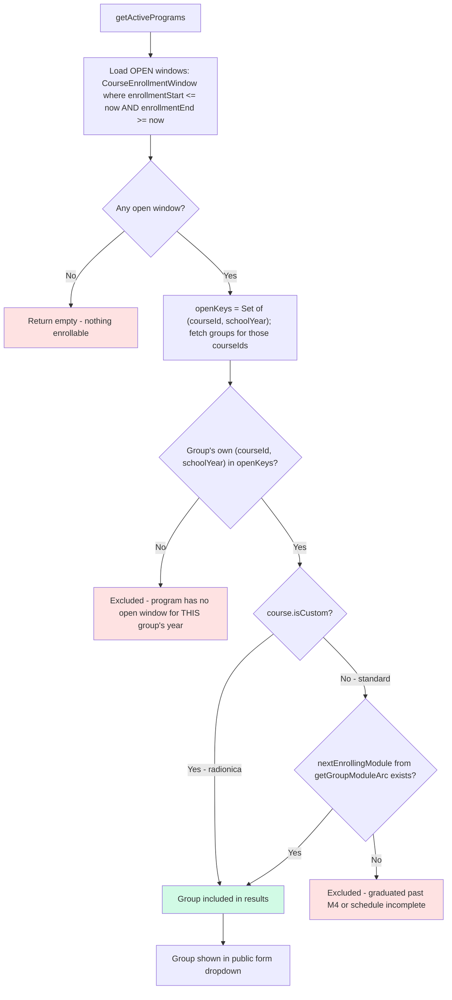
```mermaid
flowchart TD
    A[getActivePrograms] --> B["Load OPEN windows: CourseEnrollmentWindow where enrollmentStart &lt;= now AND enrollmentEnd &gt;= now"]
    B --> B0{Any open window?}
    B0 -->|No| EMPTY[Return empty - nothing enrollable]
    B0 -->|Yes| B1["openKeys = Set of (courseId, schoolYear); fetch groups for those courseIds"]
    B1 --> C{"Group's own (courseId, schoolYear) in openKeys?"}
    C -->|No| EXCLUDE[Excluded - program has no open window for THIS group's year]
    C -->|Yes| D{course.isCustom?}

    D -->|Yes - radionica| INCLUDE[Group included in results]
    D -->|No - standard| E{"nextEnrollingModule from getGroupModuleArc exists?"}

    E -->|Yes| INCLUDE
    E -->|No| EXCLUDE2[Excluded - graduated past M4 or schedule incomplete]

    INCLUDE --> I[Group shown in public form dropdown]

    style EMPTY fill:#fee2e2
    style EXCLUDE fill:#fee2e2
    style EXCLUDE2 fill:#fee2e2
    style INCLUDE fill:#d1fae5
```

> Note: A window counts as open only when **both** `enrollmentStart` and `enrollmentEnd` are set and `now` falls inside the range. No `CourseEnrollmentWindow` row for a `(course, year)` — or one outside the range — hides every group of that program/year. There is no "always open" shortcut.
>
> Note: `ScheduledGroup.schoolYear` **is** part of the visibility check now. Prisma can't correlate the window's `schoolYear` to each group's `schoolYear` in one `where`, so `getActivePrograms` resolves the open `(courseId, schoolYear)` keys first and then keeps only groups whose own `(courseId, schoolYear)` is in that set. The field still doubles as historization for `ModuleSchedule` / `ModuleEnrollment` / `StudentComment`.
>
> Note: The standard-course second gate is the per-group race-ahead arc (`getGroupModuleArc` → `getActiveModuleForGroup().nextEnrollingModule`), not a raw `ModuleSchedule.startDate > now` check. It hides a standard group once its arc has raced past the last dated module. Closing the running module early (`closeModuleSchedule` sets `endDate = today`) reshapes the arc so a later module becomes the next-enrolling one again.

---

## 5. sendScheduleOptions Flow

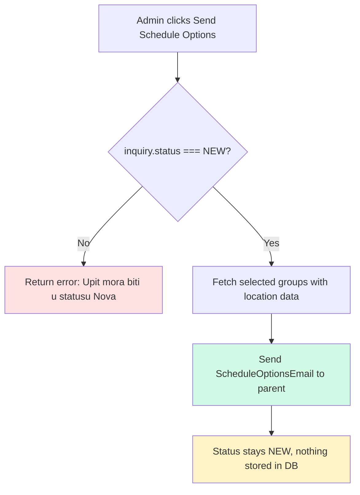
```mermaid
flowchart TD
    A[Admin clicks Send Schedule Options] --> B{inquiry.status === NEW?}
    B -->|No| ERR[Return error: Upit mora biti u statusu Nova]
    B -->|Yes| C[Fetch selected groups with location data]
    C --> D[Send ScheduleOptionsEmail to parent]
    D --> E[Status stays NEW, nothing stored in DB]

    style ERR fill:#fee2e2
    style D fill:#d1fae5
    style E fill:#fef3c7
```

> Note: sendScheduleOptions is a pure email action — no database writes. It can be called multiple times. The inquiry's preferred group from the original submission is preserved and preselected when creating an account.

---

## 6. Material Scope — Visibility Resolution

Materials use a three-scope model (`MaterialScope`: MODULE, COURSE, GROUP). The effective set for a student viewing a group combines all applicable scopes, minus per-group hide overrides.

### Student material resolution

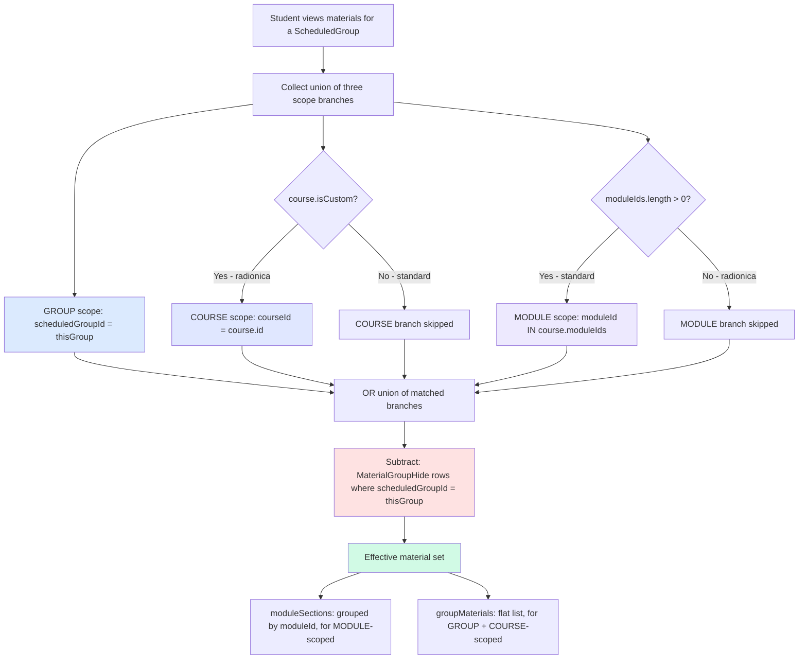
```mermaid
flowchart TD
    A[Student views materials for a ScheduledGroup] --> B[Collect union of three scope branches]

    B --> C1["GROUP scope: scheduledGroupId = thisGroup"]
    B --> C2{"course.isCustom?"}
    B --> C3{"moduleIds.length > 0?"}

    C2 -->|Yes - radionica| D1["COURSE scope: courseId = course.id"]
    C2 -->|No - standard| SKIP1[COURSE branch skipped]
    C3 -->|Yes - standard| D2["MODULE scope: moduleId IN course.moduleIds"]
    C3 -->|No - radionica| SKIP2[MODULE branch skipped]

    C1 --> UNION[OR union of matched branches]
    D1 --> UNION
    D2 --> UNION
    SKIP1 --> UNION
    SKIP2 --> UNION

    UNION --> E["Subtract: MaterialGroupHide rows where scheduledGroupId = thisGroup"]
    E --> F[Effective material set]

    F --> G1["moduleSections: grouped by moduleId, for MODULE-scoped"]
    F --> G2["groupMaterials: flat list, for GROUP + COURSE-scoped"]

    style C1 fill:#dbeafe
    style D1 fill:#e0e7ff
    style D2 fill:#ede9fe
    style E fill:#fee2e2
    style F fill:#d1fae5
```

> Note: Staff (teacher/admin) see hidden materials rendered as dimmed with a toggle to unhide. Students never see hidden materials — the `NOT { hiddenInGroups }` filter runs server-side.

### Scope validation on create

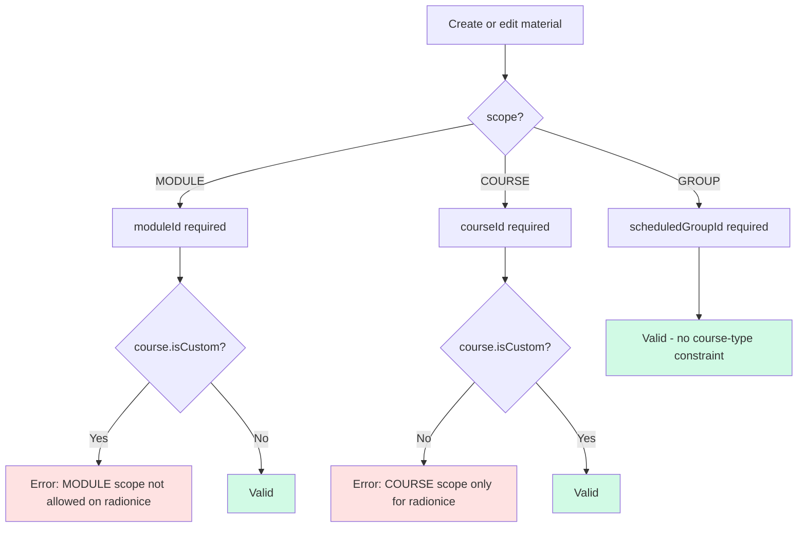
```mermaid
flowchart TD
    A[Create or edit material] --> B{scope?}

    B -->|MODULE| C1[moduleId required]
    C1 --> C2{course.isCustom?}
    C2 -->|Yes| ERR1[Error: MODULE scope not allowed on radionice]
    C2 -->|No| OK1[Valid]

    B -->|COURSE| D1[courseId required]
    D1 --> D2{course.isCustom?}
    D2 -->|No| ERR2[Error: COURSE scope only for radionice]
    D2 -->|Yes| OK2[Valid]

    B -->|GROUP| E1[scheduledGroupId required]
    E1 --> OK3[Valid - no course-type constraint]

    style ERR1 fill:#fee2e2
    style ERR2 fill:#fee2e2
    style OK1 fill:#d1fae5
    style OK2 fill:#d1fae5
    style OK3 fill:#d1fae5
```

> Note: Scope validation lives in `validateScopeConsistency()` in `src/actions/material/crud.ts`. The rule is: MODULE is for standard programs only, COURSE is for radionice only, GROUP works on any course type.
