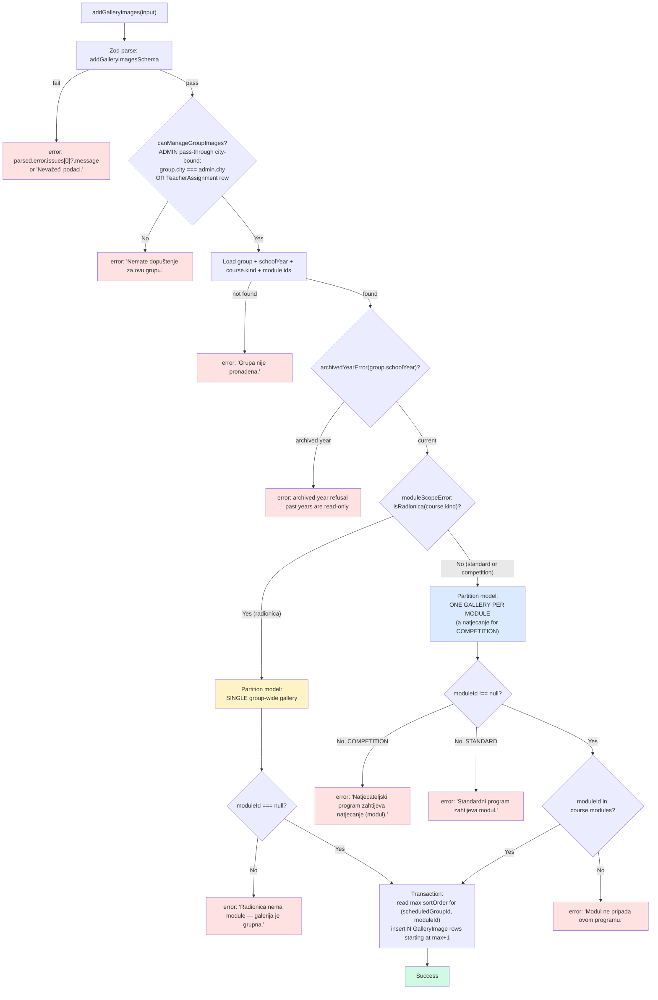
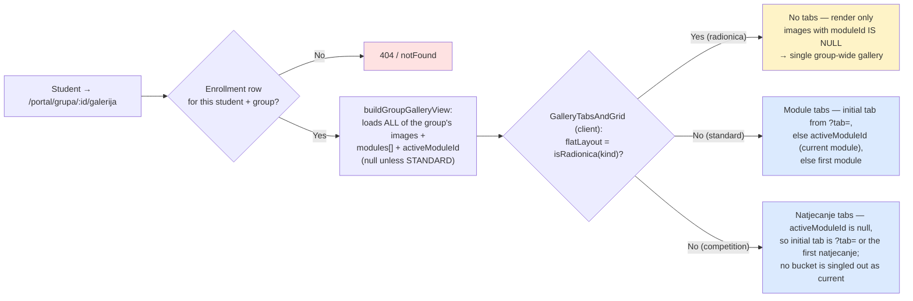
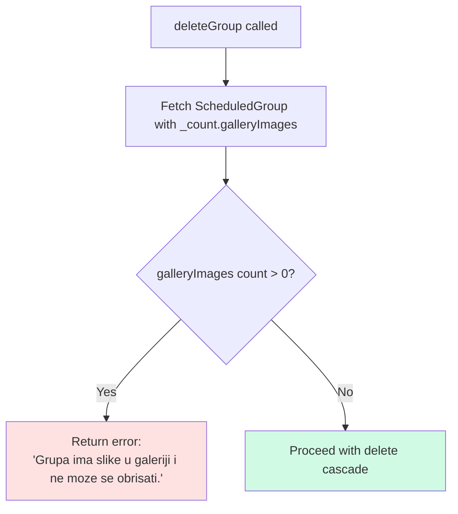

# Gallery Scope — Per-Module vs Group-Wide Partition

**Every program kind gets galleries.** What differs is how images are partitioned within a `ScheduledGroup`, and the rule is keyed on `Course.kind` (via the `src/lib/program-kind.ts` predicates):

- **Standard programs** (`kind: STANDARD`) split the gallery **per module** — one bucket of images per `CourseModule`, so `GalleryImage.moduleId` is required.
- **Natjecateljski program** (`kind: COMPETITION`) also buckets per module — its modules are the **natjecanja** — so `moduleId` is required here too. Because natjecanja are undated, there is no "current" bucket: all of them are live all season.
- **Radionice** (`kind: RADIONICA`) have no modules at all, so the gallery is **a single group-wide bucket** and `GalleryImage.moduleId` must be `null`. The error message in the action layer says this verbatim: "Radionica nema module — galerija je grupna."

Unlike `MaterialScope`, this invariant has **no DB-level `CHECK` constraint** — `Course.kind` lives on a sibling row, not on `GalleryImage` itself, so a single-row check can't express the rule. Instead the rule lives in the `moduleScopeError` helper called from `addGalleryImages()` in `src/actions/gallery/crud.ts`. This diagram is the most accessible reference for the rule.

**City tenancy:** galleries are per-group, hence per-city — `GalleryImage` needs no `city` column of its own. `canManageGroupImages` bounds the ADMIN pass-through to `group.city === session.user.city` (a cross-city admin gets "Nemate dopuštenje za ovu grupu."); teachers are bound through their same-city assignments; students through their enrollment.

## Validation flow on write

> Source: the `moduleScopeError` helper near the top of `src/actions/gallery/crud.ts` (the kind-driven moduleId rule, with the kind-aware error copy), `canManageGroupImages` above it, `archivedYearError` from `src/lib/school-year-guard.ts`, and the transactional insert with sort-order seeding lower down. Validator at `src/lib/validators/gallery.ts`. The standard-program error string stays byte-identical to the pre-COMPETITION copy (asserted in E2E spec 29).

## Reader gate

> The reader mirrors the writer's invariant, but the partitioning is **client-side**: `buildGroupGalleryView` (`src/lib/group-gallery-view.ts`) returns every image of the group in one list, and `GalleryTabsAndGrid` filters by `moduleId` per tab (`flatLayout` filters `moduleId === null`). `activeModuleId` comes from `getCurrentActiveModuleForGroup`, which returns null for anything without dated modules — so a standard group's gallery opens on the module it is working on now, while a competition group's opens on the URL's `?tab=` or the first natjecanje. The view only runs after the caller's gate passes (student enrollment row here; teacher assignment / same-city admin on the staff pages) — students of other groups get a 404, not a leaked image list.

## Summary

| `Course.kind` | Partition model | `moduleId` requirement | Action-layer error if violated |
|---|---|---|---|
| `RADIONICA` | Single group-wide gallery | Must be `null` (radionica has no modules) | `Radionica nema module — galerija je grupna.` |
| `STANDARD` | One gallery per module; the portal opens on the active module | Must be non-null AND belong to `course.modules` | `Standardni program zahtijeva modul.` / `Modul ne pripada ovom programu.` |
| `COMPETITION` | One gallery per natjecanje; all live all season, none "current" | Must be non-null AND belong to `course.modules` | `Natjecateljski program zahtijeva natjecanje (modul).` / `Modul ne pripada ovom programu.` |

## Deletion rules

`deleteGroup` refuses to delete a group that still has any rows in `GalleryImage`. Admins must clear the gallery first. The check uses Prisma `_count.galleryImages` against zero before any cascade fires.

> Source: `deleteGroup` in `src/actions/admin/group.ts`. The guard prevents orphan Cloudinary assets — Prisma `onDelete: Cascade` would drop the `GalleryImage` rows but the underlying remote files would leak because Cloudinary cleanup runs at the action layer, not via DB trigger. The Croatian error string above uses ASCII inside the mermaid label; the production error preserves the č: `Grupa ima slike u galeriji i ne može se obrisati.`

## Why no DB `CHECK` constraint

A row-local `CHECK` on `GalleryImage` can only reference its own columns. Whether `moduleId` is required depends on `Course.kind`, which sits two FK hops away (`GalleryImage.scheduledGroupId → ScheduledGroup.courseId → Course.kind`). PostgreSQL `CHECK` constraints can't traverse FKs. The two enforceable alternatives were:

1. Denormalise the kind onto `GalleryImage` (extra column, extra write hazard, extra backfill).
2. Enforce in code — what we did, with the validator + the `moduleScopeError` branch in `addGalleryImages()` plus the matching client-side partition in `GalleryTabsAndGrid`.

Option 2 keeps the schema clean and concentrates the rule in one place: the server action. Tests in `tests/phase3/29-gallery.spec.ts` cover the branches.
