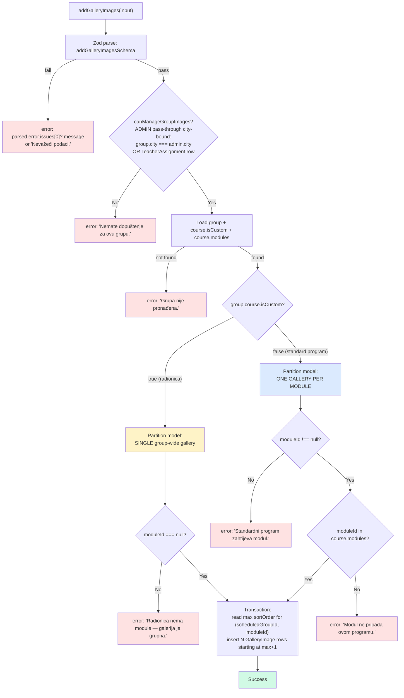
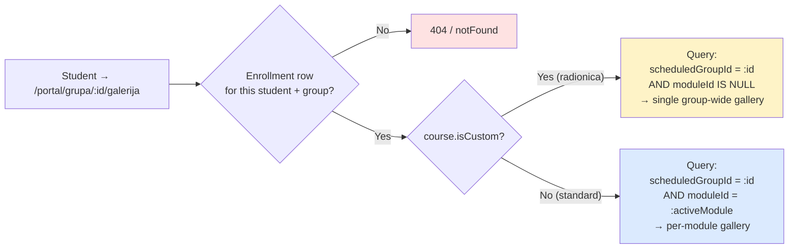
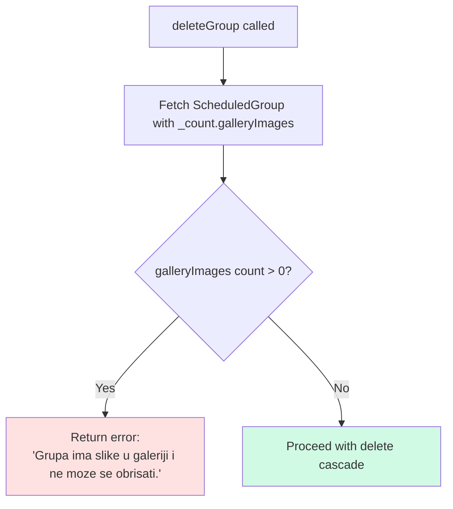

# Gallery Scope — Per-Module vs Group-Wide Partition

**Both standard programs and radionice get galleries.** What differs is how images are partitioned within a `ScheduledGroup`:

- **Standard programs** (`Course.isCustom = false`) split the gallery **per module** — one bucket of images per `CourseModule`, so `GalleryImage.moduleId` is required.
- **Radionice** (`Course.isCustom = true`) have no modules at all, so the gallery is **a single group-wide bucket** and `GalleryImage.moduleId` must be `null`. The error message in the action layer says this verbatim: "Radionica nema module — galerija je grupna."

Unlike `MaterialScope`, this invariant has **no DB-level `CHECK` constraint** — `Course.isCustom` lives on a sibling row, not on `GalleryImage` itself, so a single-row check can't express the rule. Instead the rule is enforced in `addGalleryImages()` in `src/actions/gallery/crud.ts`. This diagram is the most accessible reference for the rule.

**City tenancy:** galleries are per-group, hence per-city — `GalleryImage` needs no `city` column of its own. `canManageGroupImages` bounds the ADMIN pass-through to `group.city === session.user.city` (a cross-city admin gets "Nemate dopuštenje za ovu grupu."); teachers are bound through their same-city assignments; students through their enrollment.

## Validation flow on write

> Source: `src/actions/gallery/crud.ts:85-100` for the `isCustom` branch; `canManageGroupImages` at the same file's top; transactional insert with sort-order seeding lower down. Validator at `src/lib/validators/gallery.ts`.

## Reader gate

> The reader mirrors the writer's invariant. Standard-program pages key off the currently active module; radionica pages always filter `moduleId IS NULL`. Either branch only runs after the enrollment gate passes — students of other groups get a 404, not a leaked image list.

## Summary

| Course type (`isCustom`) | Partition model | `moduleId` requirement | Action-layer error if violated |
|---|---|---|---|
| `true` (radionica) | Single group-wide gallery | Must be `null` (radionica has no modules) | `Radionica nema module — galerija je grupna.` |
| `false` (standard) | One gallery per module | Must be non-null AND belong to `course.modules` | `Standardni program zahtijeva modul.` / `Modul ne pripada ovom programu.` |

## Deletion rules

`deleteGroup` refuses to delete a group that still has any rows in `GalleryImage`. Admins must clear the gallery first. The check uses Prisma `_count.galleryImages` against zero before any cascade fires.

> Source: `deleteGroup` in `src/actions/admin/group.ts:274`. The guard prevents orphan Cloudinary assets — Prisma `onDelete: Cascade` would drop the `GalleryImage` rows but the underlying remote files would leak because Cloudinary cleanup runs at the action layer, not via DB trigger. The Croatian error string above uses ASCII inside the mermaid label; the production error preserves the č: `Grupa ima slike u galeriji i ne može se obrisati.`

## Why no DB `CHECK` constraint

A row-local `CHECK` on `GalleryImage` can only reference its own columns. Whether `moduleId` is required depends on `Course.isCustom`, which sits two FK hops away (`GalleryImage.scheduledGroupId → ScheduledGroup.courseId → Course.isCustom`). PostgreSQL `CHECK` constraints can't traverse FKs. The two enforceable alternatives were:

1. Denormalise `isCustom` onto `GalleryImage` (extra column, extra write hazard, extra backfill).
2. Enforce in code — what we did, with the validator + branch in `addGalleryImages()` plus the matching reader query.

Option 2 keeps the schema clean and concentrates the rule in one place: the server action. Tests in `tests/phase3/29-gallery.spec.ts` cover both branches.
