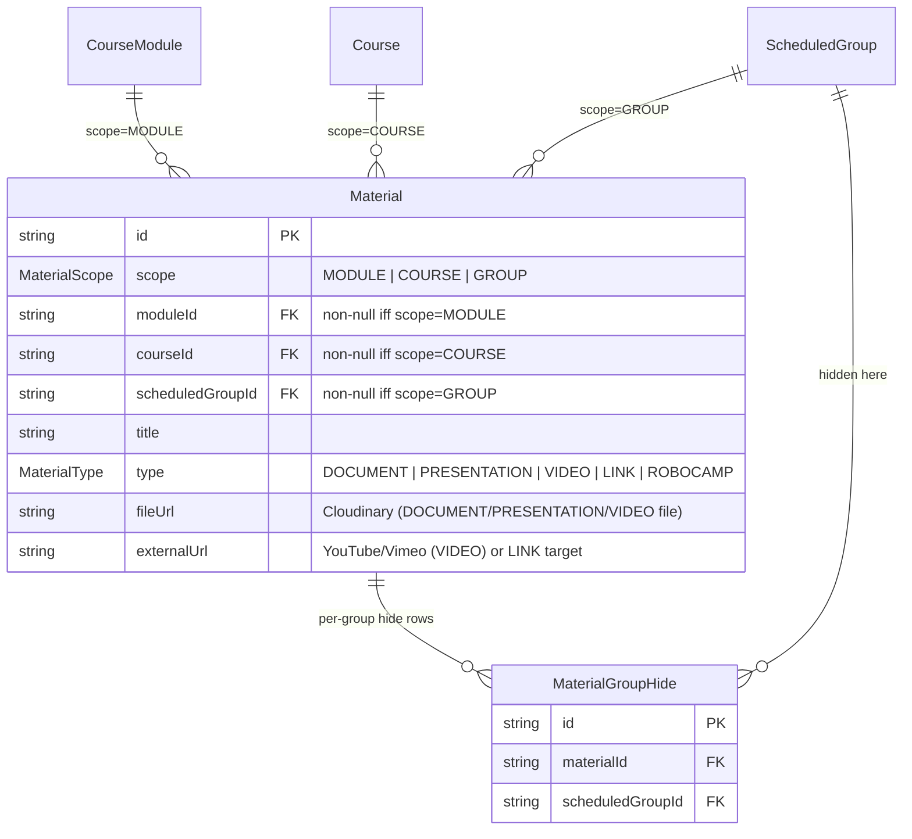
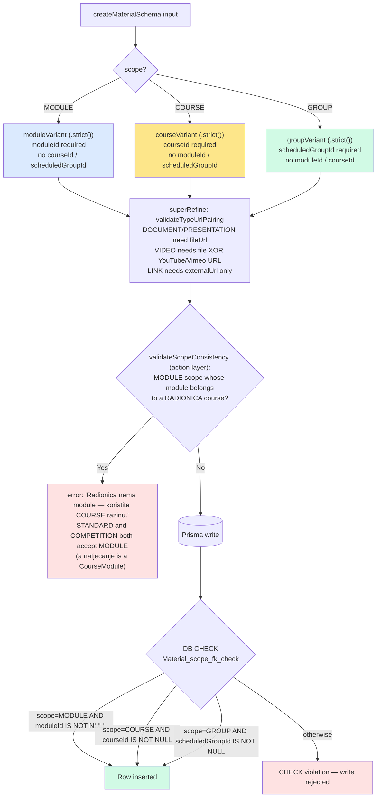
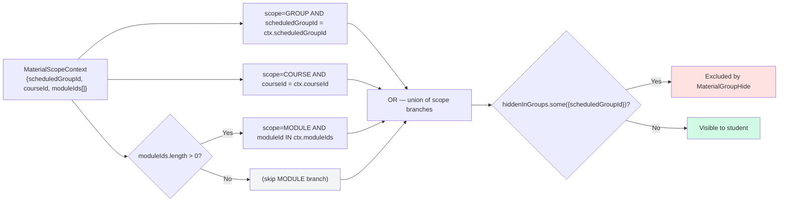
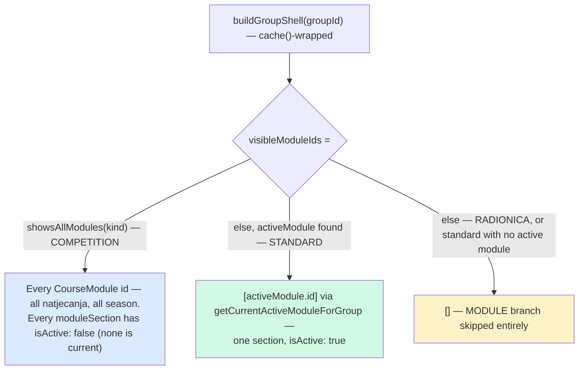

# MaterialScope — Discriminated Union and Per-Group Hide

`Material` rows carry a `scope` of `MODULE`, `COURSE`, or `GROUP`. Each value of the enum picks exactly one FK column that must be non-null — the other two must be null. The invariant is enforced at three layers: a Zod discriminated union at the action boundary, a Prisma model with three nullable FKs, and a SQL `CHECK` constraint at the DB. On top of that, `MaterialGroupHide` lets a teacher hide an inherited MODULE/COURSE-scoped material from a single `ScheduledGroup` without affecting any other group.

**City tenancy:** `Material` deliberately has **no `city` column**. MODULE/COURSE-scoped rows are the shared curriculum — one standard SLR program taught identically in Split and Šibenik; any city's admin can manage them and both cities' staff/students see and download them. GROUP-scoped rows are per-group and therefore per-city: `canManageMaterial` bounds the ADMIN branch to `group.city === session.user.city`, and the download route applies the same check for GROUP-scope files (`src/lib/material-access.ts`, `src/app/api/download/[materialId]/route.ts`). Since 2026-08-17 that route also gates the **student** branch on being currently in a program: `studentAllowed()` counts enrollments against `activeEnrollmentWhere()` (`src/lib/enrollment-activity.ts` — current year **plus next**) and returns false at zero, before any scope resolution; `getEffectiveMaterialsForStudent` uses `requireActiveStudent()` for the same reason. Without it, "no longer part of any program" would hold at the login form and not here, for as long as a JWT minted while the child was still enrolled survives (≤60 s). The student's per-group lookup stays deliberately **unfiltered by year** — an enrolled child re-opening their own previous group is legitimate. Teachers are city-bound implicitly through their same-city `TeacherAssignment`s.

## Schema shape

> Source: `prisma/schema.prisma` (`Material`, `MaterialGroupHide`, `MaterialScope` enum). Indexes mirror the three branches: `(scope, moduleId)`, `(scope, courseId)`, `(scope, scheduledGroupId)`.

## Discriminated union — which FK is required

> Sources: Zod variants in `src/lib/validators/material.ts:23-49`; `validateScopeConsistency` in `src/actions/material/crud.ts` (refuses MODULE scope when the module's course is a radionica — `isRadionica(kind)`; STANDARD and COMPETITION both pass); DB `CHECK` in `prisma/migrations/20260423123802_phase3_materials_attendance/migration.sql:36-41`. Belt-and-braces by design — Zod prevents typed callers from getting it wrong; the CHECK prevents drift via raw SQL or forgotten migrations.

## Effective materials for a student

> Source: `buildEffectiveMaterialsWhere(ctx)` in `src/lib/material-query.ts:24-43`. COURSE branch is always included — both standard programs (program-wide materials) and radionice (course-wide materials). MODULE branch only added when `moduleIds.length > 0`. Returns a `Prisma.MaterialWhereInput` with `NOT hiddenInGroups.some(...)` applied uniformly across all branches.

## Who fills `MaterialScopeContext.moduleIds` — kind-driven visibility

`buildGroupShell` (`src/lib/group-materials-view.ts`) is what turns `Course.kind` into the `moduleIds` the query above filters on. It is `cache()`-wrapped because the portal group route resolves it twice per navigation — once in `layout.tsx` for the header and tab strip, once inside `buildGroupMaterialsView` for the Materijali panel — and `buildGroupMaterialsView` calls it rather than repeating the group+modules+schedules query:

> The **same MODULE-scoped row** is therefore visible: on STANDARD only while its module is the group's active one; on COMPETITION all season (which natjecanje a group attends lives in the group NAME, not the data, so the app must never narrow for them); on RADIONICA never (the write path already refuses it). Downstream, `partitionMaterials(materials, kind)` folds COURSE + GROUP into one flat `radionicaMaterials` bucket for radionice, while programs with modules keep separate program/group buckets; `MaterialFilterTabs` renders module tabs only when `hasModules(kind)`.

> **Scope is staff-facing only (2026-08-24).** Those buckets are an intermediate structure, not a layout. The portal re-flattens them: `interactiveGuides(view)` lifts every RoboCamp row out of EVERY bucket — module sections, program, group, radionica — into the one guide section, deliberately wider than the `featuredRobocamp` field it replaced, which read module scope only and would now make a COURSE- or GROUP-scoped guide vanish from the page entirely rather than merely be demoted. `flattenExtraMaterials(view)` merges what is left into a single list ordered video → prezentacija → dokument → poveznica. A child is shown WHAT KIND a material is, never WHERE IT CAME FROM; staff keep the scope, because for them it decides whether a row can be edited, only hidden, or neither (`StaffMaterialList`). Classification lives in `src/lib/material-display.ts` — `kindOf` buckets DOCUMENT with PRESENTATION (they lay out identically), `displayKindOf` is built ON it and splits the two, keeping the RoboCamp rule (first-class type OR a RoboCamp `externalUrl` on an un-backfilled row) at one definition. That module is separate from `group-materials-view.ts` because the kids' list is a client component and must not pull `@/lib/db` into the bundle.

## Summary

| Scope | Required FK | What students see | City posture | Hide-per-group? |
|---|---|---|---|---|
| `MODULE` | `moduleId → CourseModule` | Every `ScheduledGroup` whose course owns that module — STANDARD: only while it is the group's active module · COMPETITION: every natjecanje, all season · RADIONICA: n/a (scope refused on write) | Shared curriculum — both cities | Yes — `MaterialGroupHide` on a specific group hides this row for that group only |
| `COURSE` | `courseId → Course` | Every `ScheduledGroup` of that course (standard and radionice). On standard programs = "whole program" materials visible across all modules. | Shared curriculum — both cities | Yes — same mechanism |
| `GROUP` | `scheduledGroupId → ScheduledGroup` | Only the one `ScheduledGroup` it points at | Per-city — ADMIN writes/downloads bound to `group.city === admin.city` | N/A — already group-scoped |

## Why three layers

- **Zod variant**: best error messages at the form layer, Croatian copy ("Odaberite modul", "Odaberite program", "Odaberite grupu") sits next to the field that's wrong.
- **Prisma optional FKs**: the model can't express "exactly one of three is non-null", so all three are typed `String?`. The compiler can't catch a missing FK on its own.
- **SQL `CHECK`**: last line of defense. A migration or hand-rolled query that bypasses Zod still can't insert an invalid row.
