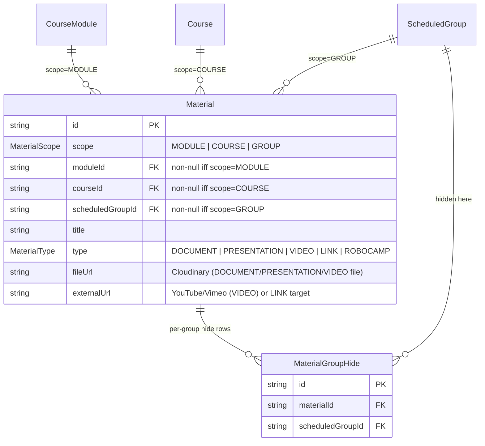
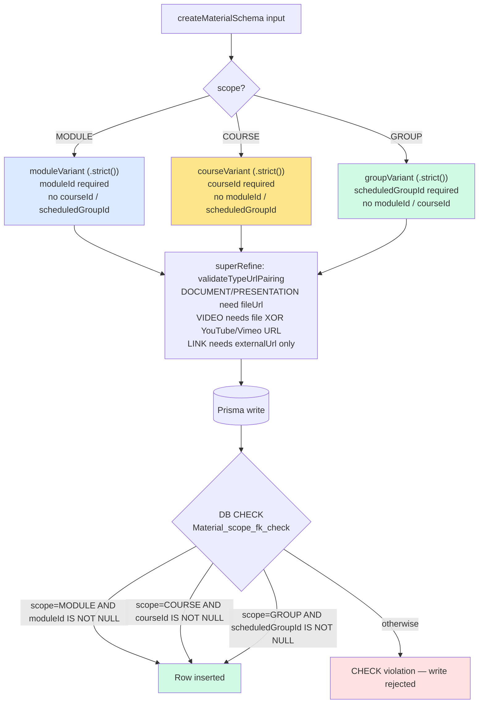
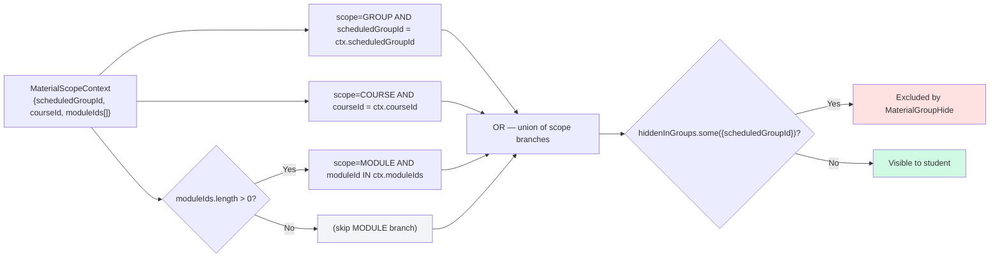

# MaterialScope — Discriminated Union and Per-Group Hide

`Material` rows carry a `scope` of `MODULE`, `COURSE`, or `GROUP`. Each value of the enum picks exactly one FK column that must be non-null — the other two must be null. The invariant is enforced at three layers: a Zod discriminated union at the action boundary, a Prisma model with three nullable FKs, and a SQL `CHECK` constraint at the DB. On top of that, `MaterialGroupHide` lets a teacher hide an inherited MODULE/COURSE-scoped material from a single `ScheduledGroup` without affecting any other group.

## Schema shape

> Source: `prisma/schema.prisma` (`Material`, `MaterialGroupHide`, `MaterialScope` enum). Indexes mirror the three branches: `(scope, moduleId)`, `(scope, courseId)`, `(scope, scheduledGroupId)`.

## Discriminated union — which FK is required

> Sources: Zod variants in `src/lib/validators/material.ts:23-49`; DB `CHECK` in `prisma/migrations/20260423123802_phase3_materials_attendance/migration.sql:36-41`. Belt-and-braces by design — Zod prevents typed callers from getting it wrong; the CHECK prevents drift via raw SQL or forgotten migrations.

## Effective materials for a student

> Source: `buildEffectiveMaterialsWhere(ctx)` in `src/lib/material-query.ts:24-43`. COURSE branch is always included — both standard programs (program-wide materials) and radionice (course-wide materials). MODULE branch only added when `moduleIds.length > 0`. Returns a `Prisma.MaterialWhereInput` with `NOT hiddenInGroups.some(...)` applied uniformly across all branches.

## Summary

| Scope | Required FK | What students see | Hide-per-group? |
|---|---|---|---|
| `MODULE` | `moduleId → CourseModule` | Every `ScheduledGroup` whose course owns that module | Yes — `MaterialGroupHide` on a specific group hides this row for that group only |
| `COURSE` | `courseId → Course` | Every `ScheduledGroup` of that course (standard and radionice). On standard programs = "whole program" materials visible across all modules. | Yes — same mechanism |
| `GROUP` | `scheduledGroupId → ScheduledGroup` | Only the one `ScheduledGroup` it points at | N/A — already group-scoped |

## Why three layers

- **Zod variant**: best error messages at the form layer, Croatian copy ("Odaberite modul", "Odaberite program", "Odaberite grupu") sits next to the field that's wrong.
- **Prisma optional FKs**: the model can't express "exactly one of three is non-null", so all three are typed `String?`. The compiler can't catch a missing FK on its own.
- **SQL `CHECK`**: last line of defense. A migration or hand-rolled query that bypasses Zod still can't insert an invalid row.
