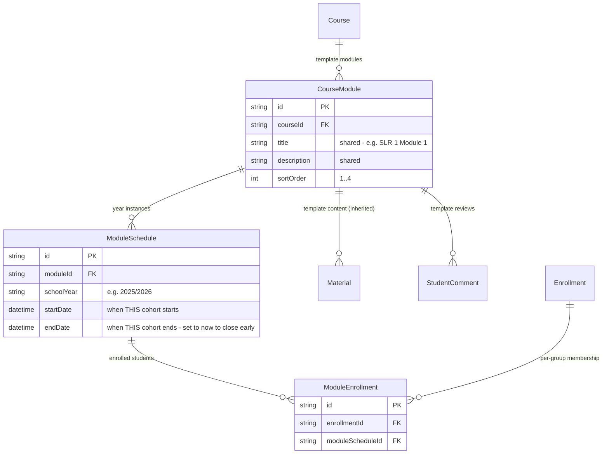
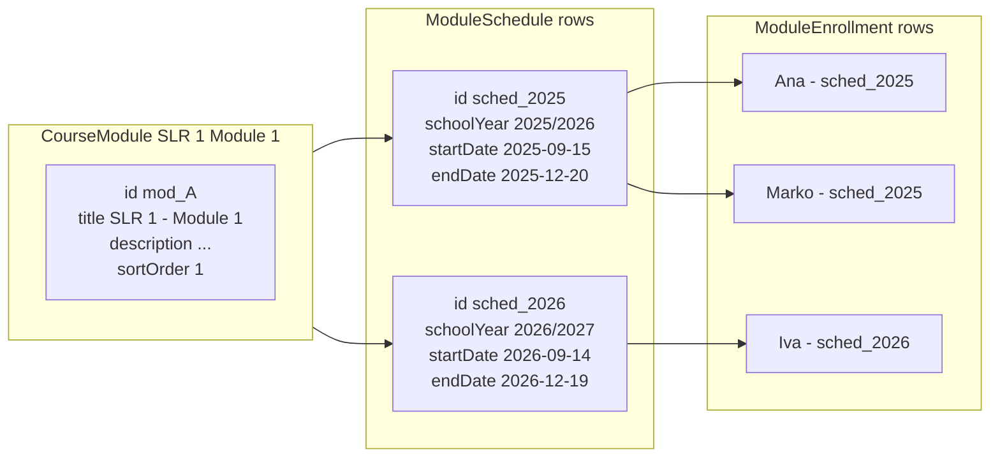

# Module Historization — Template vs Year Instance

Every standard SLR course is split into four modules (M1 – M4). The same four titles run every school year, but each year's instance has its own dates, its own cohort of students, and — eventually — its own historical record. The schema separates the **template** (what the module is about, shared across years) from the **year instance** (when it runs and who takes it).



## The split

| Concept | Lives on | Changes year to year? |
|---------|----------|----------------------|
| Module title, description, `sortOrder` | `CourseModule` | No — one template, many year instances |
| Start / end dates | `ModuleSchedule` | Yes — new row per `schoolYear` |
| Roster (which students took this module) | `ModuleEnrollment` → `ModuleSchedule` | Yes — scoped to a single year |
| Materials (PDFs, slides, videos) | `Material.moduleId` → `CourseModule` | No — one library, inherited forward |
| Student feedback / module reviews | `StudentComment.moduleId` → `CourseModule` | Stays on the template |

## Unique constraint

```
ModuleSchedule @@unique([moduleId, schoolYear])
```

A given template module has **at most one schedule per school year**. Creating a new year for a course is "for each `CourseModule`, create one `ModuleSchedule` with the new year string and the planned `startDate` / `endDate`."

## Example — SLR 1, Module 1 across two years



- Ana and Marko took SLR 1 / M1 in the 2025/2026 cohort. Their `ModuleEnrollment` rows point at `sched_2025`, which points at the template `mod_A`.
- Iva is taking the same module in the 2026/2027 cohort. Her row points at `sched_2026`, same template.
- If a teacher leaves a `StudentComment` about Ana's work on M1, it's attached to the template `mod_A`, not to `sched_2025`. The comment survives year rollover and is still meaningful if Ana re-enrolls later.

## Why split at all?

- **Materials inherit automatically.** A slide deck uploaded for "SLR 1 / M1" is available to every cohort that ever takes it. No copy-paste between years.
- **History survives rollover.** Past cohorts are queryable via `ModuleSchedule.schoolYear`. Deleting a `Course` or `CourseModule` is still the "delete everything about this module" nuclear option; deleting a `ModuleSchedule` only wipes one year.
- **`schoolYear` is just metadata.** Because the public form no longer filters groups by `computeSchoolYear()`, admins don't have to worry about when a year "flips". The year is a label on the schedule row, used for grouping history — not a gate on visibility.
- **Early closure is a date edit.** To end a module before its scheduled `endDate`, `closeModuleSchedule` sets `endDate = now` on the `ModuleSchedule`. No per-enrolment status update, no cascade to future modules, no schema churn — the historical record reads as "this cohort ran from X to the day it was closed."

## Relationship to `Enrollment`

`Enrollment` is "this student is in this group for this school year". `ModuleEnrollment` is "this student is taking this module instance within that group enrollment". For a standard course both rows exist; for a radionica (`course.isCustom`) only the `Enrollment` row exists, since a radionica is a single session rather than a set of modules.

Deleting an `Enrollment` cascades (`onDelete: Cascade`) to its `ModuleEnrollment` rows. Deleting a `ModuleEnrollment` does **not** cascade — removing a student from M2 leaves M3 and M4 untouched. This matches the business rule: a kid dropping one module mid-year doesn't automatically drop the rest.
