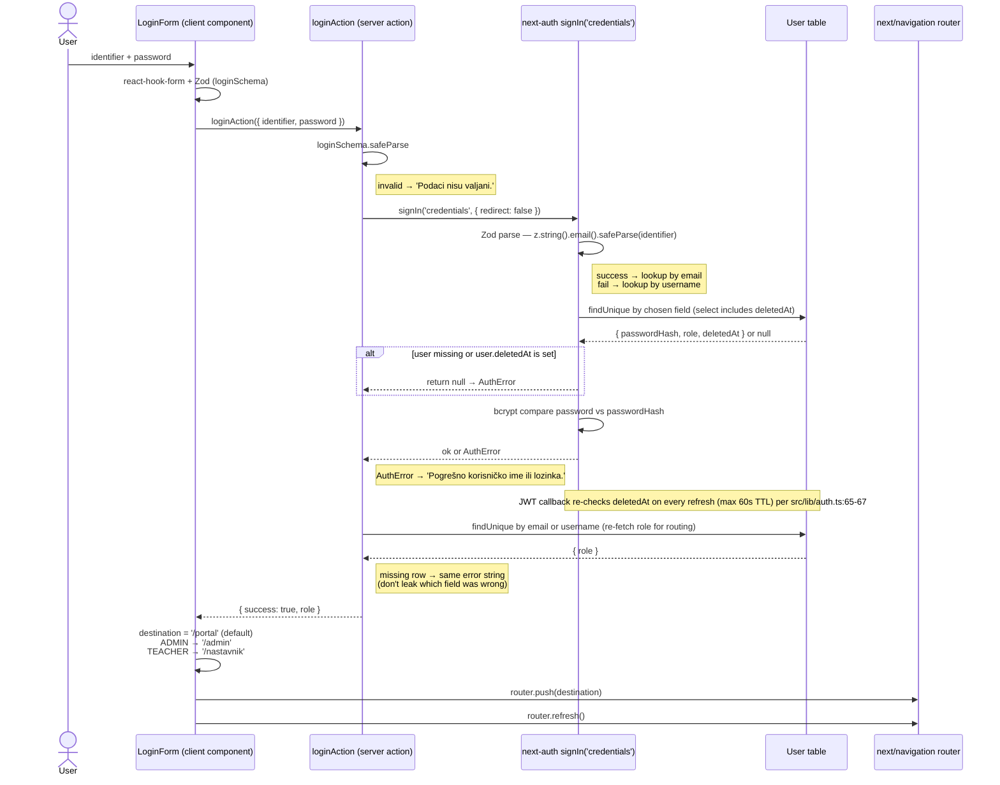
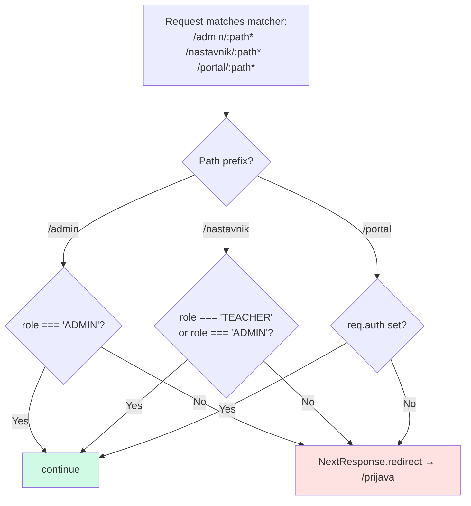
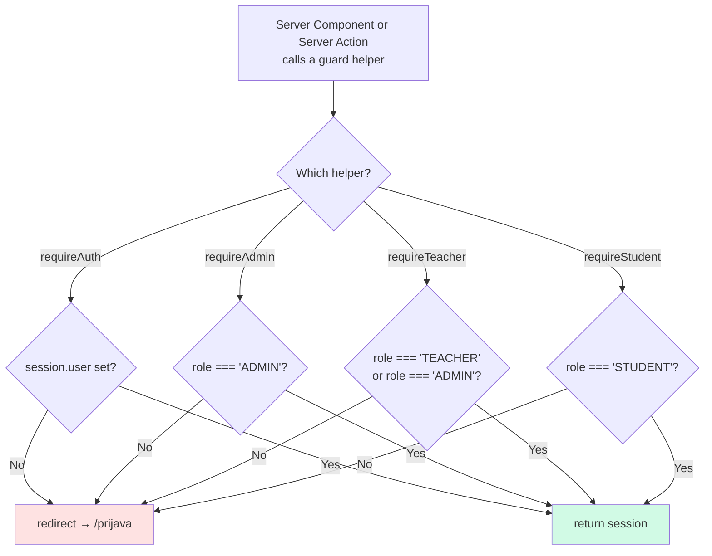

# Role-Based Login Redirect

After a successful login, the user lands on the route that matches their `UserRole`. The same mapping is enforced on every subsequent request at two layers — edge `middleware.ts` and per-page `requireX()` guards — so a stale link or direct URL can never escape the role boundary.

| Role | Post-login `router.push` target | Edge middleware allows | Server-side guard helpers that pass |
|---|---|---|---|
| `ADMIN` | `/admin` | `/admin/*`, `/nastavnik/*`, `/portal/*` (any auth) | `requireAuth`, `requireAdmin`, `requireTeacher` *(ADMIN bypass for support)* |
| `TEACHER` | `/nastavnik` | `/nastavnik/*`, `/portal/*` (any auth) | `requireAuth`, `requireTeacher` |
| `STUDENT` | `/portal` | `/portal/*` (any auth) | `requireAuth`, `requireStudent` |
| unauthenticated | login page | none — every match redirects to `/prijava` | none |

> Middleware lets any authenticated user through to `/portal/*`, but `requireStudent()` rejects non-STUDENT roles at the page level. ADMIN bypass inside `requireTeacher()` is deliberate so admins can support a class without holding a teacher seat.

## Login → first redirect

> Sources: `src/actions/login.ts:14-41` (server action), `src/components/auth/login-form.tsx:30-44` (client switch), `src/lib/auth.ts:17-33` (authorize callback: Zod email parse + deletedAt rejection), `src/lib/auth.ts:48-75` (JWT callback re-check on refresh).

## Subsequent requests — edge middleware

> Source: `src/middleware.ts`. Matcher list at the bottom of the file pins exactly which prefixes the middleware fires for; anything else passes straight to the route.

## Subsequent requests — server-side guards

> Source: `src/lib/auth-guard.ts`. Each helper composes on top of `requireAuth()`, so an unauthenticated request always lands on `/prijava` regardless of which role check follows.

## Defence in depth

Two layers cover slightly different concerns:

- **Middleware** runs at the edge before any React rendering, so it bounces stale URLs cheaply and never paints a flash of unauthorized content.
- **Guards** run inside Server Components and Server Actions, where role checks can be more granular (e.g. `assertTeacherOwnsGroup` builds on top of `requireTeacher` to also check `TeacherAssignment`). They also handle the case of someone calling a Server Action directly without crossing the middleware boundary.

If you change a route's role expectation, update **both** layers — and the post-login switch in `LoginForm` if the new route should be the default landing page for that role.
