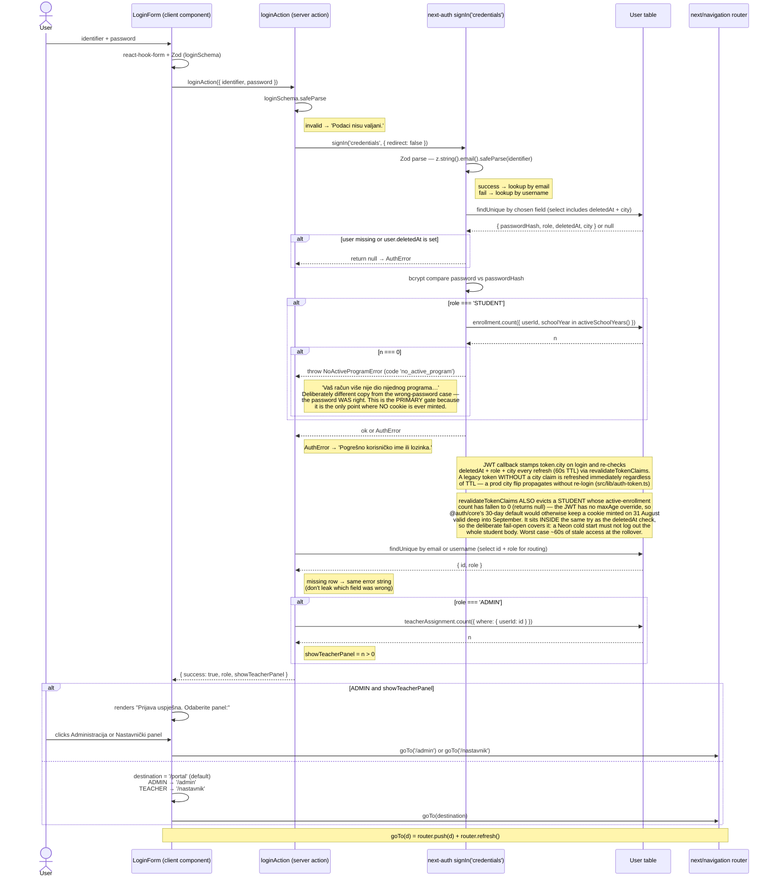
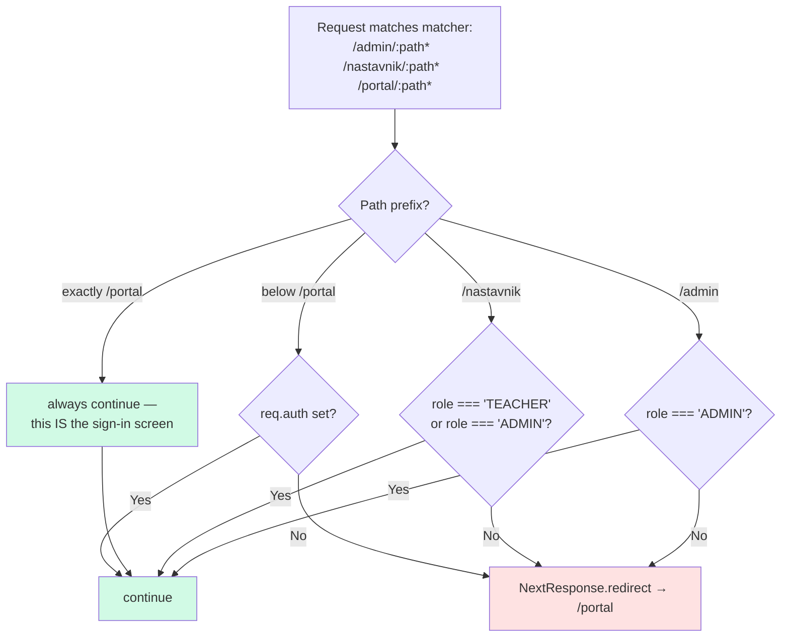
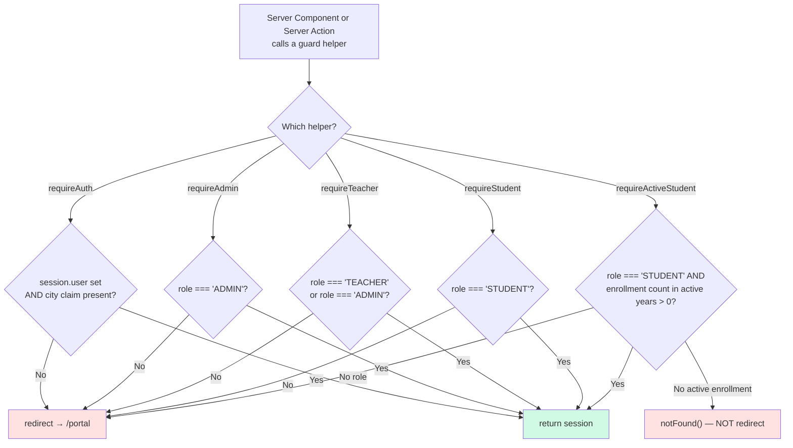

# Role-Based Login Redirect

After a successful login, the user lands on the route that matches their `UserRole`. The same mapping is enforced on every subsequent request at two layers — edge `middleware.ts` and per-page `requireX()` guards — so a stale link or direct URL can never escape the role boundary.

| Role | Post-login `router.push` target | Edge middleware allows | Server-side guard helpers that pass |
|---|---|---|---|
| `ADMIN` | `/admin` — **unless dual-role**, then a panel chooser (see below) | `/admin/*`, `/nastavnik/*`, `/portal/*` (any auth) | `requireAuth`, `requireAdmin`, `requireTeacher` *(ADMIN bypass for support)* |
| `TEACHER` | `/nastavnik` | `/nastavnik/*`, `/portal/*` (any auth) | `requireAuth`, `requireTeacher` |
| `STUDENT` | `/portal` — **only with an ACTIVE enrollment** | `/portal/*` (any auth) | `requireAuth`, `requireStudent`, `requireActiveStudent` |
| unauthenticated | `/portal` — the login screen renders **in place** there | nothing below `/portal`; every other match redirects to `/portal` | none |

> **`/portal` is both the sign-in screen and the student destination (2026-08-06).** The URL swap moved the public signup form onto `/prijava` and login onto `/portal`, so there is no standalone sign-in route any more: `(portal)/portal/page.tsx` branches — guest (or a fail-closed session with no `city` claim) → `<LoginScreen>`, ADMIN → `/admin`, TEACHER → `/nastavnik`, STUDENT → dashboard. Every auth redirect in the app targets `/portal`, which makes it the **loop terminator**: it must never bounce a guest. The middleware therefore exempts the exact `/portal` path (see below) and the `(portal)` layout no longer gates — its chrome renders only for a city-bearing STUDENT, and access control lives in the student actions' own `requireStudent()`.

> **Student access is gated on being currently in a program (2026-08-17).** "Active" means the CURRENT school year **plus the NEXT** — `activeSchoolYears()` / `activeEnrollmentWhere()` in `src/lib/enrollment-activity.ts`, the single definition behind the login gate, the token revalidation and every student-facing read. The next-year arm is not a nicety: next year's accounts are created over the summer and the CREDENTIALS campaign runs in the same window, so a current-year-only rule would refuse every child the moment they used the password they had just been mailed. There is deliberately **no grace tail** after 1 September — a child who was not re-enrolled losing access then is the requested behaviour. The TS and Prisma forms must stay in sync; a unit test asserts they agree.

> Middleware lets any authenticated user through to `/portal/*`, but `requireStudent()` rejects non-STUDENT roles at the page level. ADMIN bypass inside `requireTeacher()` is deliberate so admins can support a class without holding a teacher seat.

> **Dual-role admin.** An `ADMIN` who also holds at least one `TeacherAssignment` (e.g. the Šibenik city admin, who is also that city's only teacher) is **not** auto-redirected. `loginAction` returns `showTeacherPanel: true` and `LoginForm` swaps the form for a two-button chooser — *Administracija* → `/admin`, *Nastavnički panel* → `/nastavnik`. No guard or middleware change was needed: both prefixes already accept `ADMIN` via the middleware `/nastavnik` branch and the `requireTeacher` bypass. A non-teaching admin never sees the chooser — `/admin` is their unambiguous landing page — but the admin sidebar's "Nastavnički panel" shortcut is unconditional, so `/nastavnik` is one click away for them too.

## Login → first redirect

> Sources: `src/actions/login.ts` (server action, the dual-role `teacherAssignment.count` probe, and the `code === 'no_active_program'` branch that picks the message), `src/components/auth/login-form.tsx` (panel chooser + client role switch), `src/lib/auth.ts` `authorize()` (Zod email parse, `deletedAt` rejection, **and the active-enrollment gate**), `src/lib/auth.ts` jwt callback (re-check on refresh), `src/lib/auth-token.ts` (`revalidateTokenClaims`), `src/lib/enrollment-activity.ts` (the active-year definition). Line numbers are deliberately not cited — the previous ones (`auth.ts:17-33`, `:48-75`) had drifted by roughly twenty lines and pointed at unrelated code.

## Subsequent requests — edge middleware

> Source: `src/middleware.ts`. Matcher list at the bottom of the file pins exactly which prefixes the middleware fires for; anything else passes straight to the route. The `pathname !== '/portal'` condition on the portal branch is load-bearing, not an optimization: `/portal` is where every other branch redirects to, so gating it would bounce a guest to the page they are already on.

## Subsequent requests — server-side guards

> Source: `src/lib/auth-guard.ts`. Each helper composes on top of `requireAuth()` (module-private), so an unauthenticated request always lands on `/portal` regardless of which role check follows — the same target as the middleware, `logoutAction` and `pages.signIn`. `requireAuth` also **fails closed on a session without a `city` claim** — Prisma treats `city: undefined` in a where-clause as "no filter", so a legacy token must never reach a query. `requireAdminCtx()` returns `{ session, city }` for read actions; `adminAction` hands the same city to wrapped mutations via handler ctx.
>
> **`requireActiveStudent()`** composes on `requireStudent()` and adds proof the child is currently in a program. It gates every student-facing read of course content (`src/actions/student/materials.ts`, `gallery.ts`, `assessment.ts`), and `/api/download/[materialId]` mirrors it inline because it authorises off a session rather than through the guard. It fails with **`notFound()`, deliberately NOT `redirect('/portal')`** — `/portal` renders the dashboard for a STUDENT session, so redirecting there would loop forever. It checks that the CALLER is active, **not** that the requested group belongs to the active year: an enrolled child looking back at their own previous group is legitimate, and year-filtering the per-group lookups would quietly withdraw the parent-visible evaluation. It closes the residual window the login gate leaves — a JWT minted while the child was still enrolled stays valid until `revalidateTokenClaims` next runs (≤60 s). **Known gap:** `/api/proxy/elearning` is the one session-authorised surface that does not yet apply it.

## Defence in depth

Two layers cover slightly different concerns:

- **Middleware** runs at the edge before any React rendering, so it bounces stale URLs cheaply and never paints a flash of unauthorized content.
- **Guards** run inside Server Components and Server Actions, where role checks can be more granular (e.g. `assertTeacherOwnsGroup` builds on top of `requireTeacher` to also check `TeacherAssignment`). They also handle the case of someone calling a Server Action directly without crossing the middleware boundary.

If you change a route's role expectation, update **both** layers — and the post-login switch in `LoginForm` if the new route should be the default landing page for that role, including the dual-role chooser branch, which hardcodes its two destinations.

**City is enforced at the data layer, not in middleware.** Middleware stays role-only (it is non-authoritative); tenant separation comes from `session.user.city` flowing into every query/guard (`requireAdminCtx`, `adminAction` ctx, `city-guard.ts` asserts, city-bound ADMIN bypasses in `teacher-guard.ts`). There is no city switcher — an account's city is a static fact, changed only in the DB (the 60s JWT re-check propagates it without re-login).
