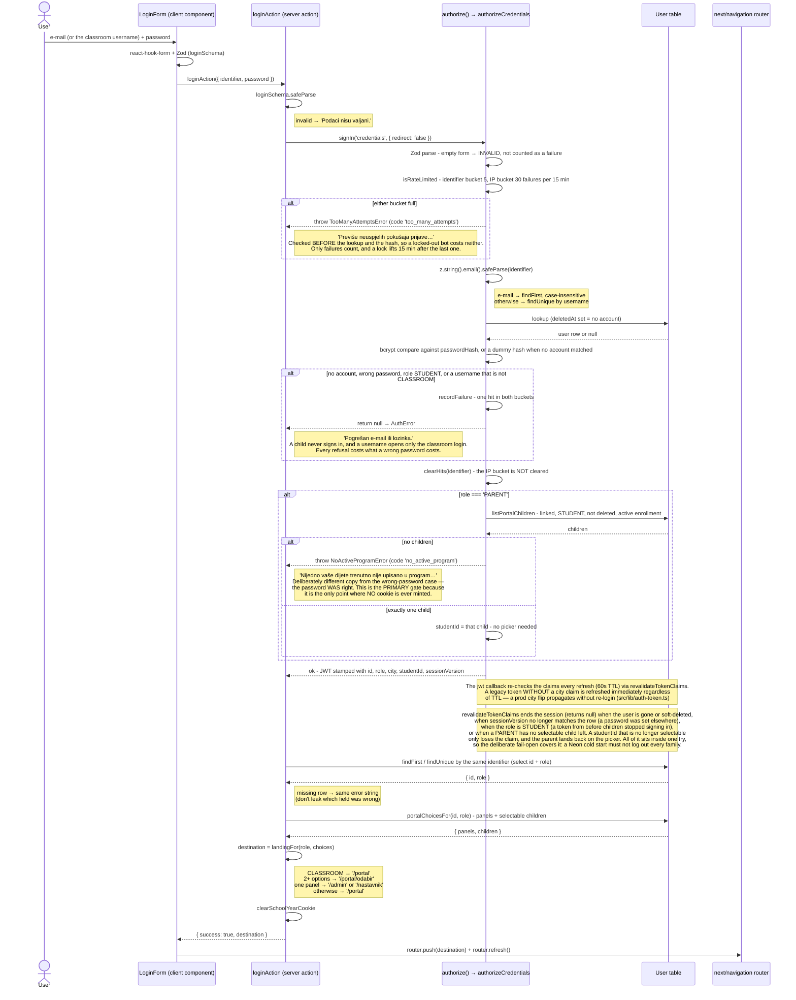
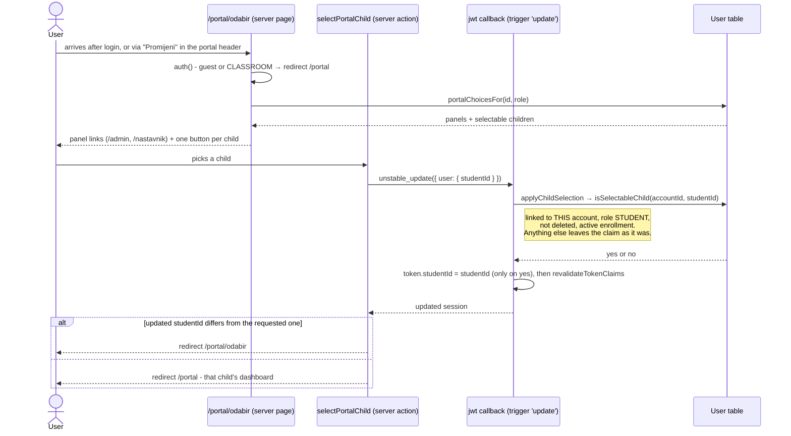
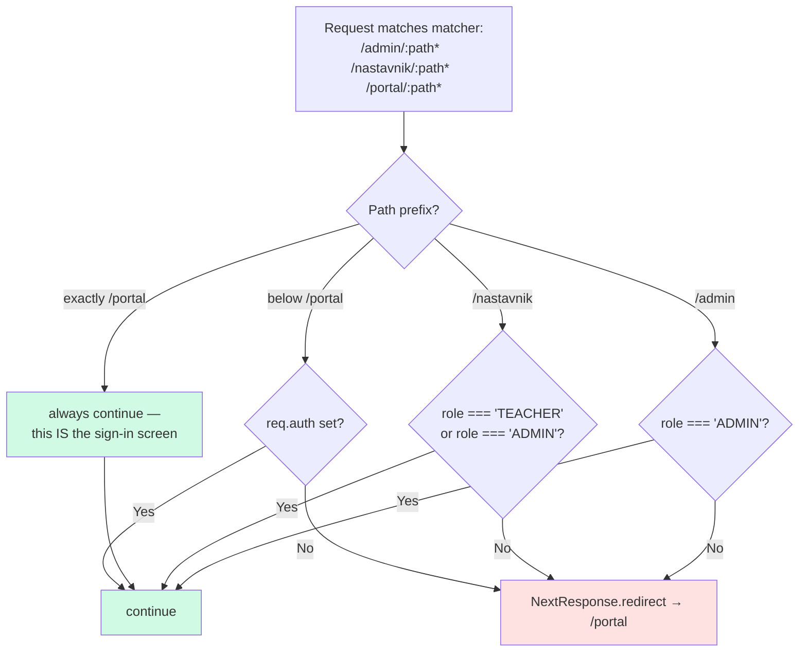
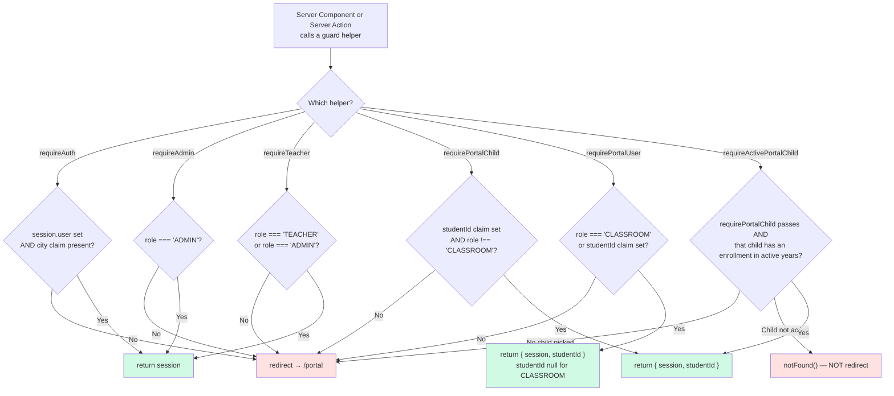

# Role-Based Login Redirect

After a successful login, the user lands on the route that matches what the account can open — its role, its staff panels and the children linked to it. The same mapping is enforced on every subsequent request at two layers — edge `middleware.ts` and per-page `requireX()` guards — so a stale link or direct URL can never escape the role boundary.

**Children do not sign in (since 2026-09-29).** The family's login is the parent's e-mail: a `PARENT` account (or a staff account whose e-mail the parent used), linked to each child through `User.parentAccountId`. The session carries the child being looked at as the JWT claim `studentId`; every portal read keys on it, never on `session.user.id`, which is the parent account.

| Role | Post-login `router.push` target (`landingFor`) | Edge middleware allows | Server-side guard helpers that pass |
|---|---|---|---|
| `ADMIN` | `/admin` — **unless it has 2+ choices** (the teacher panel, or a child linked to its e-mail), then the picker `/portal/odabir` | `/admin/*`, `/nastavnik/*`, `/portal/*` (any auth) | `requireAuth`, `requireAdmin`, `requireTeacher` *(ADMIN bypass for support)*; the portal child guards once a child is picked |
| `TEACHER` | `/nastavnik` — or `/portal/odabir` when a child is linked to their e-mail | `/nastavnik/*`, `/portal/*` (any auth) | `requireAuth`, `requireTeacher`; the portal child guards once a child is picked |
| `PARENT` | exactly ONE active child → `/portal` with the session already on that child (then forwarded to `/portal/grupa/<id>` when it has one enrollment); 2+ → `/portal/odabir`; **0 → refused at login** (`no_active_program`) | `/portal/*` (any auth) | `requireAuth`, `requirePortalChild`, `requirePortalUser`, `requireActivePortalChild` — all need a picked `studentId` |
| `STUDENT` | **never** — `authorize()` refuses the account; a token minted before 2026-09-29 is ended by `revalidateTokenClaims` | — | none |
| `CLASSROOM` | `/portal` — renders `<ClassroomPrograms>` in place; the flow is **program → group**, never a forward, because the account holds no enrollments to route on | `/portal/*` (any auth); middleware still bounces it off `/admin/*` and `/nastavnik/*` | `requireAuth`, `requirePortalUser` *(returns `studentId: null`)* |
| unauthenticated | `/portal` — the login screen renders **in place** there | nothing below `/portal`; every other match redirects to `/portal` | none |

> **`/portal` is both the sign-in screen and the family destination (2026-08-06).** The URL swap moved the public signup form onto `/prijava` and login onto `/portal`, so there is no standalone sign-in route any more: `(portal)/portal/page.tsx` branches — guest (or a fail-closed session with no `city` claim) → `<LoginScreen>`, CLASSROOM → `<ClassroomPrograms>`, **any session carrying a `studentId` → that child's dashboard** (whatever the role, since a teacher's own child is opened the way a parent's is), then without a picked child ADMIN → `/admin`, TEACHER → `/nastavnik`, PARENT → `/portal/odabir`, and anything else (a leftover STUDENT token revalidation has not ended yet) → `<LoginScreen>`, failing closed. **The dashboard forwards (2026-08-24):** a child with exactly ONE active enrollment is `redirect`ed to `/portal/grupa/<id>` — still no extra click, but the real group route, because rendering the materials panel inline gave that child no tab strip and no way through to Galerija or Evaluacija; 2+ enrollments → the grid of group cards; 0 → the empty state (unreachable through login, since the picker and the login gate only ever hold an active child). Every auth redirect in the app targets `/portal`, which makes it the **loop terminator**: it must never bounce a guest — and the forward does not weaken that, since it fires only for an already-authenticated session with a child, after `auth()`. The middleware therefore exempts the exact `/portal` path (see below) and the `(portal)` layout does not gate — its chrome renders only for a city-bearing session **with a `studentId` or CLASSROOM**, and access control lives in the portal actions' own guards. A family session's chrome is labelled by the **child's** name (`portalChildName`) and shows **"Promijeni"** → `/portal/odabir` when the account has more than one choice. For CLASSROOM the chrome is labelled by what the account *is*: `classroomDisplayName(city)` ("Račun za učionicu · Split") where a child's name would go, **"Programi"** instead of "Moje grupe", and **no Profil link** — there is no profile behind a shared login.

> **Family access is gated on a child being currently in a program (2026-08-17).** "Active" means the CURRENT school year **plus the NEXT** — `activeSchoolYears()` / `activeEnrollmentWhere()` in `src/lib/enrollment-activity.ts`, the single definition behind the login gate, the picker (`isSelectableChild`), the token revalidation and every portal read. The next-year arm is not a nicety: next year's accounts are created over the summer and the password links go out in the same window, so a current-year-only rule would refuse every family the moment they used the link they had just been mailed. There is deliberately **no grace tail** after 1 September — a child who was not re-enrolled dropping out of the portal then is the requested behaviour. The TS and Prisma forms must stay in sync; a unit test asserts they agree.

> Middleware lets any authenticated user through to `/portal/*`, but the portal guards (`requirePortalChild()` and friends) reject a session with no picked child at the page level. ADMIN bypass inside `requireTeacher()` is deliberate so admins can support a class without holding a teacher seat.

> **Several choices → the picker (2026-09-29).** `portalChoicesFor(accountId, role)` (`src/lib/portal-children.ts`) lists everything one login can open — the staff panels (`admin`, plus `teacher` for an ADMIN with at least one `TeacherAssignment`; `teacher` for a TEACHER) and the linked, selectable children — and the pure `landingFor` (`src/lib/portal-landing.ts`) sends one option straight there and 2+ to `/portal/odabir`. That page replaces the old in-form Administracija / Nastavnički panel chooser: a dual-role admin, a parent of siblings and a teacher whose own child attends all get the same list. A non-teaching admin with no linked child never sees it — `/admin` is their unambiguous landing page — but the admin sidebar's "Nastavnički panel" shortcut is unconditional, so `/nastavnik` is one click away for them too.

> **Passwords are chosen, never generated (2026-09-29).** The app no longer mints passwords, and `plainPassword` survives only on CLASSROOM rows (a DB `CHECK`). A new account gets an unusable hash; its owner sets a password through a one-time link `/postavi-lozinku#<token>` (`src/lib/password-token.ts`, `src/actions/password-setup.ts` — `SETUP` valid 7 days, `RESET` 48 h, only the SHA-256 stored). Staff can also change theirs on `/admin/lozinka` / `/nastavnik/lozinka`. Every password set bumps `User.sessionVersion`, which ends every other session at its next revalidation. The deploy that shipped this mailed every admin and teacher **one** `SETUP` link, once (`sendPasswordRolloutToStaff`, `src/lib/password-rollout.ts`, started from `src/instrumentation-node.ts` behind the release-notes production gates and claimed through a `ReleaseAnnouncement` row keyed `password-setup-rollout`); their existing passwords keep working — the mail offers, it does not force.

## Login → first redirect

```mermaid
sequenceDiagram
    actor User
    participant Form as LoginForm (client component)
    participant Action as loginAction (server action)
    participant Auth as authorize() → authorizeCredentials
    participant DB as User table
    participant Router as next/navigation router

    User->>Form: e-mail (or the classroom username) + password
    Form->>Form: react-hook-form + Zod (loginSchema)
    Form->>Action: loginAction({ identifier, password })

    Action->>Action: loginSchema.safeParse
    Note right of Action: invalid → 'Podaci nisu valjani.'

    Action->>Auth: signIn('credentials', { redirect: false })
    Auth->>Auth: Zod parse - empty form → INVALID, not counted as a failure
    Auth->>Auth: isRateLimited - identifier bucket 5, IP bucket 30 failures per 15 min
    alt either bucket full
        Auth-->>Action: throw TooManyAttemptsError (code 'too_many_attempts')
        Note right of Action: 'Previše neuspjelih pokušaja prijave…'<br/>Checked BEFORE the lookup and the hash, so a locked-out bot costs neither.<br/>Only failures count, and a lock lifts 15 min after the last one.
    end
    Auth->>Auth: z.string().email().safeParse(identifier)
    Note right of Auth: e-mail → findFirst, case-insensitive<br/>otherwise → findUnique by username
    Auth->>DB: lookup (deletedAt set = no account)
    DB-->>Auth: user row or null
    Auth->>Auth: bcrypt compare against passwordHash, or a dummy hash when no account matched
    alt no account, wrong password, role STUDENT, or a username that is not CLASSROOM
        Auth->>Auth: recordFailure - one hit in both buckets
        Auth-->>Action: return null → AuthError
        Note right of Action: 'Pogrešan e-mail ili lozinka.'<br/>A child never signs in, and a username opens only the classroom login.<br/>Every refusal costs what a wrong password costs.
    end
    Auth->>Auth: clearHits(identifier) - the IP bucket is NOT cleared
    alt role === 'PARENT'
        Auth->>DB: listPortalChildren - linked, STUDENT, not deleted, active enrollment
        DB-->>Auth: children
        alt no children
            Auth-->>Action: throw NoActiveProgramError (code 'no_active_program')
            Note right of Action: 'Nijedno vaše dijete trenutno nije upisano u program…'<br/>Deliberately different copy from the wrong-password case —<br/>the password WAS right. This is the PRIMARY gate because<br/>it is the only point where NO cookie is ever minted.
        else exactly one child
            Auth->>Auth: studentId = that child - no picker needed
        end
    end
    Auth-->>Action: ok - JWT stamped with id, role, city, studentId, sessionVersion
    Note over Auth,DB: The jwt callback re-checks the claims every refresh (60s TTL) via revalidateTokenClaims.<br/>A legacy token WITHOUT a city claim is refreshed immediately regardless<br/>of TTL — a prod city flip propagates without re-login (src/lib/auth-token.ts)
    Note over Auth,DB: revalidateTokenClaims ends the session (returns null) when the user is gone or soft-deleted,<br/>when sessionVersion no longer matches the row (a password was set elsewhere),<br/>when the role is STUDENT (a token from before children stopped signing in),<br/>or when a PARENT has no selectable child left. A studentId that is no longer selectable<br/>only loses the claim, and the parent lands back on the picker. All of it sits inside one try,<br/>so the deliberate fail-open covers it: a Neon cold start must not log out every family.

    Action->>DB: findFirst / findUnique by the same identifier (select id + role)
    DB-->>Action: { id, role }
    Note right of Action: missing row → same error string<br/>(don't leak which field was wrong)

    Action->>DB: portalChoicesFor(id, role) - panels + selectable children
    DB-->>Action: { panels, children }
    Action->>Action: destination = landingFor(role, choices)
    Note right of Action: CLASSROOM → '/portal'<br/>2+ options → '/portal/odabir'<br/>one panel → '/admin' or '/nastavnik'<br/>otherwise → '/portal'
    Action->>Action: clearSchoolYearCookie

    Action-->>Form: { success: true, destination }
    Form->>Router: router.push(destination) + router.refresh()
```

> Sources: `src/actions/login.ts` (server action, the `no_active_program` / `too_many_attempts` branches that pick the message, and `destination`), `src/components/auth/login-form.tsx`, `src/lib/auth.ts` (`authorize()` → Auth.js errors, and the jwt callback), `src/lib/credentials-authorize.ts` (`authorizeCredentials` — throttle, lookup, dummy hash, STUDENT/username refusal, the parent gate), `src/lib/rate-limit.ts` (in-process buckets), `src/lib/auth-token.ts` (`revalidateTokenClaims`), `src/lib/portal-children.ts` (`listPortalChildren`, `portalChoicesFor`, `isSelectableChild`), `src/lib/portal-landing.ts` (`landingFor`), `src/lib/enrollment-activity.ts` (the active-year definition). Line numbers are deliberately not cited — they drift.

## Choosing a child — `/portal/odabir`

```mermaid
sequenceDiagram
    actor User
    participant Page as /portal/odabir (server page)
    participant Act as selectPortalChild (server action)
    participant JWT as jwt callback (trigger 'update')
    participant DB as User table

    User->>Page: arrives after login, or via "Promijeni" in the portal header
    Page->>Page: auth() - guest or CLASSROOM → redirect /portal
    Page->>DB: portalChoicesFor(id, role)
    DB-->>Page: panels + selectable children
    Page-->>User: panel links (/admin, /nastavnik) + one button per child
    User->>Act: picks a child
    Act->>JWT: unstable_update({ user: { studentId } })
    JWT->>DB: applyChildSelection → isSelectableChild(accountId, studentId)
    Note right of JWT: linked to THIS account, role STUDENT,<br/>not deleted, active enrollment.<br/>Anything else leaves the claim as it was.
    DB-->>JWT: yes or no
    JWT->>JWT: token.studentId = studentId (only on yes), then revalidateTokenClaims
    JWT-->>Act: updated session
    alt updated studentId differs from the requested one
        Act-->>User: redirect /portal/odabir
    else
        Act-->>User: redirect /portal - that child's dashboard
    end
```

> Sources: `src/app/(auth)/portal/odabir/page.tsx`, `src/actions/portal-choice.ts`, `src/lib/portal-children.ts` (`applyChildSelection`, `isSelectableChild`). The page lives in the `(auth)` route group with its own shell, since the portal chrome names a picked child and there may be none yet. **The `update` hook is the security boundary**, not the action: Auth.js routes both `unstable_update()` and a client `update()` posted to `/api/auth/session` into it with whatever data the caller sent, so the claim is written only after `isSelectableChild` says yes, and re-proven on every revalidation (≤60 s). The action checks only the outcome, so a refused id sends the user back to the picker rather than into someone else's portal.

## Subsequent requests — edge middleware

```mermaid
flowchart TD
    REQ["Request matches matcher:<br/>/admin/:path*  /nastavnik/:path*  /portal/:path*"] --> PATH{Path prefix?}

    PATH -->|/admin| A{role === 'ADMIN'?}
    PATH -->|/nastavnik| N{role === 'TEACHER'<br/>or role === 'ADMIN'?}
    PATH -->|"exactly /portal"| EX["always continue —<br/>this IS the sign-in screen"]
    PATH -->|"below /portal"| P{req.auth set?}

    A -->|Yes| PASS[continue]
    A -->|No| RED["NextResponse.redirect → /portal"]
    N -->|Yes| PASS
    N -->|No| RED
    EX --> PASS
    P -->|Yes| PASS
    P -->|No| RED

    style PASS fill:#d1fae5
    style EX   fill:#d1fae5
    style RED  fill:#fee2e2
```

> Source: `src/middleware.ts`. Matcher list at the bottom of the file pins exactly which prefixes the middleware fires for; anything else passes straight to the route (including the public `/postavi-lozinku`). The `pathname !== '/portal'` condition on the portal branch is load-bearing, not an optimization: `/portal` is where every other branch redirects to, so gating it would bounce a guest to the page they are already on. `/portal/odabir` sits below `/portal`, so it needs a session like any other portal page.

## Subsequent requests — server-side guards

```mermaid
flowchart TD
    CALL["Server Component or Server Action<br/>calls a guard helper"] --> WHICH{Which helper?}

    WHICH -->|requireAuth| A1{session.user set<br/>AND city claim present?}
    WHICH -->|requireAdmin| A2{role === 'ADMIN'?}
    WHICH -->|requireTeacher| A3{role === 'TEACHER'<br/>or role === 'ADMIN'?}
    WHICH -->|requirePortalChild| A4{studentId claim set<br/>AND role !== 'CLASSROOM'?}
    WHICH -->|requirePortalUser| A6{role === 'CLASSROOM'<br/>or studentId claim set?}
    WHICH -->|requireActivePortalChild| A5{requirePortalChild passes AND<br/>that child has an enrollment in active years?}

    A1 -->|No| RED[redirect → /portal]
    A1 -->|Yes| OK[return session]
    A2 -->|No| RED
    A2 -->|Yes| OK
    A3 -->|No| RED
    A3 -->|Yes| OK
    A4 -->|No| RED
    A4 -->|Yes| OKC["return { session, studentId }"]
    A6 -->|No| RED
    A6 -->|Yes| OKU["return { session, studentId }<br/>studentId null for CLASSROOM"]
    A5 -->|"No child picked"| RED
    A5 -->|"Child not active"| NF["notFound() — NOT redirect"]
    A5 -->|Yes| OKC

    style NF  fill:#fee2e2
    style OK  fill:#d1fae5
    style OKC fill:#d1fae5
    style OKU fill:#d1fae5
    style RED fill:#fee2e2
```

> Source: `src/lib/auth-guard.ts`. Each helper composes on top of `requireAuth()` (module-private), so an unauthenticated request always lands on `/portal` regardless of which role check follows — the same target as the middleware, `logoutAction` and `pages.signIn`. `requireAuth` also **fails closed on a session without a `city` claim** — Prisma treats `city: undefined` in a where-clause as "no filter", so a legacy token must never reach a query. `requireAdminCtx()` returns `{ session, city }` for read actions; `adminAction` hands the same city to wrapped mutations via handler ctx.
>
> **`requirePortalChild()`** is role-agnostic on purpose: it asks for a picked child, not a PARENT role, so a staff account whose e-mail is a parent's opens its child the same way. A session with no child goes to `/portal`, which sends a parent to the picker and staff to their panel. It returns `{ session, studentId }`, and **`studentId` is what every portal read keys on** — `session.user.id` is the parent account and must never be used as a student id. The claim is trusted the way `city` and `role` are: proven by `isSelectableChild` when written, re-proven on every token revalidation (≤60 s).
>
> **`requireActivePortalChild()`** composes on `requirePortalChild()` and adds proof the chosen child is currently in a program. It gates every portal read of course content (`src/actions/student/gallery.ts`, `assessment.ts`, and through `assertPortalGroupAccess` also `materials.ts` and `group.ts` — `getStudentGroupShell`, which feeds the portal group layout's header and tab strip). It fails with **`notFound()`, deliberately NOT `redirect('/portal')`** — `/portal` renders the dashboard for a session holding a child, so redirecting there would loop; since the single-enrollment forward, `/portal` may itself send the session straight back to the group layout that calls this very guard. It checks that the CHILD is active, **not** that the requested group belongs to the active year: an enrolled child's family looking back at a previous group is legitimate, and year-filtering the per-group lookups would quietly withdraw the parent-visible evaluation. It closes the residual window the login gate and the picker leave — a claim written while the child was still enrolled stays in the JWT until `revalidateTokenClaims` next runs (≤60 s). `/api/download/[materialId]` mirrors it inline because it authorises off a session rather than through the guard: after the staff branches, a session carrying `studentId` is checked with `studentAllowed(studentId, …)`, which counts that child's active enrollments first. `/api/proxy/elearning` admits `ALLOWED_ROLES` (`TEACHER | ADMIN | CLASSROOM` — the RoboCamp guide iframe is same-origin and carries the session cookie) **or** any session carrying a `studentId`; it does not call the guard, so for a family it relies on the claim's ≤60 s re-proof.
>
> **`requirePortalUser()` (2026-09-20)** is the one guard that admits both a family session with a picked child and the `CLASSROOM` login — it returns `{ session, studentId }`, with `studentId: null` exactly for CLASSROOM; anything else `redirect('/portal')`. It exists because the shared classroom login reads the same materials a child does, and nothing else. **`assertPortalGroupAccess(groupId)`** (`src/lib/portal-group-access.ts` — a plain module, not a `'use server'` file, because an export from one of those is a callable endpoint and this is a guard; returns `void`) is what it composes into: with a `studentId` the session must pass `requireActivePortalChild()` *and* that child must hold an enrollment in this group **in any year**; a **CLASSROOM** session's group must match `classroomGroupWhere(session.user.city)` (its own city, current school year). Either miss is **`notFound()`, never a redirect** — `/portal` is inside the portal, so redirecting there would loop. Deliberately **not** used by the gallery, evaluation or profile reads: those stay behind `requirePortalChild()` / `requireActivePortalChild()`, which is what keeps them off the classroom PCs (a CLASSROOM session hitting them is sent back to `/portal`, where it gets its program tiles rather than a loop).
>
> **CLASSROOM is neither refused at login nor evicted.** A username identifier opens only a CLASSROOM account, and `authorize()` and `revalidateTokenClaims` gate the active-program check on `role === 'PARENT'`, so the account — which holds no enrollments by design — never trips `NoActiveProgramError` and is never logged out by the 60 s re-check.

## Defence in depth

Two layers cover slightly different concerns:

- **Middleware** runs at the edge before any React rendering, so it bounces stale URLs cheaply and never paints a flash of unauthorized content.
- **Guards** run inside Server Components and Server Actions, where role checks can be more granular (e.g. `assertTeacherOwnsGroup` builds on top of `requireTeacher` to also check `teacherGroupAccessWhere` — a `TeacherAssignment`, or a `SessionStaffChange` on that group with `sessionDate` ≥ today, Europe/Zagreb). They also handle the case of someone calling a Server Action directly without crossing the middleware boundary.

If you change a route's role expectation, update **both** layers — and `portalChoicesFor` / `landingFor` if the new route should be a landing page or a picker option for that role, since the login action, the `/portal/odabir` page and the portal header's "Promijeni" all read the same choices.

**City is enforced at the data layer, not in middleware.** Middleware stays role-only (it is non-authoritative); tenant separation comes from `session.user.city` flowing into every query/guard (`requireAdminCtx`, `adminAction` ctx, `city-guard.ts` asserts, city-bound ADMIN bypasses in `teacher-guard.ts`). There is no city switcher — an account's city is a static fact, changed only in the DB (the 60s JWT re-check propagates it without re-login). **A parent account is the exception:** it sees every child linked to it in either city, because the portal reads key on the picked child's `studentId`, not on the session's city; its own `city` only picks which office writes to it.
