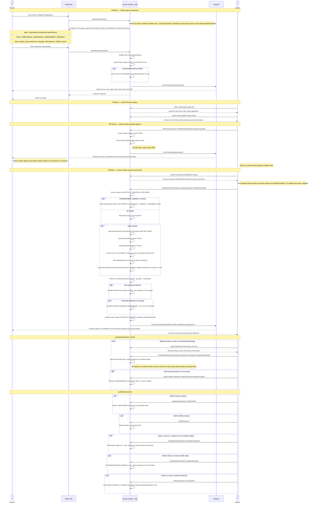

# End-to-End Enrollment Flow — Sequence Diagram

> The "available spots" number surfaced in the public form for standard courses comes from the **next-starting** module (first module by `sortOrder` whose schedule for that group's `schoolYear` has `startDate > now`), not the currently-running module. A module that's already running is past the point of new enrolments; the group's public capacity reflects the next one in line.
