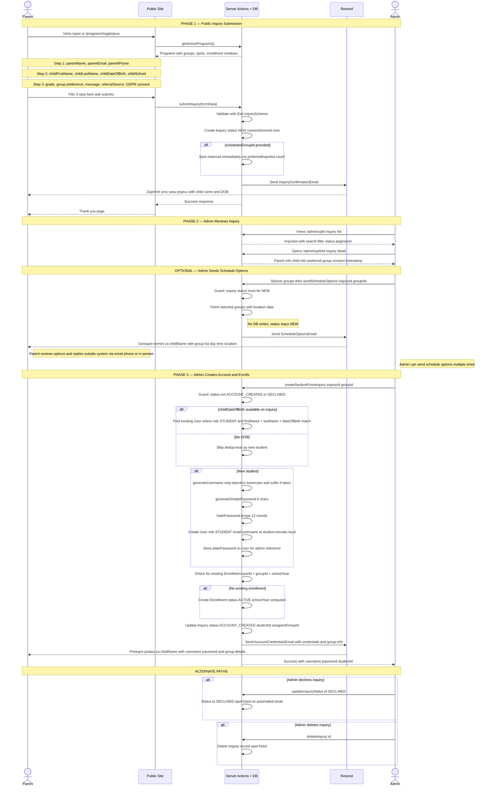

# End-to-End Enrollment Flow — Sequence Diagram

```mermaid
sequenceDiagram
    actor Parent
    participant Web as Public Site
    participant Server as Server Actions + DB
    participant Email as Resend
    actor Admin

    Note over Parent, Admin: PHASE 1 — Public Inquiry Submission

    Parent->>Web: Visits /upisi or /programi/slug/prijava
    Web->>Server: getActivePrograms()
    Server-->>Web: Programs with groups, spots, enrollment windows

    Note over Parent, Web: Step 1: parentName, parentEmail, parentPhone
    Note over Parent, Web: Step 2: childFirstName, childLastName, childDateOfBirth, childSchool
    Note over Parent, Web: Step 3: grade, group preference, message, referralSource, GDPR consent

    Parent->>Web: Fills 3-step form and submits
    Web->>Server: submitInquiry(formData)

    Server->>Server: Validate with Zod inquirySchema
    Server->>Server: Create Inquiry status NEW consentGivenAt now

    alt scheduledGroupId provided
        Server->>Server: Spot reserved immediately via preferredInquiries count
    end

    Server->>Email: Send InquiryConfirmationEmail
    Email-->>Parent: Zaprimili smo vasu prijavu with child name and DOB
    Server-->>Web: Success response
    Web-->>Parent: Thank you page

    Note over Parent, Admin: PHASE 2 — Admin Reviews Inquiry

    Admin->>Server: Views /admin/upiti inquiry list
    Server-->>Admin: Inquiries with search filter status pagination

    Admin->>Server: Opens /admin/upiti/id inquiry detail
    Server-->>Admin: Parent info child info preferred group consent timestamp

    Note over Parent, Admin: OPTIONAL — Admin Sends Schedule Options

    Admin->>Server: Selects groups then sendScheduleOptions inquiryId groupIds

    Server->>Server: Guard: inquiry status must be NEW
    Server->>Server: Fetch selected groups with location data
    Note right of Server: No DB writes, status stays NEW

    Server->>Email: Send ScheduleOptionsEmail
    Email-->>Parent: Dostupni termini za childName with group list day time location

    Note right of Parent: Parent reviews options and replies outside system via email phone or in-person
    Note right of Admin: Admin can send schedule options multiple times

    Note over Parent, Admin: PHASE 3 — Admin Creates Account and Enrolls

    Admin->>Server: createStudentFromInquiry inquiryId groupId

    Server->>Server: Guard: status not ACCOUNT_CREATED or DECLINED

    alt childDateOfBirth available on inquiry
        Server->>Server: Find existing User where role STUDENT and firstName + lastName + dateOfBirth match
    else No DOB
        Server->>Server: Skip dedup treat as new student
    end

    alt New student
        Server->>Server: generateUsername strip diacritics lowercase add suffix if taken
        Server->>Server: generateSimplePassword 6 chars
        Server->>Server: hashPassword bcrypt 12 rounds
        Server->>Server: Create User role STUDENT email username at student.inovatic.local
        Server->>Server: Store plainPassword on User for admin reference
    end

    Server->>Server: Check for existing Enrollment userId + groupId + schoolYear
    alt No existing enrollment
        Server->>Server: Create Enrollment status ACTIVE schoolYear computed
    end

    Server->>Server: Update Inquiry status ACCOUNT_CREATED studentId assignedGroupId

    Server->>Email: Send AccountCredentialsEmail with credentials and group info
    Email-->>Parent: Pristupni podaci za childName with username password and group details

    Server-->>Admin: Success with username password studentId

    Note over Parent, Admin: ALTERNATE PATHS

    alt Admin declines inquiry
        Admin->>Server: updateInquiryStatus id DECLINED
        Server->>Server: Status to DECLINED spot freed no automated email
    end

    alt Admin deletes inquiry
        Admin->>Server: deleteInquiry id
        Server->>Server: Delete Inquiry record spot freed
    end
```
