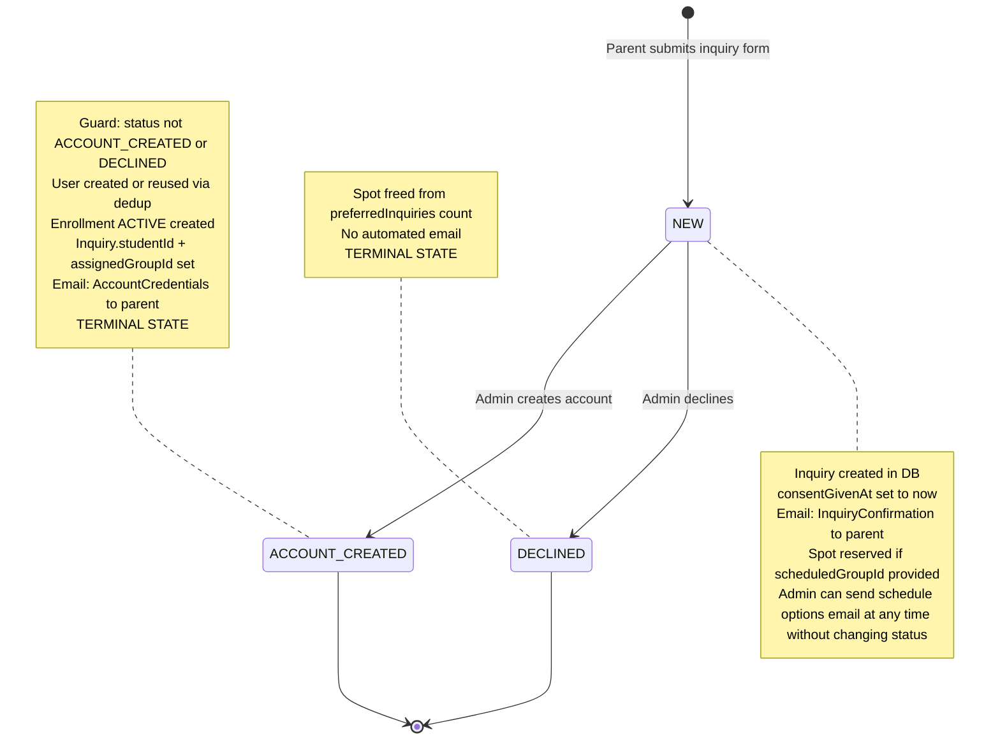

# Inquiry Status — State Machine

## Transition Rules

| From | To | Action | Guard | Side Effects |
|------|-----|--------|-------|-------------|
| -- | `NEW` | submitInquiry | Zod validation | Inquiry created, confirmation email, spot reserved if group selected |
| `NEW` | `ACCOUNT_CREATED` | createStudentFromInquiry | `status !== ACCOUNT_CREATED && status !== DECLINED` | User + Enrollment created, credentials email, studentId + assignedGroupId set |
| `NEW` | `DECLINED` | updateInquiryStatus | None in code | Spot freed, no automated email |

## Non-Status Actions

| Action | When | Side Effects |
|--------|------|-------------|
| sendScheduleOptions | Any time while status is NEW | Fetches selected groups and sends schedule email to parent. No database writes. |

## Terminal States

- **ACCOUNT_CREATED** — student account exists, enrollment is active
- **DECLINED** — inquiry rejected, spot freed

## Deletion

- `deleteInquiry` has no status guard — can delete at any status
- Does NOT cascade to User or Enrollment if already created
