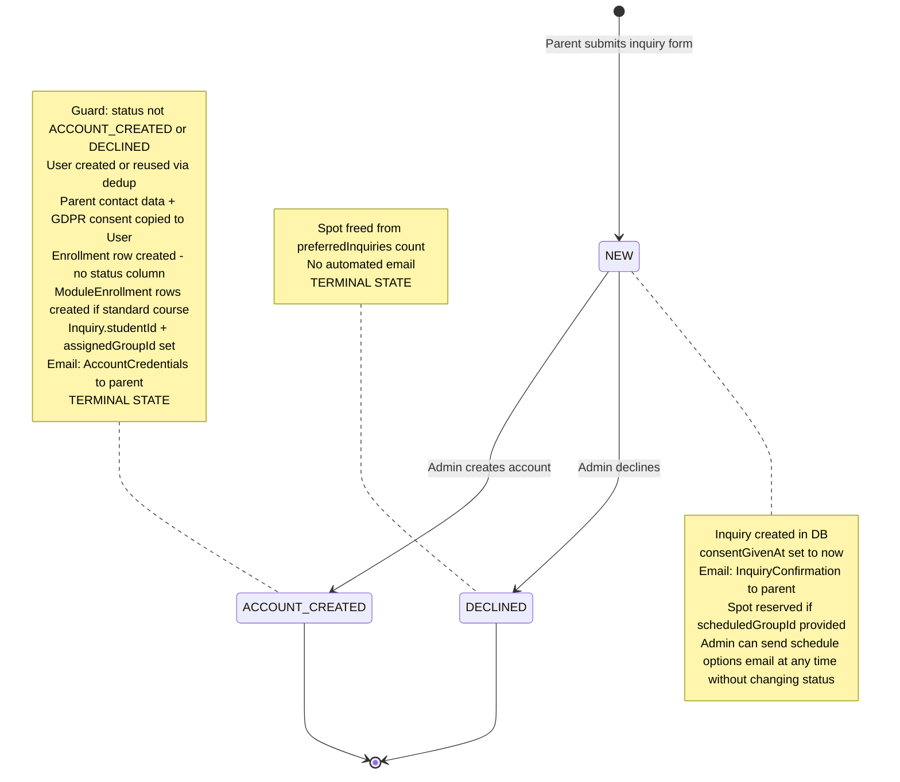

# Inquiry Status — State Machine

Only one entity still has a real state machine: `Inquiry`. `Enrollment` and `ModuleEnrollment` used to carry status columns; they no longer do. See "Why there is no Enrollment state machine" at the bottom.

## Transition Rules

| From | To | Action | Guard | Side Effects |
|------|-----|--------|-------|-------------|
| -- | `NEW` | submitInquiry | Zod validation | Inquiry created, confirmation email, spot reserved if group selected |
| `NEW` | `ACCOUNT_CREATED` | createStudentFromInquiry | `status !== ACCOUNT_CREATED && status !== DECLINED` | User + Enrollment + ModuleEnrollments created, credentials email, studentId + assignedGroupId set |
| `NEW` | `DECLINED` | updateInquiryStatus | None in code | Spot freed, no automated email |

## Non-Status Actions

| Action | When | Side Effects |
|--------|------|-------------|
| sendScheduleOptions | Any time while status is NEW | Fetches selected groups and sends schedule email to parent. No database writes. |

## Terminal States

- **ACCOUNT_CREATED** — student account exists, enrollment row exists
- **DECLINED** — inquiry rejected, spot freed

## Deletion

- `deleteInquiry` has no status guard — can delete at any status
- Does NOT cascade to User or Enrollment if already created

---

## Why there is no Enrollment or ModuleEnrollment state machine

Earlier versions of the schema had `Enrollment.status` (`PENDING` / `ACTIVE` / `COMPLETED` / `CANCELLED`) and `ModuleEnrollment.status` with the same shape. Both were dropped in migration `20260415000000_drop_enrollment_statuses`. In the current model:

- **`ModuleEnrollment` is a presence row.** A student is "in" a module iff a `ModuleEnrollment` row exists linking them to the relevant `ModuleSchedule`. To remove a student from a module, delete the row — there is no "cancelled" state to transition through. Removing module N does **not** cascade to N+1, N+2, … — each module row is its own independent fact.
- **A module is "done" when `ModuleSchedule.endDate < now`.** That's it. It might be "done" because the date naturally passed, or because a teacher manually closed it early by setting `endDate = now` via `closeModuleSchedule`. Either way, no per-row status change is needed — every `ModuleEnrollment` for that schedule is automatically treated as past once the date is past.
- **`Enrollment` is a group-membership row per school year.** No status, no lifecycle. An enrollment is "active for a radionica" iff the group's `date` hasn't passed. For standard courses, the student is "actively participating" iff they have a `ModuleEnrollment` pointing at a `ModuleSchedule` whose `endDate` is still in the future.
- **Cancellations are deletes.** For a radionica, "the child is no longer coming" → `deleteEnrollment`. For a single module in a standard course → `deleteModuleEnrollment`. The `Enrollment` row survives until the admin deletes it explicitly, which cascades to remove its `ModuleEnrollment` rows.
- **History is whatever rows still exist.** Past `ModuleEnrollment` rows stay in the DB as the record of what the student participated in, scoped by the `ModuleSchedule.schoolYear` they point to. There's no "COMPLETED" status to set — finishing a module means the calendar moved forward, not that a field was updated.

The practical effect: the state-machine diagrams we used to maintain for `Enrollment` and `ModuleEnrollment` had exactly two long-lived states — "the row exists" and "the row doesn't exist" — so they stopped earning their keep as diagrams and have been removed from this document.
